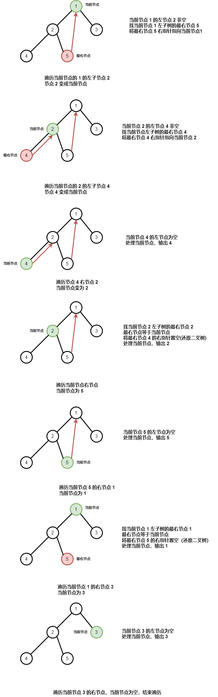

### Morris 遍历

用常数空间实现二叉树遍历

利用树的大量空闲指针，实现空间开销的极限缩减。其反序中序遍历规则总结如下：

1. 如果当前节点的**右子节点**为空，处理当前节点，并遍历当前节点的**左子节点**
2. 如果当前节点的**右子节点**非空，找到当前节点**右子树**的**最左节点**（该节点为当前节点中序遍历的前驱节点）
   - 如果**最左节点的左指针**为空，将**最左节点的左指针**指向当前节点，并遍历当前节点的右子节点
   - 如果**最左节点的左指针**非空，将**最左节点的左指针**重新置为空（恢复树的原状），处理当前节点，并将当前节点置为其左节点
3. 重复步骤 1 和步骤 2，直至遍历结束

### 图形理解



### 参考代码

```cpp
void morrisMid(TreeNode *root) {
    TreeNode *cur = root;
    while (cur) {
        // 当前节点的左节点为空
        if (!cur->left) {
            // 处理当前节点
            std::cout << cur->val << std::endl;
            // 遍历当前节点右节点
            cur = cur->right;
        } else {
            // 当前节点的左节点非空
            // 找到当前节点的左子树的最右节点，前驱节点
            TreeNode *pre = cur->left;
            // pre->right != cur 防止走出左子树
            while (pre->right && pre->right != cur) {
                // 遍历到右节点
                pre = pre->right;
            }
            // 前驱节点的右指针不指向了当前节点
            // 说明第一次访问该前驱节点
            if (pre->right != cur) {
                // 前驱节点的右指针指向当前节点
                pre->right = cur;
                // 遍历当前节点左节点
                cur = cur->left;
            } else {
                // 前驱节点的右指针被设置
                // 前驱节点的右指针置为空（还原二叉树）
                pre->right = nullptr;
                // 处理当前节点
                std::cout << cur->val << std::endl;
                // 遍历当前节点右节点
                cur = cur->right;
            }
        }
    }
}
```
