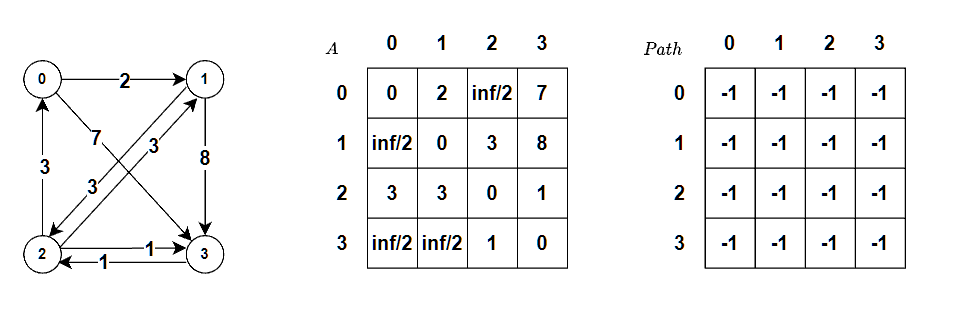

### floyd 算法



$A$ 表示邻接矩阵，存储任意两个顶点当前的最短路径长度

$Path$ 存储任意两个顶点在最短路径上的中间点

对于每一个顶点 $v$ ，和任意顶点对 ( $i,j$ )， $i\neq j$ ， $v\neq i$ ， $v\neq j$ ，如果 $A[i][j]>A[i][v]+A[v][j]$ ，则将 $A[i][j]$ 更新为 $A[i][v]+A[v][j]$ ，并且将 $Path[i][j]$ 更新为 $v$ ，表示顶点 $i$ 到 $j$ 的中间点为 $v$ 。

### 参考代码

```cpp
#include <iostream>
#include <vector>

using namespace std;

void floyd(vector<vector<int>> &g, vector<vector<int>> &path) {
    int n = g.size();
    for (int i = 0; i < n; ++i) {
        for (int j = 0; j < n; ++j) {
            for (int k = 0; k < n; ++k) {
                // g[i][j] = min(g[i][j], g[i][k] + g[k][j]);
                if (i != j && k != i && k != j && g[i][j] > g[i][k] + g[k][j]) {
                    g[i][j] = g[i][k] + g[k][j];
                    path[i][j] = k;
                }
            }
        }
    }
}

int main() {
    int n = 4; // 4 个点（0~3）
    vector<vector<int>> edges {
        {0, 1, 2},
        {0, 3, 7},
        {1, 2, 3},
        {1, 3, 8},
        {2, 0, 3},
        {2, 1, 3},
        {2, 3, 1},
        {3, 2, 1},
    };
    vector<vector<int>> g(n, vector<int>(n, INT_MAX / 2)); // 邻接矩阵
    vector<vector<int>> path(n, vector<int>(n)); // 中间点
    for (const auto &e : edges) {
        int f = e[0], t = e[1], w = e[2];
        g[f][t] = w;
    }
    floyd(g, path);
    cout << g[0][3] << endl;
    return 0;
}
```

