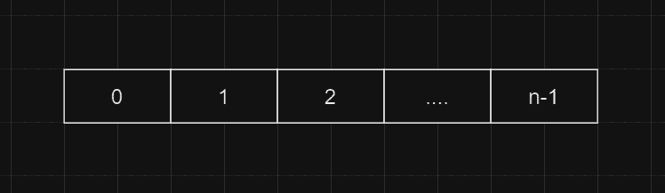

### 题目描述

在早期的人工智能规划和机器人研究中使用了一个区块世界，在这个世界中，机器人手臂执行涉及区块操作的任务。问题是要解析一系列命令，这些命令指导机器人手臂如何操作平板上的块。最初，有 $n$ 个区块 (编号为 $0\sim n-1$)，对于所有 $0\le i \lt n-1$ 的情况，区块 $b_i$ 与区块 $b_{i+1}$ 相邻，如下图所示。

用于操纵块的有效命令如下。

- move a onto b：把 a 和 b 上方的块全部放回初始位置，然后把 a 放到 b上方。
- move a over b：把 a 上方的块全部放回初始位置，然后把 a 放到 b 所在块堆的最上方。
- pile a onto b：把 b 上方的块全部放回初始位置，然后把 a 和 a 上方所有的块整体放到 b 上方。
- pile a over b：把 a 和 a 上方所有的块整体放到 b 所在块堆的最上方。
- quit：结束标志。

任何 a = b 或 a 和 b 在同一块堆中的命令都是非法命令。所有非法命令都应被忽略。

输入： 输入的第 1 行为整数 n （0<n <25），表示区块世界中的块
数。后面是一系列块命令，每行一个命令。在遇到 quit 命令之前，程序
应该处理所有命令。所有命令都将采用上面指定的格式，不会有语法错
误的命令。

输出： 输出应该包含区块世界的最终状态。每一个区块 i （0 ≤ i 
< n ）后面都有一个冒号。如果上面至少有一个块，则冒号后面必须跟
一个空格，后面跟一个显示在该位置的块列表，每个块号与其他块号之
间用空格隔开。不要在行末加空格。
