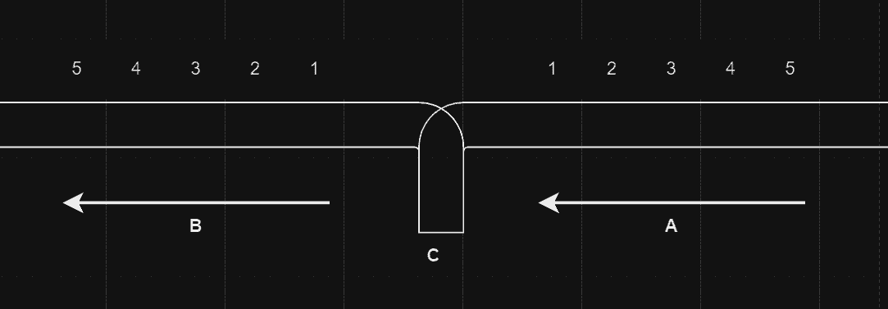

### 题目

某城市有一个火车站，铁轨铺设如下图所示。有n （n ≤1000）节车厢从 A 方向驶入车站，将其按进站的顺序编号为1～n 。你的任务是判断是否能让它们按照某种特定的顺序进入B方向的铁轨并驶出车站。例如，出栈顺序（5 4 1 2 3）是不可能的，但出栈顺序（5 4 3 2 1）是可能的。为了重组车厢，你可以借助中转站 C。中转站 C 是一个可以停放任意多节车厢的车站，但由于末端封顶，驶入 C 的车厢必须按照相反的顺序驶出 C。对于每节车厢，一旦从 A 移入 C，就不能返回 A 了；一旦从 C 移入 B，就不能返回 C 了。在任意时刻只有两种选择：A  到C 和 C 到 B。

  

输入： 输入包含多组数据，对于每一组数据，第1行是一个整数n。接下来的若干行，每行n 个数，代表1~n 车厢的出栈顺序，最后一行只有一个整数0。最后一组数据 “n = 0”，输入结束，不输出答案。

输出： 对每行的出栈顺序都单行输出“Yes”或“No”。对每组数据都在最后输出空行。

输入样例：

```
5
1 2 3 4 5
5 4 1 2 3
0
6
6 5 4 3 2 1
0
0
```

输出样例：

```
YES
NO

YES
```

