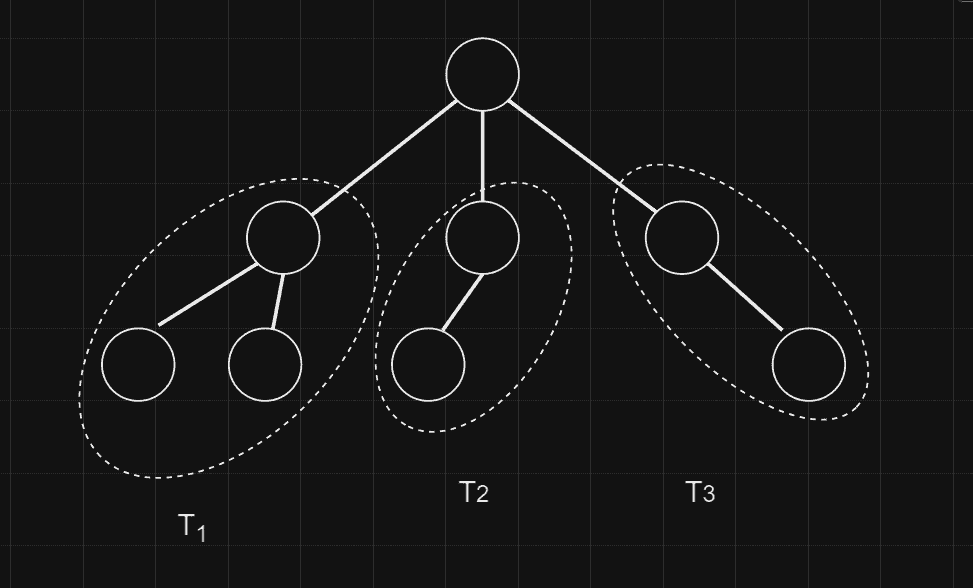
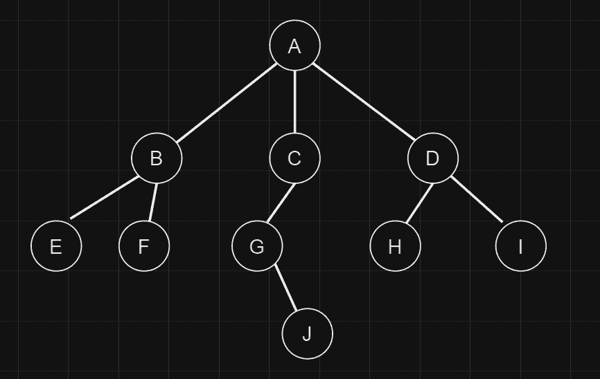
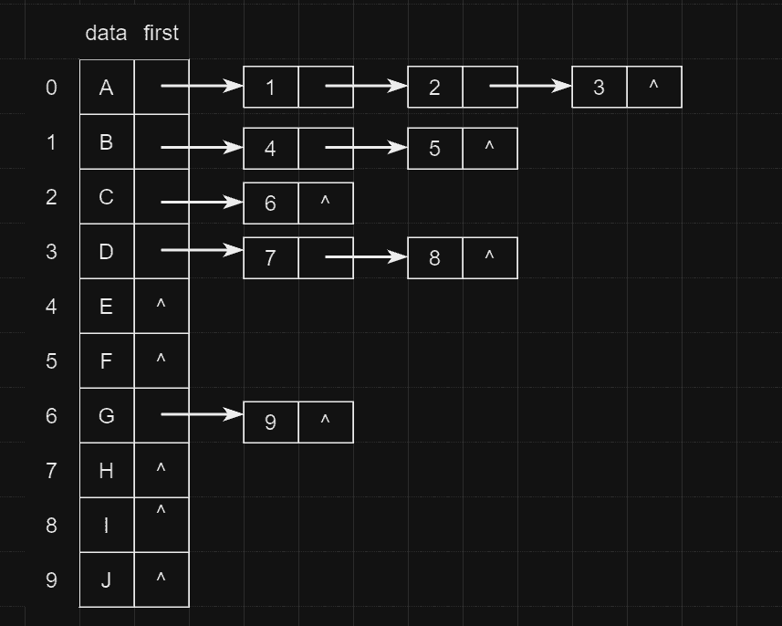
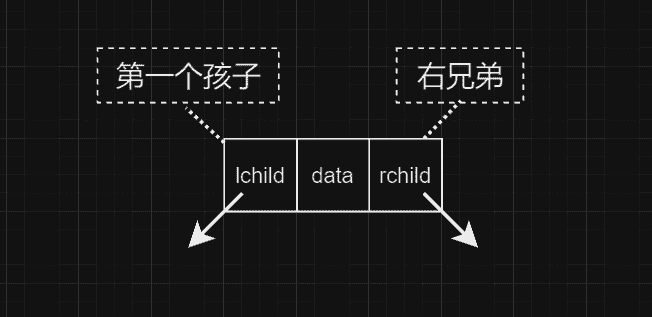
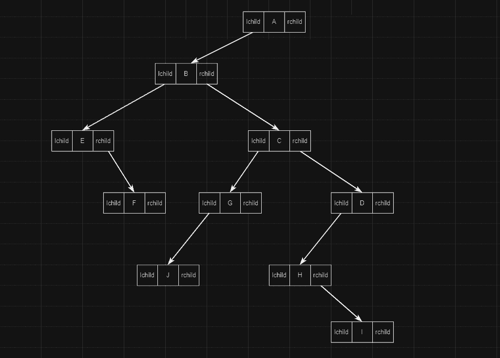
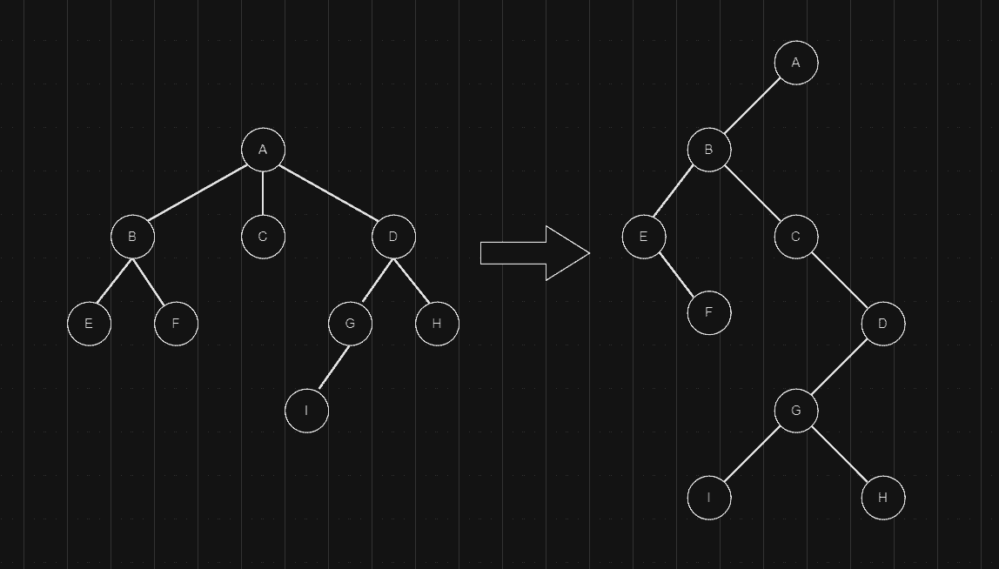
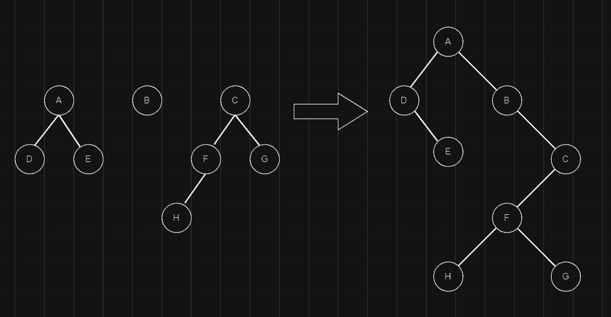
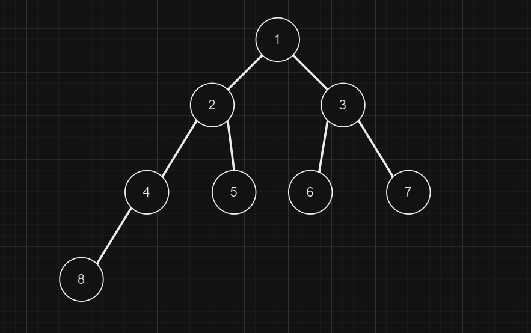

### 1.1 树

树（Tree）是 $n$ ($n\ge n$) 个节点的有限集合，当 $n=0$ 时，为空树。

任意一棵非空树，都满足：

1. 有且只有一个根节点
2. 除根节点外的其余节点可分为 $m$($m\gt 0$)个互不相交的有限集 $T_1,T_2,···,T_m$，其中每一个集合本身又是一棵树，称为根的子树

  

### 2.1 树的术语

| 术语                | 描述                                                         |
| ------------------- | ------------------------------------------------------------ |
| 节点的度            | 节点拥有的子树个数。                                         |
| 树的度              | 树中所有节点的度的最大值。                                   |
| 端点节点 / 叶子节点 | 度为 0 的节点。                                              |
| 分支节点 / 分支节点 | 度大于 0 的节点（除叶子节点其余节点都是分支节点）。          |
| 内部节点            | 除了树根和叶子，都是内部节点。                               |
| 节点的层次          | 从根到该节点的层数（根节点为第1层）。                        |
| 树的深度（或高度）  | 所有节点中最大的层数。                                       |
| 路劲                | 树中两个节点之间经过的结点序列。                             |
| 路径长度            | 两节点之间路径上经过的边数。                                 |
| 双亲、孩子          | 节点的子树的根被称为该节点的孩子，反之该节点为其孩子的双亲。 |
| 兄弟                | 双亲相同的节点互称兄弟。                                     |
| 堂兄弟              | 双亲是兄弟的节点，称为堂兄弟。                               |
| 祖先                | 从该节点到根经过的所有结点，称为该节点的祖先。               |
| 子孙                | 节点的子树中的所有节点，称为该节点的子孙。                   |
| 有序树              | 节点的各子树从左至右有序，不能互换位置。                     |
| 无序树              | 节点的各子树可互换位置。                                     |
| 森林                | 由 $m$($m\ge0$)颗不相交的树组成的集合。                      |

### 3.1 树的存储

#### 3.1.1 树的顺序存储

树中节点的数据关系是一对多的逻辑关系，所以不仅需要存储数据元素，还要存储他们之间的逻辑关系。



顺序存储有三种方法。

##### 3.1.1.1 双亲表示法

除了存储数据元素，还存储其双亲节点的存储位置下标，用 -1 表示不存在，每个节点都有两个域：**数据域 data**和**双亲域 parent**。（缺点：无法直接得到每个节点的孩子）

| index | data | parent |
| ----- | ---- | ------ |
| 0     | A    | -1     |
| 1     | B    | 0      |
| 2     | C    | 0      |
| 3     | D    | 0      |
| 4     | E    | 1      |
| 5     | F    | 1      |
| 6     | G    | 2      |
| 7     | H    | 3      |
| 8     | I    | 3      |
| 9     | J    | 6      |

##### 3.1.1.2 孩子表示法

除了存储数据元素，还要存储其所有孩子节点的存储位置下标。（缺点：不知道每个节点到底有多少孩子，因此只能按照树的度来分配孩子空间，可能造成空间浪费）

| index | data | child | child | child |
| ----- | ---- | ----- | ----- | ----- |
| 0     | A    | 1     | 2     | 3     |
| 1     | B    | 4     | 5     | -1    |
| 2     | C    | 6     | -1    | -1    |
| 3     | D    | 7     | 8     | -1    |
| 4     | E    | -1    | -1    | -1    |
| 5     | F    | -1    | -1    | -1    |
| 6     | G    | 9     | -1    | -1    |
| 7     | H    | -1    | -1    | -1    |
| 8     | I    | -1    | -1    | -1    |
| 9     | J    | -1    | -1    | -1    |

##### 3.1.1.3 双亲孩子表示法

除了存储数据元素，还要存储其双亲、所有孩子的存储位置下标。（可能造成空间浪费）

| index | data | parent | child | child | child |
| ----- | ---- | ------ | ----- | ----- | ----- |
| 0     | A    | -1     | 1     | 2     | 3     |
| 1     | B    | 0      | 4     | 5     | -1    |
| 2     | C    | 0      | 6     | -1    | -1    |
| 3     | D    | 0      | 7     | 8     | -1    |
| 4     | E    | 1      | -1    | -1    | -1    |
| 5     | F    | 1      | -1    | -1    | -1    |
| 6     | G    | 2      | 9     | -1    | -1    |
| 7     | H    | 3      | -1    | -1    | -1    |
| 8     | I    | 3      | -1    | -1    | -1    |
| 9     | J    | 6      | -1    | -1    | -1    |


#### 3.1.2 树的链式存储

由于树中每个节点的孩子的数量无法确定，因此在使用链式存储时，孩子指针域不确定分配多少个合适。如果采用“异构型”数据结构，将每个节点的指针域个数按照节点的孩子来分配，则不便于数据结构描述；如果采用每个节点都分配固定个数的指针域（树的度），则可能浪费很多空间。


可以考虑两种方法存储：

1. 采用**邻接表**，将节点的所有孩子都存储在一个单链表中，称为孩子链表表示法；
2. 采用**二叉链表**，左指针存储第一个孩子，右指针存储右兄弟，称为孩子兄弟表示法。

##### 3.1.2.1 孩子链表表示法

表头包含数据元素和指向第 1 个孩子指针，将所有孩子都放入一个单链表中，在表头中，`data` 存储数据元素，`first` 为指向第一个孩子的指针，单链表的节点记录该节点的下标和下一个节点的地址。

  

> 在孩子链表表示法的基础上再增加一个双亲域，则为双亲孩子链表表示法。


##### 3.1.2.2 孩子兄弟表示法

节点除了存储数据元素，还存储两个指针域：`lchild` 和 `rchild`，称为二叉链表。`lchild` 存储第一个孩子的地址，`rchild` 存储其右兄弟的地址，其节点数据结构如下图所示。

  

下图是用孩子兄弟表示法表示：



### 4.1 树、森林与二叉树的转换

#### 4.1.1 树与二叉树的转换

树转为二叉树的方法：将长子作为左孩子，将兄弟关系向右斜。孩子兄弟表示法。

  

二叉树还原为树的方法：转换二叉树反操作即可。

- B 是 A 的左孩子，说明 B 是 A 的长子，B、C、D 在 右斜线上，说明 B、C、D 是兄弟。
- E 是 B 的左孩子，说明 E 是 B 的长子，E、F 在右斜线上，说明E、F 是兄弟。
- G 是 D 的左孩子，说明 G 是 D 的长子，G、H 在右斜线上，说明 G、H 是兄弟。
- I 是 G 的左孩子，说明 I 是 G 的长子。

#### 4.1.2 森林和二叉树的转换

森林转为二叉树的方法：依然是使用孩子兄弟表示法。

  

二叉树转为森林的方法：转换二叉树的方法反操作即可。

> 实际应用中，由于普通树的每个节点的子树个数不同，存储和计算比较困难，因此可以将树或森林转换为二叉树。

### 5.1 二叉树

#### 5.1.1 二叉树的性质

**性质 1**：二叉树第 $i$ 层上**至多**有 $2^{i-1}$ 个节点(等差数列， $a_n=a_1 \times q^{n-1}$)。

**性质 2**：深度为 $k$ 的二叉树**至多**有 $2^k-1$ 个节点(等比数列求和， $S_n=a_1 \frac{1-q^n}{1-q}$ )。

**性质 3**：对于任意一棵二叉树，若叶子数为 $n_0$，度为 2 的节点数为 $n_2$，则 $n_0=n_2+1$

证明：

节点总数 $n$ 的计算方法，二叉树中的节点度数不超过 2，因此共有 3 种节点：度为 0、度为 1、度为 2。设二叉树总的节点数为 $n$，度为 0 的节点数为 $n_0$，度为 1 的节点数为 $n_1$，度为 2 的节点数为 $n_2$，节点总数 $n=n_0+n_1+n_2$ (1)

总节点数 $n$ 的计算方法，从下向上看，除了头节点之外的每一个节点都带有一个分支，所以节点总数 $n=b+1$ (2)

分支数 $b$ 的计算方法，从上向下看，每个度为 2 的节点产生 2 个分支，度为 1 的节点产生 1 产生 1 个分支，度为 0 的节点没有产生分支，所以分支数 $b=n_1+2n_2$ (3)

由 (1)、(2)、(3) 式得：

$$\begin{cases}
n=n_0+n_1+n_2\\
n=b+1\\
b=n_1+2n_2
\end{cases}$$

可得 $n_0=n_2+1$

**满二叉树**：

一颗深度为 $k$ 且有 $2^{k}-1$ 个节点的二叉树。

**完全二叉树**：

除最后一层外每一层都达到最大节点数，最后一层从左向右出现。深度为 $k$ 的完全二叉树，当且仅当每一个节点都与深度为 $k$ 的满二叉树中编号为 $1\sim n$ 的节点一一对应。

**性质 4**：具有 $n$ 个节点的完全二叉树的深度必为 $\lfloor\log_2n\rfloor + 1$

证明：

假设完全二叉树的深度为 $k$，那么除了最后一层，前 $k-1$ 层都是满的，最后一层至少有一个节点，至多达到最大节点数。

总结点数 $n$ 满足 $2^{k-1}\le n\le2^k-1$， 右边放大 $2^{k-1}\le n<2^k$，同时取对数 $k-1\le\log_2n$ 。

$$\begin{cases}
k\le\log_2n+1\\
k>\log_2n
\end{cases}$$

得 $k=\lfloor\log_2n\rfloor + 1$

**性质 5**：对于完全二叉树，若从上向下，从左向右编号，则编号为 $i$ 的节点，其左孩子编号必为 $2i$，其右孩子编号必为 $2i+1$，其双亲结点编号必为 $i/2$

  

例题 1：一颗完全二叉树有 1001 个节点，求其中叶子节点的个数。

节点 1001 编号的双亲结点编号为 1001 / 2 = 500，该节点是最后一个有孩子的节点，之后编号一直到 1001 都是没有孩子的节点，即叶子节点个数等于 1001 - 500 = 501

例题 2：一颗完全二叉树第 6 层有 8 个叶子节点，则该完全二叉树最少有多少个节点，最多有多少个节点。

当第 6 层为最后一层，即前 5 层是满的，得节点数最少有 $(2^5-1)+8=39$

当第 6 层为倒数第二层，第 7 层缺少 8*2 个节点，的节点数最多有 $(2^7-1)-2\times8=111$

#### 5.1.2 二叉树的存储结构

##### 5.1.2.1 顺序存储结构

按完全二叉树的节点层次编号，依次存放二叉树中的数据元素，完全二叉树适合顺序存储，能够很好的利用空间，普通二叉树可以进行顺序存储时，可以将其补充为完全二叉树，在对应的完全二叉树没有孩子的位置补 0。

##### 5.1.2.2 链式存储结构

每个节点包含数据域、左孩子指针域和右孩子指针域。

二叉链表结构体定义：

```cpp
typedef struct BNode {
    ElemType data;
    BNode* lchild, *rchild;
}BNode, *BTree;
```

三叉链表结构体定义：

```cpp
typedef struct BNode {
    ElemType data;
    BNode* lchild, *rchild, *parent;
}BNode, *BTree;
```

##### 5.1.2.3 二叉树的创建

###### 5.1.2.3.1 询问法

按先序遍历顺序，每次输入节点后，都询问是否创建该节点的左子树，如果是，则递归创建其左子树，否则其有左子树为空，在询问是否创建该节点的右子树，如果是，则递归创建其右子树，否则其右子树为空。

1) 输入节点信息，创建一个节点 T
2) 询问是否创建 T 的左子树，如果是，则递归创建其左子树，否则其左子树为空
3) 询问是否创建 T 的右孩子，如果是，则递归创建其右子树，否则其右子树为空

##### 5.1.2.3.2 补空法

如果左子树或右子树为空，则用特殊字符补空，例如 ‘#’，按先序遍历的顺序，得到先序遍历序列，根据该序列递归创建二叉树。

1. 输入补空后的二叉树先序遍历序列
2. 如果 `ch == '#'` ，则 `T = nullptr`，否则创建一个新节点 T，令 `T->data = ch`，递归创建 T 的左子树，递归创建 T 的右子树

