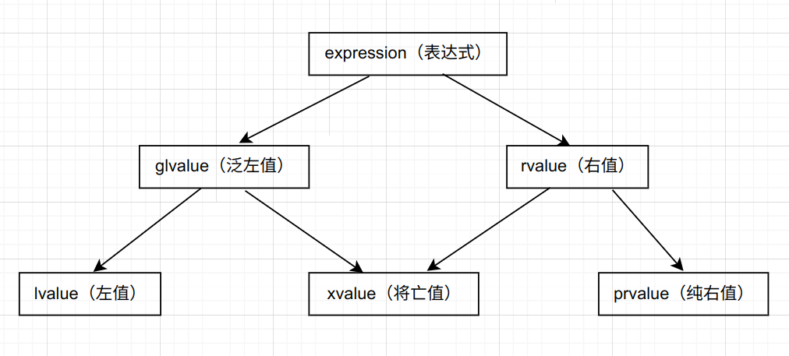

### 1. 左值和右值

C++ 中**左值**是指向特定内存的具有名称的值（具名对象）；**右值**是不指向稳定内存地址的匿名值（不具名对象）。通常可以用 `&` 来区分左值和右值，能取址的为左值，不能则为右值。

```cpp
int x = 1;

int getVal() {
    return x;
}

void setVal(int a) {
    &a;
    x = a;
}

int main() {
    &++x;
    // &x++; // compilation failed
    int y = getVal();
    // &getVal(); // compilation failed
    setVal(2);
    const char(*p)[] = &"hello";
}
```

字面量通常是右值，但是**字符串字面量是左值**，字符串字面量存储在程序的数据段，程序加载时会为其开辟内存空间。

当右值使用之后会马上销毁对象并释放内存。

```cpp
#include <iostream>

struct A {
    ~A() { std::cout << "~A()" << std::endl; }
};

int main(int argc, char const *argv[]) {
    A a = A();
    std::cout << "---" << std::endl;
    return 0;
}
```

运行结果：

```
~A()
---
～A()
```

### 2. 左值引用

非常量左值引用的对象必须是一个左值，常量左值引用的对象可以是左值也可以是右值：

```cpp
int a = 1;
int &ra = a;
// int &x = 1; // compilation failed
const int &x = 1;
const int &rx = x;
```

虽然 `const int &x = 1;` 和 `const int x = 1` 在结果上没区别，但在语法上，前者 `1` 的生命周期被延长了，后者在语句结束后右值 `1` 被销毁。函数形参中使用 `const &` 可以增加可接受参数的类型：

```cpp
struct A {};

void foo(const A &a) {}

int main(int argc, char const *argv[]) {
    foo(A());
    A a;
    foo(a);
    const A a2 = a;
    foo(a2);
    const A &a3 = a;
    foo(a3);
    return 0;
}
```

但函数 `foo` 无法对 `a` 进行修改（除强制类型转换）。

### 3. 右值引用

右值引用**只能引用右值**

```cpp
int &&i = 1;
int &&j = i; // compilation failed
```

右值引用可以延长右值的生命周期，减少对象复制：

```cpp
#include <iostream>

class X {
public:
    X() { std::cout << "X()" << std::endl; }
    X(const X &) { std::cout << "X(const X &)" << std::endl; }
    ~X() { std::cout << "~X()" << std::endl; }
};

X makeX() {
    X x1;
    return x1;
}

int main(int argc, char const *argv[]) {
    X &&x2 = makeX();
    // X x2 = makeX();
    return 0;
}
```

用 GCC 编译以上代码时需加上命令行参数 `-fno-elide-constructors` 用于关闭函数返回值优化（RVO），RVO 会减少构造函数的调用。同时 C++ 标准要求高于等于 C++11，低于 C++17。

运行结果：

```
X()
X(const X &)
~X()
~X()
```

取消注释，注释 `X &&x2 = makeX();`，运行结果：

```
X()
X(const X &)
~X()
X(const X &)
~X()
~X()
```

可以看出延长临时对象生命周期目的是减少对象复制。

### 4. 移动构造函数

```cpp
#include <iostream>
#include <string.h>

class MemoryPool {
public:
    MemoryPool() : pool_(new char[pool_size]) {}
    MemoryPool(const MemoryPool &other) : pool_(new char[pool_size]) {
        std::cout << "copy memory pool" << std::endl;
        memcpy(pool_, other.pool_, pool_size);
    }
    // MemoryPool(MemoryPool &&other) {
    //     std::cout << "move memory pool" << std::endl;
    //     pool_ = other.pool_;
    //     other.pool_ = nullptr;
    // }
    ~MemoryPool() {
        if (pool_ != nullptr) {
            delete[] pool_;
        }
    }
private:
    char *pool_;
    static const int pool_size = 4096;
};

MemoryPool getMemoryPool(const MemoryPool &pool) {
    return pool;
}

MemoryPool makePool() {
    MemoryPool pool;
    return getMemoryPool(pool);
}

int main(int argc, char const *argv[]) {
    MemoryPool pool = makePool();
    return 0;
}
```

运行结果：

```
copy memory pool
copy memory pool
copy memory pool
```

取消注释后的运行结果：

```cpp
copy memory pool
move memory pool
move memory pool
```

后两次构造函数调用了移动构造函数，因为这两次操作实参是右值（临时对象），对于右值，编译器会优先调用移动构造函数来构造目标对象。

复制构造函数 `MemoryPool(const MemoryPool &other)` 形参是**左值引用**类型。复制构造函数中往往是深复制，即在不破坏实参对象的前提下复制目标对象。

移动构造函数 `MemoryPool(MemoryPool &&other)` 形参是**右值引用**类型。通过转移实参对象来构建目标对象，实参对象是会被修改的。

```cpp
#include <iostream>
#include <string.h>
#include <chrono>

class MemoryPool {
public:
    MemoryPool() : pool_(new char[pool_size]) {}
    MemoryPool(const MemoryPool &other) : pool_(new char[pool_size]) {
        // std::cout << "copy memory pool" << std::endl;
        memcpy(pool_, other.pool_, pool_size);
    }
    MemoryPool(MemoryPool &&other) {
        // std::cout << "move memory pool" << std::endl;
        pool_ = other.pool_;
        other.pool_ = nullptr;
    }
    ~MemoryPool() {
        if (pool_ != nullptr) {
            delete[] pool_;
        }
    }
private:
    char *pool_;
    static const int pool_size = 4096;
};

MemoryPool getMemoryPool(const MemoryPool &pool) {
    return pool;
}

MemoryPool makePool() {
    MemoryPool pool;
    return getMemoryPool(pool);
}

int main(int argc, char const *argv[]) {
    auto start = std::chrono::high_resolution_clock::now();
    for (int i = 0; i < 1000000; ++i) {
        MemoryPool pool = makePool();
    }
    auto end = std::chrono::high_resolution_clock::now();
    std::chrono::duration<double> diff = end - start;
    std::cout << "time: " << diff.count() << " s" << std::endl;
    return 0;
}
```

运行结果（仅供参考）：

```
time: 0.0950749 s
```

注释移动构造函数后，运行结果（仅供参考）：

```
time: 0.216418 s
```

### 5. 移动赋值函数

```cpp
#include <iostream>
#include <string.h>

class MemoryPool {
public:
    MemoryPool() : pool_(new char[pool_size]) {}
    MemoryPool(const MemoryPool &other) : pool_(new char[pool_size]) {
        std::cout << "copy memory pool" << std::endl;
        memcpy(pool_, other.pool_, pool_size);
    }
    MemoryPool(MemoryPool &&other) {
        std::cout << "move memory pool" << std::endl;
        pool_ = other.pool_;
        other.pool_ = nullptr;
    }
    // 移动赋值
    MemoryPool &operator=(MemoryPool &&other) {
        std::cout << "move(operator=) memory pool" << std::endl;
        if (pool_ != nullptr) {
            delete[] pool_;
        }
        pool_ = other.pool_;
        other.pool_ = nullptr;
        return *this;
    }
    ~MemoryPool() {
        if (pool_ != nullptr) {
            delete[] pool_;
        }
    }
private:
    char *pool_;
    const static int pool_size = 4096;
};

MemoryPool getMemoryPool(const MemoryPool &pool) {
    return pool;
}

MemoryPool makeMemoryPool() {
    MemoryPool pool;
    return getMemoryPool(pool);
}

int main(int argc, char const *argv[]) {
    MemoryPool pool;
    pool = makeMemoryPool();
    return 0;
}
```

运行结果：

```
copy memory pool
move memory pool
move(operator=) memory pool
```

编译器会在没有任何**复制函数**（复制构造、复制赋值）、**移动函数**（移动构造、移动赋值）及**析构函数**的条件下会生成一份移动构造函数。

```cpp
#include <iostream>
#include <string.h>

class MemoryPool {
public:
    MemoryPool() : pool_(new char[pool_size]) {}
    // 复制构造
    MemoryPool(const MemoryPool &other) : pool_(new char[pool_size]) {
        std::cout << "copy memory pool" << std::endl;
        memcpy(pool_, other.pool_, pool_size);
    }
    // 移动构造
    MemoryPool(MemoryPool &&other) {
        std::cout << "move memory pool" << std::endl;
        pool_ = other.pool_;
        other.pool_ = nullptr;
    }
    // 复制赋值
    MemoryPool &operator=(const MemoryPool &other) {
        std::cout << "copy(operator=) memory pool" << std::endl;
        memcpy(pool_, other.pool_, pool_size);
        return *this;
    }
    // 移动赋值
    MemoryPool &operator=(MemoryPool &&other) {
        std::cout << "move(operator=) memory pool" << std::endl;
        if (pool_ != nullptr) {
            delete[] pool_;
        }
        pool_ = other.pool_;
        other.pool_ = nullptr;
        return *this;
    }
    ~MemoryPool() {
        if (pool_ != nullptr) {
            delete[] pool_;
        }
    }
private:
    char *pool_;
    const static int pool_size = 4096;
};

MemoryPool getMemoryPool(const MemoryPool &pool) {
    return pool;
}

MemoryPool makeMemoryPool() {
    MemoryPool pool;
    return getMemoryPool(pool);
}

int main(int argc, char const *argv[]) {
    MemoryPool pool;
    pool = makeMemoryPool();
    return 0;
}
```

在移动构造函数中，如果当一个对象的资源转移到另一个对象时发生异常，对象的一部分发生转移，另一部分没有，就会造成源对象和目标对象不完成的情况，所以在编写移动语义的函数时需确保函数不会抛出异常，如无法保证不会抛出异常，则使用 `noexcept` 说明符限制该函数。

### 6. 值类别

C++11 标准中引入的值类别概念，该属性将表达式分为 3 个类别：左值（lvalue）、纯右值（prvalue）、将亡值（xvalue），在 C++17 中完善。



泛左值是一个通过评估能够确定对象、位域或函数的标识的表达式，确定了对象或者函数的标识（具名对象）。

纯右值是指一个通过评估能够用于初始化对象和位域，或者能够计算运算符操作数的值的表达式。

纯右值是指一种表达式，它代表一个临时的、无名的值，该值在语句执行完后就会消失。这种值通常可以被用来初始化对象或位域，或者作为运算符的操作数。

将亡值属于泛左值的一种，表示资源可以被重用的对象和位域，通常这是因为他们接近其生命周期的末尾，另外也可能是经过右值引用的转换产生的。

纯右值转换到临时对象的过程为**临时量实质化**，当一个纯右值出现在泛左值的地方时，临时量实质化会发生，就是说创建一个临时对象并且使用纯右值对其进行初始化，临时对象就是一个将亡值。

```cpp
struct X {
    int a;
};

int main(int argc, char const *argv[]) {
    int b = X().a;
    return 0;
}
```

`X()` 是一个纯右值，访问其成员时需要一个泛左值，所以发生了临时量实质化，将 `X()` 转换为将亡值，然后访问其成员，在 C++17 之前临时变量是纯右值，只有转换为右值引用的类型才是将亡值。

### 7. 左值转换为右值

右值引用只能绑定右值，但在 C++11 中可以不创建临时值，显式的将左值通过 `static_cast` 转换为将亡值，从而被右值引用。

```cpp
#include <iostream>

class A {
public:
    A() {}
    ~A() { std::cout << "~A()" << std::endl; }
    int x = 1;
};

int main(int argc, char const *argv[]) {
    A a;
    {
        // A &&a1 = a; // compilation
        A &&a2 = static_cast<A &&>(a);
        a2.x = 2;
    }
    std::cout << a.x << std::endl;
    std::cout << "---" << std::endl;
    return 0;
}
```

转换的不是右值，因此 `a` 依然有和未转换之前相同的生命周期和内存地址，所以运行结果：

```
2
---
~A()
```

右值被转为左值后再次转换为右值，典型的例子是右值作为函数实参，无论函数的实参的值类型，**形参都是左值**。

```cpp
#include <iostream>
#include <string.h>

class MemoryPool {
public:
    MemoryPool() : pool_(new char[pool_size]) {}
    MemoryPool(const MemoryPool &other) : pool_(new char[pool_size]) {
        std::cout << "copy memory pool" << std::endl;
        memcpy(pool_, other.pool_, pool_size);
    }
    MemoryPool(MemoryPool &&other) {
        std::cout << "move memory pool" << std::endl;
        pool_ = other.pool_;
        other.pool_ = nullptr;
    }
    ~MemoryPool() {
        if (pool_ != nullptr) {
            delete[] pool_;
        }
    }
private:
    char *pool_;
    static const int pool_size = 4096;
};

void movePool(MemoryPool &&pool) {
    MemoryPool p(pool);
}

int main(int argc, char const *argv[]) {
    movePool(MemoryPool());
    return 0;
}
```

运行结果：

```
copy memory pool
```

想让 `foo` 调用移动构造函数，需要将形参 `pool` 进行强制转换为右值：

```cpp
void movePool(MemoryPool &&pool) {
    MemoryPool(static_cast<MemoryPool &&>(pool));
}
```

运行结果：

```
move memory pool
```

在 C++11 标准中，提供了 `std::move()` 函数模板，以便将一个左值转换为右值，其内部也是使用 `static_cast` 做类型转换：

```cpp
void movePool(MemoryPool &&pool) {
    MemoryPool p(std::move(pool));
}
```

### 8. 万能引用和引用折叠

```cpp
#include <iostream>

template<class T>
void foo(T &&t) {}

int getVal() { return 1; }
auto &&y = getVal();
auto &&z = getVal;

int main(int argc, char const *argv[]) {
    std::cout << z() << y << std::endl;
    return 0;
}
```

运行结果：

```
11
```

C++11 标准中，允许引用叠加推导的规则，引用折叠规定了在不同引用类型相互作用下的推导规则：

| 类模板型 | T 实际类型 | 最终类型 |
| -------- | ---------- | -------- |
| T &      | R          | R &      |
| T &      | R &        | R &      |
| T &      | R &&       | R &      |
| T &&     | R          | R &&     |
| T &&     | R &        | R &      |
| T &&     | R &&       | R &&     |

推导过程中只要有左值引用参与，最终类型就是左值引用。

### 9. 完美转发

```cpp
#include <iostream>
#include <string>

template<class T>
void showType(T t) {
    std::cout << typeid(t).name() << std::endl;
}

template<class T>
void normalForwarding(T t) {
    showType(t);
}

int main(int argc, char const *argv[]) {
    std::string str = "hello world";
    normalForwarding(str);
    return 0;
}
```

`normalForwarding` 函数可以完成字符串的转发，但是效率较低，因为其按值转发，`std::string` 在转发的过程中会额外发生一次临时对象的复制，其中一个解决方法是将形参类型修改为引用类型：

```cpp
template<class T>
void normalForwarding(T &t) { showType(t); }
```

但是无法传递右值：

```cpp
std::string getString() {
    return "hello world";
}

template<class T>
void normalForwarding(T &t) {
    showType(t);
}

int main(int argc, char const *argv[]) {
    normalForwarding(getString()); // compilation failed
    return 0;
}
```

也可以使用 `void normalForarding(const T &t)` 来解决问题，但是无法在函数中修改该字符串：

```cpp
template<class T>
void normalForwarding(const T &t) {
    t = "world"; // compilation failed
    showType(t);
}
```

万能引用是一个最终的解决方法，对于万能引用的形参而言，如果实参是一个右值，则形参被推导为右值引用，如果实参是左值，则形参被推导为左值引用，所以不会发生多余的临时复制问题：

```cpp
#include <iostream>
#include <string>

template<class T>
void showType(T t) {
    std::cout << typeid(t).name() << std::endl;
}

template<class T>
void perfectForwarding(T &&t) {
    showType(static_cast<T &&>(t));
}

int main(int argc, char const *argv[]) {
    std::string str = "hello";
    perfectForwarding(str);
    perfectForwarding(std::string("world"));
    return 0;
}
```

运行结果：

```
NSt7__cxx1112basic_stringIcSt11char_traitsIcESaIcEEE
0
1
0
NSt7__cxx1112basic_stringIcSt11char_traitsIcESaIcEEE
1
0
0
```

`showType(static_cast<T &&>(t))` 这里使用类型转换的原因是作为形参的 `t` 是左值，为了让转发将左右值的属性带到目标函数中，所以需要进行类型转换。

由于显示的使用类型转换并不方便，所以 C++11 标准中提供了 `std::forward` 函数模板，函数内部也是使用 `static_cast` 进行类型转换。

```cpp
template<class T>
void prefectForwarding(T &&t) {
    showType(std::forward<T>(t));
}
```

`std::move` 和 `std::forward` 在使用上有区别，`std::move` 一定会将实参转换为右值引用，且不需要指定模板参数，模板实参由函数调用推到出来，而 `std::forward` 会根据左值和右值的实际情况进行转发，在使用时需要指定模板实参。

### 10. 局部变量和右值引用的隐式移动

相同的代码及编译器选项，在新标准的编译器中，代码的执行效率会提升，原因是新标准的编译器在某些情况下将隐式复制修改为隐式移动。

```cpp
#include <iostream>

struct X {
    X() = default;
    X(const X &) = default;
    X(X &&) {
        std::cout << "move" << std::endl;
    }
};

X f(X x) {
    return x;
}

int main(int argc, char *argv[]) {
    X x = f(X());
    return 0;
}
```

`X x = f(X())` 在支持移动语义的新标准会采用移动构造函数，在旧时的标准中应该是一个复制操作。

对于局部变量也有相似的规则，但大多数编译器会采用更高效的返回值优化代替移动操作。

```cpp
X f() {
    X x;
    return x;
}

int main() {
    X x = f();
}
```

关闭返回值优化，运行程序会发现 `X x = f()` 也是调用移动构造函数。

在 C++20 标准中，隐式移动操作针对右值引用和 `throw` 的情况进行拓展：

```cpp
#include <iostream>
#include <string>

struct X {
    X() = default;
    X(const X &) = default;
    X(X &&) {
        std::cout << "move" << std::endl;
    }
};

X f(X &&x) {
    return x;
}

void test() {
    X x;
    throw x;
}

int main(int argc, char *argv[]) {
    X x = f(X());

    try {
        test();
    } catch (...) {
        
    }
    return 0;
}
```

