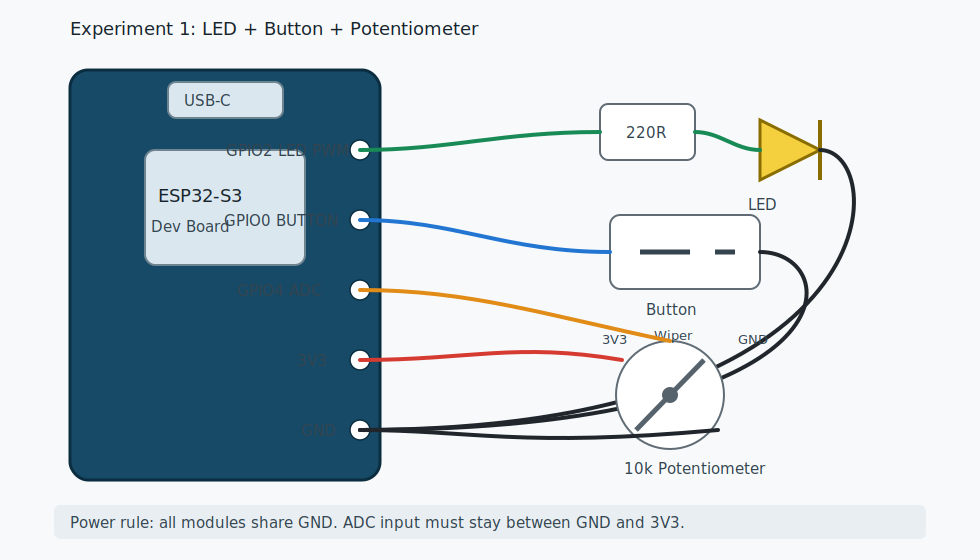

# 04 实验 1：GPIO、PWM、ADC

本实验把最基础的三件事放在一起：

```text
按键输入 -> 控制 LED 是否启用
电位器 ADC -> 读取模拟量
PWM 输出 -> 改变 LED 亮度
```

代码目录：

```text
examples/esp-idf/01_gpio_pwm_adc
```

源文件：

```text
examples/esp-idf/01_gpio_pwm_adc/main/main.c
```

## 接线图



## 实物接线

```text
LED:
  GPIO2 -> 220 欧到 1k 欧电阻 -> LED 正极
  LED 负极 -> GND

按键:
  GPIO0 -> 按键 -> GND
  程序使用内部上拉

电位器:
  中间脚 -> GPIO4
  两侧脚 -> 3V3 / GND
```

如果直接用开发板板载 BOOT 键，通常不用外接按键，因为 BOOT 键常接 GPIO0。

GPIO0 是启动相关引脚。学习时用它很方便；做正式项目时，建议换成普通空闲 GPIO，并同步修改代码：

```c
#define BUTTON_GPIO GPIO_NUM_0
```

## 烧录

```bash
cd examples/esp-idf/01_gpio_pwm_adc
idf.py set-target esp32s3
idf.py build
idf.py flash monitor
```

退出：

```text
Ctrl + ]
```

## 你应该看到什么

- 旋转电位器，LED 亮度变化。
- 按下按键，LED 在“启用”和“关闭”之间切换。
- 串口每 500 ms 打印一次：

```text
I (...) gpio_pwm_adc: adc_raw=2048 pwm_duty=127 button=1
```

`button=1` 表示按键松开，`button=0` 表示按下。

## 代码解析

### 1. 选择 GPIO 和 ADC 通道

```c
#define LED_GPIO GPIO_NUM_2
#define BUTTON_GPIO GPIO_NUM_0
#define ADC_CHANNEL ADC_CHANNEL_3 // GPIO4 on ESP32-S3
```

这三个宏把硬件接线集中在文件顶部。以后换脚，优先改这里。

注意 ADC 写的是 `ADC_CHANNEL_3`，不是 `GPIO_NUM_4`。在 ESP32-S3 上，本例用的 `ADC_CHANNEL_3` 对应 GPIO4。换 ADC 引脚时，要同时查清楚它对应哪个 ADC channel。

### 2. 配置按键输入

```c
gpio_config_t button_cfg = {
    .pin_bit_mask = 1ULL << BUTTON_GPIO,
    .mode = GPIO_MODE_INPUT,
    .pull_up_en = GPIO_PULLUP_ENABLE,
    .pull_down_en = GPIO_PULLDOWN_DISABLE,
    .intr_type = GPIO_INTR_DISABLE,
};
ESP_ERROR_CHECK(gpio_config(&button_cfg));
```

这段代码做了 4 件事：

- 把 GPIO0 配成输入。
- 打开内部上拉。
- 关闭内部下拉。
- 不使用中断，主循环里轮询。

内部上拉的效果：

```text
松开：GPIO 被内部电阻拉到高电平，读到 1
按下：GPIO 被按键接到 GND，读到 0
```

### 3. 配置 LEDC PWM 定时器

```c
ledc_timer_config_t timer_cfg = {
    .speed_mode = LEDC_LOW_SPEED_MODE,
    .duty_resolution = LEDC_TIMER_8_BIT,
    .timer_num = LEDC_TIMER_0,
    .freq_hz = 5000,
    .clk_cfg = LEDC_AUTO_CLK,
};
ESP_ERROR_CHECK(ledc_timer_config(&timer_cfg));
```

这里设置 PWM：

| 字段 | 含义 |
| --- | --- |
| `LEDC_TIMER_8_BIT` | 占空比范围 0 到 255 |
| `freq_hz = 5000` | PWM 频率 5 kHz |
| `LEDC_LOW_SPEED_MODE` | 使用低速 LEDC 模式 |

频率足够高时，人眼看到的是平均亮度，不会明显闪烁。

### 4. 把 PWM 输出绑定到 GPIO2

```c
ledc_channel_config_t channel_cfg = {
    .gpio_num = LED_GPIO,
    .speed_mode = LEDC_LOW_SPEED_MODE,
    .channel = LEDC_CHANNEL_0,
    .timer_sel = LEDC_TIMER_0,
    .duty = 0,
    .hpoint = 0,
};
ESP_ERROR_CHECK(ledc_channel_config(&channel_cfg));
```

定时器决定“PWM 怎么计时”，通道决定“PWM 从哪个 GPIO 输出”。

### 5. 初始化 ADC

```c
adc_oneshot_unit_handle_t adc_handle;
adc_oneshot_unit_init_cfg_t adc_init_cfg = {
    .unit_id = ADC_UNIT_1,
};
ESP_ERROR_CHECK(adc_oneshot_new_unit(&adc_init_cfg, &adc_handle));
```

`adc_oneshot_new_unit()` 创建 ADC1 的句柄。Oneshot 模式适合这种“循环里读一次”的简单采样。

然后配置通道：

```c
adc_oneshot_chan_cfg_t adc_chan_cfg = {
    .atten = ADC_ATTEN_DB_12,
    .bitwidth = ADC_BITWIDTH_DEFAULT,
};
ESP_ERROR_CHECK(adc_oneshot_config_channel(adc_handle, ADC_CHANNEL, &adc_chan_cfg));
```

`ADC_ATTEN_DB_12` 允许测量更高的输入电压范围，适合 0 到 3.3V 电位器实验。这里读到的是原始值，不是精确毫伏值。

### 6. 按键消抖和状态切换

```c
int button = gpio_get_level(BUTTON_GPIO);
if (last_button == 1 && button == 0) {
    led_enabled = !led_enabled;
    ESP_LOGI(TAG, "button pressed, led_enabled=%d", led_enabled);
    vTaskDelay(pdMS_TO_TICKS(40));
}
last_button = button;
```

这段只在“从松开变成按下”的瞬间触发一次，叫边沿检测。

`vTaskDelay(40 ms)` 是简单消抖。机械按键按下时电平会抖动几毫秒，如果不消抖，程序可能以为你按了很多次。

### 7. ADC 控制 PWM

```c
int raw = 0;
ESP_ERROR_CHECK(adc_oneshot_read(adc_handle, ADC_CHANNEL, &raw));
uint32_t duty = raw * 255 / 4095;
```

默认 ADC 原始值近似是 0 到 4095。PWM 是 8 bit，占空比是 0 到 255。所以把 ADC 映射到 PWM：

```text
0    -> 0
2048 -> 127
4095 -> 255
```

更新 PWM：

```c
ESP_ERROR_CHECK(ledc_set_duty(LEDC_LOW_SPEED_MODE, LEDC_CHANNEL_0, led_enabled ? duty : 0));
ESP_ERROR_CHECK(ledc_update_duty(LEDC_LOW_SPEED_MODE, LEDC_CHANNEL_0));
```

`ledc_set_duty()` 只是设置新值，`ledc_update_duty()` 才让新值生效。

## 你可以改什么

### 改 LED 引脚

```c
#define LED_GPIO GPIO_NUM_2
```

换成你的空闲 GPIO，例如：

```c
#define LED_GPIO GPIO_NUM_10
```

### 改 PWM 频率

```c
.freq_hz = 5000,
```

LED 调光常用几百 Hz 到几 kHz。频率太低会闪，频率太高会影响可用分辨率。

### 改亮度曲线

人眼对亮度不是线性敏感。可以先简单平方一下：

```c
uint32_t duty = (uint32_t)((uint64_t)raw * raw * 255 / (4095ULL * 4095ULL));
```

这里用 `uint64_t` 是为了避免中间乘法溢出，也避免过早整数除法导致大部分结果变成 0。

## 常见问题

### LED 不亮

- LED 极性反了。
- 没串电阻或接线断了。
- GPIO2 在你的板子上被占用，换一个 GPIO。
- LED 负极没有接 GND。

### 按键一按就烧录失败

GPIO0 是 BOOT 脚。烧录和复位时不要让它一直被外部电路拉低。正式项目换普通 GPIO。

### ADC 一直是 0 或 4095

- 电位器两侧没有接到 3V3/GND。
- 中间脚没有接 GPIO4。
- 用错 ADC channel。
- 接到了 5V，立刻断电检查，避免损坏。

### LED 亮度变化不明显

- 电位器中间脚没接对。
- LED 限流电阻太大。
- LED 接法是低电平点亮，但代码按高电平点亮写的。

## 验收

你能做到这些，就可以进入下一个实验：

- 不看文档也能说出按键为什么松开是 1、按下是 0。
- 能解释 PWM 是占空比，不是真正改变 GPIO 电压。
- 能根据串口 `adc_raw` 判断电位器接线是否正常。
- 能换一个普通 GPIO 控制 LED。

下一章：[05 Wi-Fi 与 HTTP GET](05_experiment_wifi_http.md)。
