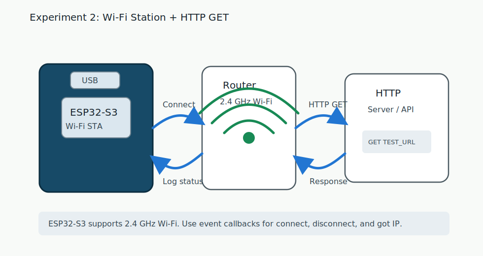

# 05 实验 2：Wi-Fi 与 HTTP GET

本实验让 ESP32-S3 像手机一样连接路由器，然后发一个 HTTP GET 请求。

代码目录：

```text
examples/esp-idf/02_wifi_http
```

源文件：

```text
examples/esp-idf/02_wifi_http/main/main.c
```

## 流程图



## 接线

本实验不需要额外外设，只需要：

```text
电脑 USB -> ESP32-S3
```

ESP32-S3 需要连接 2.4 GHz Wi-Fi。只开 5 GHz 的热点无法连接。

## 修改配置

打开：

```text
examples/esp-idf/02_wifi_http/main/main.c
```

修改：

```c
#define WIFI_SSID "YOUR_WIFI_SSID"
#define WIFI_PASS "YOUR_WIFI_PASSWORD"
#define TEST_URL "http://worldtimeapi.org/api/timezone/Etc/UTC"
```

例如：

```c
#define WIFI_SSID "my_home_wifi"
#define WIFI_PASS "12345678"
```

如果你的网络不能访问默认 `TEST_URL`，可以换成你自己的局域网 HTTP 服务。

## 烧录

```bash
cd examples/esp-idf/02_wifi_http
idf.py set-target esp32s3
idf.py build
idf.py flash monitor
```

## 你应该看到什么

连接成功时：

```text
I (...) wifi_http: got ip: 192.168.1.23
I (...) wifi_http: connected to ap SSID:my_home_wifi
```

之后每 10 秒发一次 HTTP GET，并打印响应片段和状态码：

```text
I (...) wifi_http: HTTP status=200 content_length=...
```

如果密码错误或信号太差，会看到重试日志：

```text
W (...) wifi_http: Wi-Fi disconnected, retry 1
```

## 代码解析

### 1. Wi-Fi 配置宏

```c
#define WIFI_SSID "YOUR_WIFI_SSID"
#define WIFI_PASS "YOUR_WIFI_PASSWORD"
#define TEST_URL "http://worldtimeapi.org/api/timezone/Etc/UTC"
```

示例为了直观，把 Wi-Fi 名称和密码直接写在代码里。公开仓库或正式产品不要这样保存密码，后面可以迁移到 NVS 或配网页面。

### 2. 事件组：等待连接完成

```c
#define WIFI_CONNECTED_BIT BIT0
#define WIFI_FAIL_BIT BIT1
```

ESP-IDF 的 Wi-Fi 是事件驱动的。程序不能假设 `esp_wifi_start()` 后立刻联网成功，所以用 FreeRTOS Event Group 表示状态：

```text
WIFI_CONNECTED_BIT：已经拿到 IP
WIFI_FAIL_BIT：重试多次仍失败
```

### 3. Wi-Fi 事件处理函数

```c
static void wifi_event_handler(void *arg, esp_event_base_t event_base, int32_t event_id, void *event_data)
```

里面处理三类事件。

启动后开始连接：

```c
if (event_base == WIFI_EVENT && event_id == WIFI_EVENT_STA_START) {
    esp_wifi_connect();
}
```

断线后重连：

```c
else if (event_base == WIFI_EVENT && event_id == WIFI_EVENT_STA_DISCONNECTED) {
    if (retry_count < MAX_RETRY) {
        retry_count++;
        ESP_LOGW(TAG, "Wi-Fi disconnected, retry %d", retry_count);
        esp_wifi_connect();
    } else {
        xEventGroupSetBits(wifi_event_group, WIFI_FAIL_BIT);
    }
}
```

拿到 IP 后通知主流程：

```c
else if (event_base == IP_EVENT && event_id == IP_EVENT_STA_GOT_IP) {
    ip_event_got_ip_t *event = (ip_event_got_ip_t *)event_data;
    ESP_LOGI(TAG, "got ip: " IPSTR, IP2STR(&event->ip_info.ip));
    retry_count = 0;
    xEventGroupSetBits(wifi_event_group, WIFI_CONNECTED_BIT);
}
```

重点是：Wi-Fi 连接、断线、拿 IP 都不是同步返回结果，而是通过事件告诉你。

### 4. 初始化网络栈

```c
ESP_ERROR_CHECK(esp_netif_init());
ESP_ERROR_CHECK(esp_event_loop_create_default());
esp_netif_create_default_wifi_sta();
```

这三步准备 ESP-IDF 的网络接口和默认事件循环。

### 5. 初始化 Wi-Fi 驱动

```c
wifi_init_config_t cfg = WIFI_INIT_CONFIG_DEFAULT();
ESP_ERROR_CHECK(esp_wifi_init(&cfg));
```

`WIFI_INIT_CONFIG_DEFAULT()` 给出大多数项目够用的默认配置。

注册事件处理函数：

```c
ESP_ERROR_CHECK(esp_event_handler_instance_register(WIFI_EVENT, ESP_EVENT_ANY_ID, wifi_event_handler, NULL, NULL));
ESP_ERROR_CHECK(esp_event_handler_instance_register(IP_EVENT, IP_EVENT_STA_GOT_IP, wifi_event_handler, NULL, NULL));
```

### 6. 设置 STA 模式

```c
wifi_config_t wifi_config = {
    .sta = {
        .ssid = WIFI_SSID,
        .password = WIFI_PASS,
        .threshold.authmode = WIFI_AUTH_WPA2_PSK,
    },
};

ESP_ERROR_CHECK(esp_wifi_set_mode(WIFI_MODE_STA));
ESP_ERROR_CHECK(esp_wifi_set_config(WIFI_IF_STA, &wifi_config));
ESP_ERROR_CHECK(esp_wifi_start());
```

`WIFI_MODE_STA` 表示 Station 模式，ESP32-S3 作为客户端连接路由器。

### 7. 等待连接结果

```c
EventBits_t bits = xEventGroupWaitBits(
    wifi_event_group,
    WIFI_CONNECTED_BIT | WIFI_FAIL_BIT,
    pdFALSE,
    pdFALSE,
    pdMS_TO_TICKS(30000));
```

最多等 30 秒。拿到 IP 就继续；失败就打印错误。

### 8. HTTP 响应回调

```c
static esp_err_t http_event_handler(esp_http_client_event_t *evt)
{
    if (evt->event_id == HTTP_EVENT_ON_DATA && evt->data_len > 0) {
        printf("%.*s", evt->data_len, (char *)evt->data);
    }
    return ESP_OK;
}
```

当 HTTP 客户端收到数据时，会触发 `HTTP_EVENT_ON_DATA`。这里直接把响应内容打印到串口。

`%.*s` 的写法表示只打印 `data_len` 长度，避免响应数据没有字符串结尾时越界。

### 9. 发起一次 HTTP GET

```c
esp_http_client_config_t config = {
    .url = TEST_URL,
    .event_handler = http_event_handler,
    .timeout_ms = 5000,
};
esp_http_client_handle_t client = esp_http_client_init(&config);
esp_err_t err = esp_http_client_perform(client);
```

流程是：

```text
创建 client -> perform 执行请求 -> 读取状态码 -> cleanup 释放资源
```

执行成功后打印状态码：

```c
ESP_LOGI(TAG, "HTTP status=%d content_length=%lld",
         esp_http_client_get_status_code(client),
         esp_http_client_get_content_length(client));
```

### 10. NVS 初始化

```c
esp_err_t ret = nvs_flash_init();
if (ret == ESP_ERR_NVS_NO_FREE_PAGES || ret == ESP_ERR_NVS_NEW_VERSION_FOUND) {
    ESP_ERROR_CHECK(nvs_flash_erase());
    ESP_ERROR_CHECK(nvs_flash_init());
}
```

ESP-IDF Wi-Fi 需要 NVS 保存一些校准和配置数据。所以使用 Wi-Fi 前通常要初始化 NVS。

## 你可以改什么

### 改请求间隔

```c
vTaskDelay(pdMS_TO_TICKS(10000));
```

单位是毫秒。改成 3000 表示 3 秒一次。

### 改 URL

```c
#define TEST_URL "http://你的服务器/path"
```

先用 HTTP，不要一上来用 HTTPS。HTTPS 还涉及证书校验，排障复杂度会高很多。

### 改重试次数

```c
#define MAX_RETRY 10
```

真实项目通常不会永久阻塞在“首次连接”这里，而是进入离线状态，后台继续重连。

## 常见问题

### 一直连不上 Wi-Fi

- 确认 Wi-Fi 是 2.4 GHz。
- 检查 SSID 和密码是否包含中文、空格或隐藏字符。
- 手机热点先试一遍，排除路由器隔离。
- 板子离路由器近一点。
- 如果是开放网络，代码里的 `.threshold.authmode = WIFI_AUTH_WPA2_PSK` 可能不适合。

### got ip 了，但 HTTP 失败

- 默认 URL 可能被网络阻断或 DNS 失败。
- 电脑、校园网、公司网可能限制外网 HTTP。
- 换成你电脑上的局域网 HTTP 服务测试。

### 串口打印乱码

- monitor 波特率不对。
- 复位后 USB 端口重新枚举，monitor 连到了旧端口。

## 验收

你能做到这些，就可以进入 I2S 麦克风实验：

- 能解释 STA 模式是什么。
- 能从串口找到开发板 IP。
- 改错密码时能看到重试。
- 能把 `TEST_URL` 换成自己的 HTTP 地址。
- 知道为什么 Wi-Fi 示例要初始化 NVS。

下一章：[06 I2S 麦克风 RMS](06_experiment_i2s_mic.md)。
