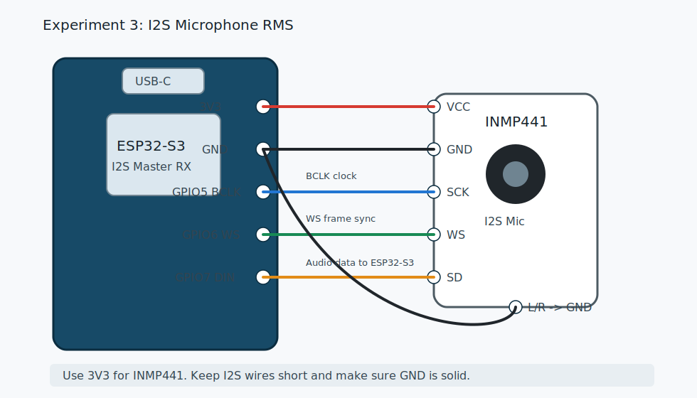

# 06 实验 3：I2S 麦克风采集 RMS 音量

本实验接入 INMP441 这类 I2S 数字麦克风，读取 16 kHz 音频帧，并在串口打印最小值、最大值和 RMS 音量。

代码目录：

```text
examples/esp-idf/03_i2s_mic_rms
```

源文件：

```text
examples/esp-idf/03_i2s_mic_rms/main/main.c
```

## 接线图



## 实物接线

以 INMP441 为例：

```text
INMP441 -> ESP32-S3
VCC     -> 3V3
GND     -> GND
SCK     -> GPIO5
WS      -> GPIO6
SD      -> GPIO7
L/R     -> GND
```

`L/R` 决定麦克风输出在左声道还是右声道。默认接 GND。如果读数不对，可以试着改接 3V3，或者调整 I2S slot 配置。

## 烧录

```bash
cd examples/esp-idf/03_i2s_mic_rms
idf.py set-target esp32s3
idf.py build
idf.py flash monitor
```

## 你应该看到什么

串口持续打印：

```text
I (...) i2s_mic_rms: samples=320 min=-123 max=456 rms=18.23
```

安静时 RMS 较小；对着麦克风说话、拍手、吹气，RMS 会明显变大。

## 音频参数

示例使用：

```c
#define SAMPLE_RATE 16000
#define FRAME_SAMPLES 320 // 20 ms at 16 kHz
```

计算：

```text
16000 samples/s * 0.02 s = 320 samples
```

也就是说，程序每次读取约 20 ms 的音频。

## 代码解析

### 1. I2S 引脚宏

```c
#define I2S_MIC_BCLK GPIO_NUM_5
#define I2S_MIC_WS GPIO_NUM_6
#define I2S_MIC_DIN GPIO_NUM_7
```

I2S 麦克风有三根核心信号线：

| 信号 | 含义 | 方向 |
| --- | --- | --- |
| BCLK / SCK | 位时钟 | ESP32-S3 输出给麦克风 |
| WS / LRCLK | 声道选择/帧同步 | ESP32-S3 输出给麦克风 |
| DIN | ESP32-S3 的数据输入 | 麦克风 SD 输出到 ESP32-S3 |

### 2. 创建 I2S RX 通道

```c
static i2s_chan_handle_t rx_chan;

i2s_chan_config_t chan_cfg = I2S_CHANNEL_DEFAULT_CONFIG(I2S_NUM_AUTO, I2S_ROLE_MASTER);
ESP_ERROR_CHECK(i2s_new_channel(&chan_cfg, NULL, &rx_chan));
```

`I2S_ROLE_MASTER` 表示 ESP32-S3 产生 BCLK 和 WS。INMP441 是从设备，跟着 ESP32-S3 的时钟输出数据。

`i2s_new_channel(&chan_cfg, NULL, &rx_chan)` 的第二个参数是 TX，第三个参数是 RX。这里只接收，所以 TX 传 `NULL`。

### 3. 配置 I2S 标准模式

```c
i2s_std_config_t std_cfg = {
    .clk_cfg = I2S_STD_CLK_DEFAULT_CONFIG(SAMPLE_RATE),
    .slot_cfg = I2S_STD_PHILIPS_SLOT_DEFAULT_CONFIG(I2S_DATA_BIT_WIDTH_32BIT, I2S_SLOT_MODE_MONO),
    .gpio_cfg = {
        .mclk = I2S_GPIO_UNUSED,
        .bclk = I2S_MIC_BCLK,
        .ws = I2S_MIC_WS,
        .dout = I2S_GPIO_UNUSED,
        .din = I2S_MIC_DIN,
    },
};
```

关键点：

- `SAMPLE_RATE` 是采样率，语音识别常用 16 kHz。
- `I2S_DATA_BIT_WIDTH_32BIT` 表示每个采样槽按 32 bit 接收。
- `I2S_SLOT_MODE_MONO` 表示单声道。
- `dout` 不用，因为麦克风实验只接收。
- `mclk` 不用，INMP441 常见模块不需要外接 MCLK。

然后初始化并启用：

```c
ESP_ERROR_CHECK(i2s_channel_init_std_mode(rx_chan, &std_cfg));
ESP_ERROR_CHECK(i2s_channel_enable(rx_chan));
```

### 4. 读取一帧音频

```c
int32_t samples[FRAME_SAMPLES];
size_t bytes_read = 0;
ESP_ERROR_CHECK(i2s_channel_read(rx_chan, samples, sizeof(samples), &bytes_read, portMAX_DELAY));
```

`portMAX_DELAY` 表示一直等到读到数据。I2S 驱动底层用 DMA 接收音频，应用层按帧取数据。

计算样本个数：

```c
int sample_count = bytes_read / sizeof(int32_t);
```

### 5. 为什么要右移 14 位

```c
int32_t s = samples[i] >> 14;
```

很多 I2S 数字麦克风的有效音频位在 32 bit 数据的高位，低位可能没有有效信息。右移是为了把数值缩到更方便观察的范围。

这不是唯一正确的缩放值。不同麦克风模块、slot 配置、位宽配置可能需要调整。如果你后面要保存 16 bit PCM，可以用实际听感和波形来校准移位量。

### 6. 计算 min、max、RMS

```c
if (s < min_sample) {
    min_sample = s;
}
if (s > max_sample) {
    max_sample = s;
}
sum_square += (double)s * (double)s;
```

RMS：

```c
double rms = sqrt(sum_square / sample_count);
```

RMS 可以理解为“这一帧声音的平均能量”。它比单独看最大值更稳定，适合做：

- 音量显示
- 拍手检测
- 说话检测
- 静音判断

## 你可以改什么

### 改采样率

```c
#define SAMPLE_RATE 16000
```

语音识别常用 16 kHz。8 kHz 更省带宽，但声音信息少；24 kHz 或 48 kHz 信息更多，但内存和带宽压力更大。

### 改帧长

```c
#define FRAME_SAMPLES 320
```

16 kHz 下：

```text
160 samples = 10 ms
320 samples = 20 ms
640 samples = 40 ms
```

实时语音常用 20 ms 左右的帧。

### 做一个说话检测

可以在 RMS 大于阈值时点亮 LED：

```c
if (rms > 100.0) {
    // speaking
}
```

阈值必须根据你自己的麦克风、环境噪声和移位量实测。

## 常见问题

### RMS 一直是 0

- 麦克风 VCC 没接 3V3。
- `SD` 没接到代码里的 `din`。
- BCLK 和 WS 接反。
- L/R 声道选择不匹配，试试把 L/R 从 GND 改到 3V3。

### RMS 一直很大

- 数据线悬空。
- GND 没接牢。
- 供电噪声太大。
- 位宽或移位量不合适。

### 编译时报 `driver/i2s_std.h` 找不到

你可能使用 ESP-IDF v4.x。请换 ESP-IDF v5.1 或更新版本。

### 拍手没变化

- 麦克风孔被挡住。
- 接线太长或接触不良。
- `samples[i] >> 14` 缩放后太小，试试改成 `>> 12` 或 `>> 8` 观察。

## 验收

你能做到这些，就可以进入扬声器实验：

- 串口能稳定打印 RMS。
- 安静和说话时 RMS 明显不同。
- 能解释 BCLK、WS、DIN 分别是什么。
- 能说出为什么每帧 320 个采样约等于 20 ms。

下一章：[07 I2S 扬声器提示音](07_experiment_i2s_speaker.md)。
