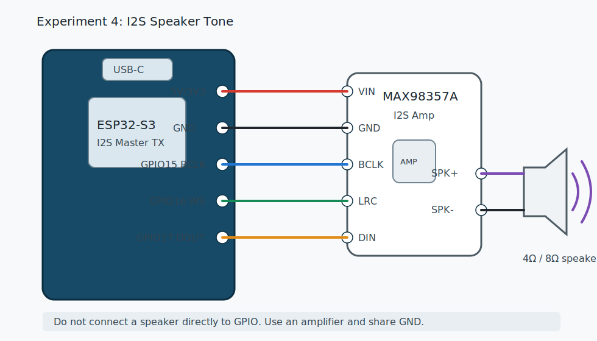

# 07 实验 4：I2S 扬声器播放提示音

本实验接入 MAX98357A 这类 I2S 数字功放，用 ESP32-S3 生成 440 Hz 正弦波 PCM，并通过扬声器播放。

代码目录：

```text
examples/esp-idf/04_i2s_speaker_tone
```

源文件：

```text
examples/esp-idf/04_i2s_speaker_tone/main/main.c
```

## 接线图



## 实物接线

以 MAX98357A 为例：

```text
MAX98357A -> ESP32-S3
VIN       -> 5V 或 3V3，按模块说明选择
GND       -> GND
BCLK      -> GPIO15
LRC / WS  -> GPIO16
DIN       -> GPIO17
SPK+      -> 扬声器一端
SPK-      -> 扬声器另一端
```

不要把扬声器直接接 ESP32-S3 GPIO。GPIO 只能输出数字信号，不能直接推动语音扬声器。

如果功放使用外部 5V 供电，外部电源 GND 必须和 ESP32-S3 GND 相连。

## 烧录

```bash
cd examples/esp-idf/04_i2s_speaker_tone
idf.py set-target esp32s3
idf.py build
idf.py flash monitor
```

## 你应该听到什么

烧录后，扬声器持续播放 440 Hz 提示音。串口会打印：

```text
I (...) i2s_speaker: playing 440 Hz tone
```

如果声音太大，可以先把功放供电改成 3V3，或者降低代码中的幅度。

## 代码解析

### 1. 数学库和 `M_PI`

```c
#include <math.h>
```

代码用 `sin()` 生成正弦波。部分环境可能没有定义 `M_PI`，所以示例补了一个：

```c
#ifndef M_PI
#define M_PI 3.14159265358979323846
#endif
```

对应 `main/CMakeLists.txt` 里链接数学库：

```cmake
target_link_libraries(${COMPONENT_LIB} PRIVATE m)
```

### 2. I2S 功放引脚

```c
#define I2S_SPK_BCLK GPIO_NUM_15
#define I2S_SPK_WS GPIO_NUM_16
#define I2S_SPK_DOUT GPIO_NUM_17
```

这里的 `DOUT` 是从 ESP32-S3 视角说的：数据从 ESP32-S3 输出到功放的 `DIN`。

### 3. 音频参数

```c
#define SAMPLE_RATE 16000
#define TONE_HZ 440
#define FRAME_SAMPLES 320
```

含义：

- 每秒输出 16000 个采样。
- 正弦波频率是 440 Hz。
- 每帧 320 个采样，也就是 20 ms。

### 4. 创建 I2S TX 通道

```c
static i2s_chan_handle_t tx_chan;

i2s_chan_config_t chan_cfg = I2S_CHANNEL_DEFAULT_CONFIG(I2S_NUM_AUTO, I2S_ROLE_MASTER);
ESP_ERROR_CHECK(i2s_new_channel(&chan_cfg, &tx_chan, NULL));
```

`i2s_new_channel(&chan_cfg, &tx_chan, NULL)` 的第二个参数是 TX，第三个参数是 RX。扬声器只输出，所以 RX 传 `NULL`。

### 5. 配置 I2S 标准输出

```c
i2s_std_config_t std_cfg = {
    .clk_cfg = I2S_STD_CLK_DEFAULT_CONFIG(SAMPLE_RATE),
    .slot_cfg = I2S_STD_PHILIPS_SLOT_DEFAULT_CONFIG(I2S_DATA_BIT_WIDTH_16BIT, I2S_SLOT_MODE_MONO),
    .gpio_cfg = {
        .mclk = I2S_GPIO_UNUSED,
        .bclk = I2S_SPK_BCLK,
        .ws = I2S_SPK_WS,
        .dout = I2S_SPK_DOUT,
        .din = I2S_GPIO_UNUSED,
    },
};
```

功放播放 16 bit PCM，所以这里用：

```c
I2S_DATA_BIT_WIDTH_16BIT
```

然后初始化并启用：

```c
ESP_ERROR_CHECK(i2s_channel_init_std_mode(tx_chan, &std_cfg));
ESP_ERROR_CHECK(i2s_channel_enable(tx_chan));
```

### 6. 生成正弦波 PCM

```c
int16_t frame[FRAME_SAMPLES];
double phase = 0;
double step = 2.0 * M_PI * TONE_HZ / SAMPLE_RATE;
```

`phase` 是当前相位，`step` 是每个采样点前进多少相位。

采样率 16000、频率 440 时：

```text
每秒 16000 个点
每秒正弦波转 440 圈
每个点前进 2π * 440 / 16000
```

填充一帧：

```c
for (int i = 0; i < FRAME_SAMPLES; i++) {
    frame[i] = (int16_t)(sin(phase) * 8000);
    phase += step;
    if (phase > 2.0 * M_PI) {
        phase -= 2.0 * M_PI;
    }
}
```

`8000` 是幅度。16 bit 有符号 PCM 范围大约是 -32768 到 32767。用 8000 是为了留余量，避免声音过大或削波。

### 7. 写入 I2S

```c
size_t bytes_written = 0;
ESP_ERROR_CHECK(i2s_channel_write(tx_chan, frame, sizeof(frame), &bytes_written, portMAX_DELAY));
```

`i2s_channel_write()` 会把 PCM 数据送入 I2S 驱动。后续播放 TTS 或 WAV，本质上也是不断把 PCM 写入这里。

## 你可以改什么

### 改音调

```c
#define TONE_HZ 440
```

改成 880 会高一个八度，改成 220 会低一个八度。

### 改音量

```c
frame[i] = (int16_t)(sin(phase) * 8000);
```

把 8000 改小，音量变小；改大，音量变大。不要一开始就改到 30000，容易刺耳或失真。

### 改采样率

```c
#define SAMPLE_RATE 16000
```

语音提示音和 TTS 常用 16 kHz 或 24 kHz。音乐播放通常更高，但资源压力也更大。

## 常见问题

### 完全没声音

- 功放 VIN 没供电。
- GND 没共地。
- BCLK、LRC、DIN 接反。
- 扬声器没接到 SPK+ / SPK-。
- GPIO15/16/17 在你的板子上被占用。

### 声音很小

- 功放用 3V3 供电，输出功率较低。
- 幅度 8000 对你的喇叭偏小。
- 扬声器阻抗或功率不匹配。

### 声音破裂或爆音

- 幅度太大。
- 供电不足。
- 杜邦线太长或接触不良。
- 扬声器功率过大，USB 供电撑不住。

### 烧录后 Wi-Fi 或板子重启

扬声器响的时候电流会增加。如果 USB 口供电弱，可能导致电压跌落。先降低音量，或者给功放单独供电并共地。

## 验收

你能做到这些，就可以进入录音上传实验：

- 能听到稳定 440 Hz 提示音。
- 改 `TONE_HZ` 后音调变化。
- 改幅度后音量变化。
- 能解释为什么扬声器要接功放。

下一章：[08 按键录音并 HTTP POST 上传](08_experiment_record_upload.md)。
