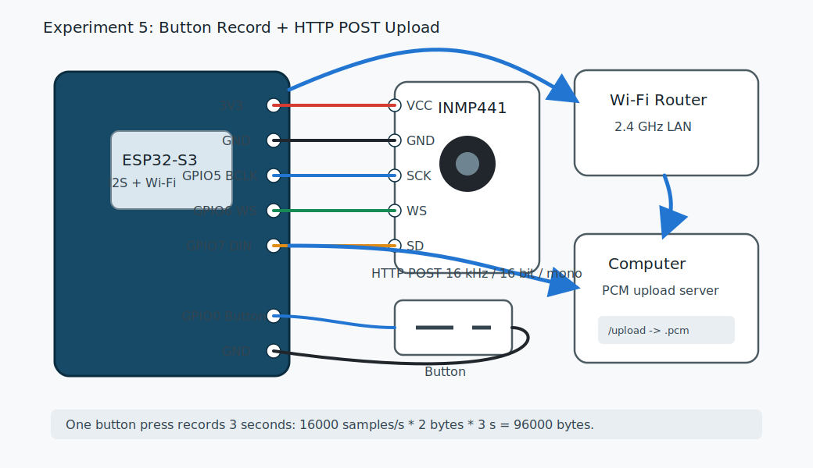

# 08 实验 5：按键录音并 HTTP POST 上传

本实验把前面的能力串起来：

```text
按键 -> I2S 麦克风录音 -> 16 bit PCM 缓冲 -> Wi-Fi -> HTTP POST -> 电脑保存 .pcm 文件
```

这是最接近语音助手的第一个闭环。它还不做语音识别，但已经完成了“设备采集语音并上传服务端”的关键链路。

代码目录：

```text
examples/esp-idf/05_record_http_post
```

源文件：

```text
examples/esp-idf/05_record_http_post/main/main.c
```

电脑端服务器：

```text
tools/pcm_upload_server.py
```

## 系统图



## 接线

INMP441：

```text
INMP441 -> ESP32-S3
VCC     -> 3V3
GND     -> GND
SCK     -> GPIO5
WS      -> GPIO6
SD      -> GPIO7
L/R     -> GND
```

按键：

```text
GPIO0 -> 按键 -> GND
```

如果使用开发板板载 BOOT 键，可以先不外接按键。

## 启动电脑端上传服务器

在仓库根目录运行：

```bash
python3 tools/pcm_upload_server.py
```

看到：

```text
listening on http://0.0.0.0:8000/upload
```

服务器会把收到的 PCM 保存为：

```text
upload_YYYYMMDD_HHMMSS.pcm
```

## 查电脑 IP

ESP32-S3 要访问电脑的局域网 IP。

Linux：

```bash
ip addr
```

macOS：

```bash
ifconfig
```

Windows：

```powershell
ipconfig
```

假设电脑 IP 是 `192.168.1.100`，上传地址就是：

```text
http://192.168.1.100:8000/upload
```

电脑和 ESP32-S3 必须在同一个局域网。公司网、校园网、某些手机热点可能会阻止设备互访。

## 修改 ESP32-S3 配置

打开：

```text
examples/esp-idf/05_record_http_post/main/main.c
```

修改：

```c
#define WIFI_SSID "YOUR_WIFI_SSID"
#define WIFI_PASS "YOUR_WIFI_PASSWORD"
#define UPLOAD_URL "http://192.168.1.100:8000/upload"
```

把 `UPLOAD_URL` 换成你的电脑 IP。

## 烧录

```bash
cd examples/esp-idf/05_record_http_post
idf.py set-target esp32s3
idf.py build
idf.py flash monitor
```

按一下按键，串口应看到：

```text
I (...) record_post: recording 3 seconds...
I (...) record_post: record done, bytes=96000
I (...) record_post: upload ok, status=200 len=96000
```

电脑端应看到：

```text
saved upload_20260508_210000.pcm (96000 bytes)
```

## 播放 PCM 文件

如果安装了 ffmpeg：

```bash
ffplay -f s16le -ar 16000 -ac 1 upload_*.pcm
```

参数含义：

| 参数 | 含义 |
| --- | --- |
| `-f s16le` | 原始 PCM，signed 16-bit little-endian |
| `-ar 16000` | 采样率 16 kHz |
| `-ac 1` | 单声道 |

也可以用 Audacity 导入 Raw Data：

```text
Encoding: Signed 16-bit PCM
Byte order: Little-endian
Channels: 1 Channel
Sample rate: 16000 Hz
```

## 为什么文件是 96000 字节

示例参数：

```text
采样率：16000 samples/s
位深：16 bit = 2 bytes
声道：1
时长：3 s
```

计算：

```text
16000 * 2 * 1 * 3 = 96000 bytes
```

这就是音频内存和网络带宽估算的基本方式。

## 代码解析

### 1. 录音参数

```c
#define SAMPLE_RATE 16000
#define FRAME_SAMPLES 320
#define RECORD_SECONDS 3
#define RINGBUF_SIZE (64 * 1024)
```

含义：

- 每秒 16000 个采样。
- 每帧 320 个采样，也就是 20 ms。
- 每次按键录 3 秒。
- 环形缓冲区 64 KB。

### 2. 全局对象

```c
static EventGroupHandle_t wifi_event_group;
static RingbufHandle_t audio_rb;
static i2s_chan_handle_t rx_chan;
static volatile bool recording = false;
```

用途：

| 对象 | 用途 |
| --- | --- |
| `wifi_event_group` | 等待 Wi-Fi 连接 |
| `audio_rb` | 音频采集任务和录音流程之间传递 PCM |
| `rx_chan` | I2S 麦克风接收通道 |
| `recording` | 控制当前是否把音频写入缓冲 |

`volatile` 表示这个变量会被不同任务访问，提醒编译器不要过度优化读取。

### 3. Wi-Fi 事件

```c
if (event_base == WIFI_EVENT && event_id == WIFI_EVENT_STA_START) {
    esp_wifi_connect();
} else if (event_base == WIFI_EVENT && event_id == WIFI_EVENT_STA_DISCONNECTED) {
    ESP_LOGW(TAG, "Wi-Fi disconnected, reconnecting");
    xEventGroupClearBits(wifi_event_group, WIFI_CONNECTED_BIT);
    esp_wifi_connect();
} else if (event_base == IP_EVENT && event_id == IP_EVENT_STA_GOT_IP) {
    xEventGroupSetBits(wifi_event_group, WIFI_CONNECTED_BIT);
}
```

这个版本没有最大重试次数，断线就持续重连。录音上传前会等待 `WIFI_CONNECTED_BIT`。

### 4. I2S 麦克风初始化

```c
i2s_chan_config_t chan_cfg = I2S_CHANNEL_DEFAULT_CONFIG(I2S_NUM_AUTO, I2S_ROLE_MASTER);
ESP_ERROR_CHECK(i2s_new_channel(&chan_cfg, NULL, &rx_chan));
```

只创建 RX 通道。

```c
.slot_cfg = I2S_STD_PHILIPS_SLOT_DEFAULT_CONFIG(I2S_DATA_BIT_WIDTH_32BIT, I2S_SLOT_MODE_MONO),
.gpio_cfg = {
    .bclk = I2S_MIC_BCLK,
    .ws = I2S_MIC_WS,
    .din = I2S_MIC_DIN,
}
```

用 32 bit slot 读取 I2S 麦克风，再转换成 16 bit PCM。

### 5. 音频采集任务

```c
static void audio_capture_task(void *arg)
{
    int32_t raw[FRAME_SAMPLES];
    int16_t pcm16[FRAME_SAMPLES];

    while (true) {
        size_t bytes_read = 0;
        ESP_ERROR_CHECK(i2s_channel_read(rx_chan, raw, sizeof(raw), &bytes_read, portMAX_DELAY));

        if (!recording) {
            continue;
        }
        ...
    }
}
```

这个任务一直从 I2S 读音频。没在录音时，它只读不存，这样 I2S DMA 不会堆积旧数据。

录音时，把 32 bit 原始样本转成 16 bit：

```c
int count = bytes_read / sizeof(int32_t);
for (int i = 0; i < count; i++) {
    pcm16[i] = (int16_t)(raw[i] >> 14);
}
```

然后写入环形缓冲区：

```c
BaseType_t ok = xRingbufferSend(audio_rb, pcm16, count * sizeof(int16_t), pdMS_TO_TICKS(20));
if (ok != pdTRUE) {
    ESP_LOGW(TAG, "audio ring buffer full, dropping frame");
}
```

环形缓冲区的意义是解耦：

```text
I2S 采集任务：稳定每 20 ms 产生音频
录音/上传流程：按键触发后从缓冲区取音频
```

### 6. 清空旧音频

```c
static void clear_audio_ringbuffer(void)
{
    size_t item_size = 0;
    uint8_t *item = NULL;
    while ((item = (uint8_t *)xRingbufferReceive(audio_rb, &item_size, 0)) != NULL) {
        vRingbufferReturnItem(audio_rb, item);
    }
}
```

按键开始录音前清空缓冲，避免把按下前的旧音频混进新文件。

### 7. 录 3 秒到内存

```c
const int target_bytes = SAMPLE_RATE * RECORD_SECONDS * sizeof(int16_t);
uint8_t *record_buf = heap_caps_malloc(target_bytes, MALLOC_CAP_8BIT);
```

3 秒需要 96000 字节。这里用堆内存申请完整录音缓冲。

开始录音：

```c
clear_audio_ringbuffer();
recording = true;
ESP_LOGI(TAG, "recording %d seconds...", RECORD_SECONDS);
```

循环从环形缓冲取数据：

```c
while (offset < target_bytes) {
    size_t item_size = 0;
    uint8_t *item = (uint8_t *)xRingbufferReceive(audio_rb, &item_size, pdMS_TO_TICKS(1000));
    ...
    memcpy(record_buf + offset, item, copy_len);
    offset += copy_len;
    vRingbufferReturnItem(audio_rb, item);
}
```

录够目标字节后停止：

```c
recording = false;
ESP_LOGI(TAG, "record done, bytes=%d", offset);
```

### 8. 等待 Wi-Fi 后上传

```c
xEventGroupWaitBits(wifi_event_group, WIFI_CONNECTED_BIT, pdFALSE, pdTRUE, portMAX_DELAY);
upload_pcm_buffer(record_buf, offset);
free(record_buf);
```

如果 Wi-Fi 断开，程序会等到重新拿到 IP 再上传。

### 9. HTTP POST 上传 PCM

```c
esp_http_client_config_t config = {
    .url = UPLOAD_URL,
    .method = HTTP_METHOD_POST,
    .event_handler = http_event_handler,
    .timeout_ms = 15000,
};
esp_http_client_handle_t client = esp_http_client_init(&config);
```

设置 Content-Type：

```c
esp_http_client_set_header(client, "Content-Type", "audio/L16; rate=16000; channels=1");
```

设置请求体：

```c
esp_http_client_set_post_field(client, (const char *)data, len);
```

执行请求：

```c
esp_err_t err = esp_http_client_perform(client);
```

最后释放：

```c
esp_http_client_cleanup(client);
```

### 10. 按键任务

```c
static void button_task(void *arg)
```

先配置 GPIO0 输入和内部上拉：

```c
gpio_config_t button_cfg = {
    .pin_bit_mask = 1ULL << BUTTON_GPIO,
    .mode = GPIO_MODE_INPUT,
    .pull_up_en = GPIO_PULLUP_ENABLE,
};
```

然后轮询按键，检测按下边沿：

```c
if (last == 1 && level == 0) {
    vTaskDelay(pdMS_TO_TICKS(40));
    if (gpio_get_level(BUTTON_GPIO) == 0) {
        record_and_upload_once();
        while (gpio_get_level(BUTTON_GPIO) == 0) {
            vTaskDelay(pdMS_TO_TICKS(10));
        }
    }
}
```

这里有三层保护：

- `last == 1 && level == 0`：只在刚按下时触发。
- `vTaskDelay(40 ms)`：按键消抖。
- 等待松手：避免长按触发多次录音。

### 11. app_main 启动顺序

```c
nvs_flash_init();
audio_rb = xRingbufferCreate(RINGBUF_SIZE, RINGBUF_TYPE_BYTEBUF);
wifi_init_sta();
i2s_mic_init();
xTaskCreate(audio_capture_task, "audio_capture", 4096, NULL, 6, NULL);
xTaskCreate(button_task, "button", 8192, NULL, 4, NULL);
```

顺序很重要：

1. Wi-Fi 需要 NVS。
2. 音频任务需要 ring buffer。
3. I2S 初始化完成后才能创建采集任务。
4. 采集任务优先级比按键任务高，保证音频读取更稳定。

## 你可以改什么

### 改录音时长

```c
#define RECORD_SECONDS 3
```

改成 5 秒后，文件大小应变为：

```text
16000 * 2 * 1 * 5 = 160000 bytes
```

### 改服务器地址

```c
#define UPLOAD_URL "http://你的电脑IP:8000/upload"
```

不要写 `127.0.0.1`。对 ESP32-S3 来说，`127.0.0.1` 是它自己，不是你的电脑。

### 改为边录边传

当前代码为了好懂，先把 3 秒录音完整放内存，再一次性 POST。真正低延迟语音助手更常用：

```text
I2S 每 20 ms 产生一帧 -> WebSocket 立刻发送 -> 服务端流式识别
```

## 常见问题

### ESP32-S3 上传失败

- `UPLOAD_URL` 里的 IP 写错。
- 电脑防火墙拦截 8000 端口。
- 电脑和开发板不在同一个局域网。
- 路由器开启了客户端隔离。
- 手机热点不允许设备互访。

### 生成的 PCM 全是噪声

- I2S 麦克风接线错误。
- L/R 声道选择不匹配。
- 移位量 `>> 14` 不适合你的模块。
- GND 或供电不稳。

### 按键没反应

- GPIO0 没接到按键。
- 使用外接按键但没有接 GND。
- 开发板 BOOT 键不是 GPIO0，查板子原理图。
- 串口烧录时 GPIO0 被一直拉低，导致进入下载模式。

### 录音后重启

- 内存不足。
- 任务栈不够。
- HTTP 请求阻塞太久触发问题。
- 供电不稳。

先把 `RECORD_SECONDS` 改成 1 秒测试。

## 验收

你已经完成本教程最小语音链路，如果能做到：

- 按键后录音 3 秒。
- 电脑生成 `.pcm` 文件。
- 播放 `.pcm` 能听到你刚说的话。
- 改录音时长后文件大小按比例变化。
- 关掉服务器时，ESP32-S3 打印上传失败而不是崩溃。

## 下一步：变成语音助手

把 `tools/pcm_upload_server.py` 换成真正的 ASR 服务：

```text
ESP32-S3 上传 PCM -> 服务端 ASR -> 返回文本/意图
```

服务端可以返回：

```json
{"text":"开灯","intent":"light_on","reply":"好的"}
```

ESP32-S3 收到后：

- `intent == light_on`：控制 GPIO 打开灯。
- `reply` 或 `reply_audio_url`：播放提示音或下载 TTS 音频。
- 如果要降低延迟，把 HTTP POST 升级成 WebSocket 流式上传。

排障见：[09 排障速查表](09_troubleshooting.md)。
