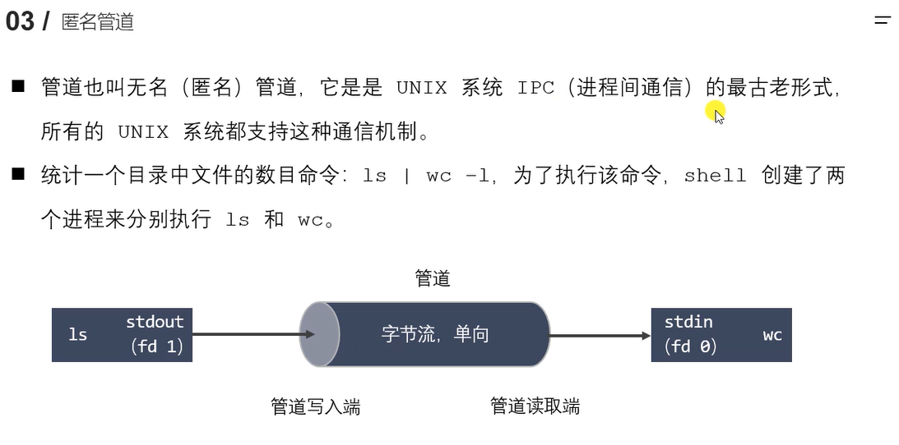
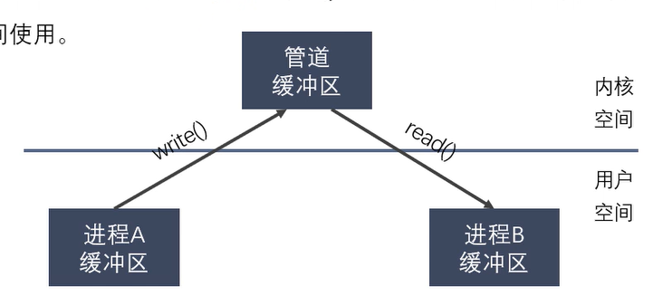
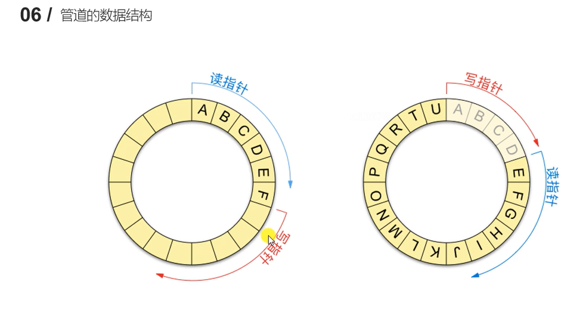
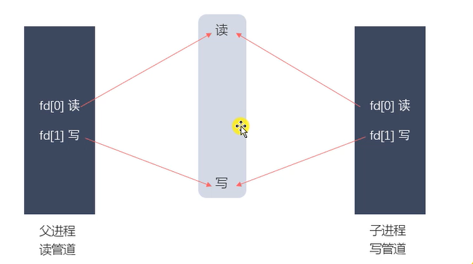

### 匿名管道

无名管道，是 UNIX 系统 IPC（进程间通信）的最古老形式，所有 UNIX 系统都支持这种通信机制。

统计一个目录中文件的数量命令 `ls | wc -l`，为了执行该命令，shell 创建了两个进程来执行，分别执行 ls 和 wc



匿名管道特点：

1. 匿名管道是一个在内核内存中维护的缓冲器，这个缓冲区的存储能力是有限的，不同的操作系统大小不一定相等。
2. 匿名管道拥有文件的特质：读写操作，写操作，匿名管道没有文件实体。
3. 一个管道是一个字节流，使用管道时不存在消息或者消息边界的概念，从管道读取数据的进程可以读取任意大小的数据块，而不管写入进程写入管道的数据块的大小是多少。
4. 通过管道传递的数据先进先出。
5. 管道中的数据的传递方向是单向的，一端写入，一段读取，管道是**半双工**的。
6. 管道读数据是一次性操作，数据一旦被读取，他就从管道中被抛弃，释放空间以便写入更多的数据，在管道中无法使用 lseek() 文件定位操作。
7. 匿名管道只能在具有公共祖先的进程（父进程与子进程、两个兄弟进程、有亲缘关系的进程）之间使用



在创建匿名管道时，操作系统会为其分配一个文件描述符（File Descriptor），父进程可以通过该文件描述符将数据写入管道，而子进程则可以通过相应的文件描述符从管道中读取数据。由于匿名管道是基于文件描述符的，因此它需要通过进程间继承传递给子进程。

因此，只有具有公共祖先的进程之间才能在匿名管道上进行通信。这通常是通过创建子进程（使用 `fork()` 系统调用）来实现的。父进程和子进程共享同一个文件描述符表，使得它们可以访问同一个匿名管道。

需要注意的是，匿名管道是单向的，只能支持父进程到子进程的单向通信。如果需要双向通信或在没有公共祖先的进程之间进行通信，可以考虑使用命名管道（Named Pipe）或其他更高级的进程间通信（IPC）机制，如消息队列、共享内存等。




### 匿名管道的使用

创建匿名管道

```c
#include <unistd.h>
int pipe(int pipefd[2]);
```

查看缓冲区大小

```sh
ulimit -a
```

查看管道缓冲大小函数

```c
#include <unistd.h>
long fpathconf(int fd, int name);
```



管道读写的特点：

使用管道时，需要注意以下几种情况（假设都是阻塞 I/O 操作）

1. 所有的指向管道写端的文件描述符都关闭了（管道写端引用计数为 0），在进程从管道的读写数据，那么管道中剩余的数据被读取之后，再次 read 会返回 0（类似读到文件末尾）。
2. 如果有指向管道写端的文件描述符没有关闭（管道的写端引用计数大于 0），而持有管道写端的进程也没有向管道中写入数据，此时有进程从管道中读取数据，那么管道中剩余数据被读取后，再次调用 read 读取会阻塞，直到管道中有数据可以读了才返回读取数据并返回读到的字节数。
3. 如果所有指向管道读端的文件描述符都关闭了（管道的读端引用计数为 0），此时如果有进程向管道中写数据，该进程会收到一个信号 SIGPIPE，通常会导致进程异常终止。
4. 如果有指向管道读端的文件描述符没有关闭（管道读端读端引用计数大于 0），而持有管道的进程也没有向管道中读数据，此时如果有进程向管道中写数据，那么在管道在被写满之后，再次调用 write 会阻塞，直到管道中有空位才能再次写入数据并返回写入数据的字节数。

总结：

- 读管道：
  - 管道中有数据：read 返回实际读到的字节数
  - 管道中无数据：
    - 写入端全部关闭，read 返回 0（相当于读到文件的末尾）
    - 写端没有完全关闭，read 读取会阻塞
- 写管道：
  - 管道读端全部关闭，进程异常终止，进程收到 SIGPIPE 信号
  - 管道读端没有全部关闭：
    - 管道已满：write 阻塞
    - 管道没有满：write 将数据写入，并返回实际写入的字节数


设置管道非阻塞

```c
/*
    设置管道非阻塞
    int flag = fcntl(df[0], F_GETFL); // 获取原来的 flag
    flags |= O_NONBLOCK
    fcntl(fd[0], F_SETFL, flags);
 */

#include <unistd.h>
#include <stdio.h>
#include <fcntl.h>
#include <sys/types.h>
#include <stdlib.h>
#include <string.h>

int main() {
    int pipe_fd[2];
    int ret = pipe(pipe_fd);

    if (-1 == ret) {
        perror("pipe");
        return -1;
    }

    pid_t s_pid = fork();
    if (0 == s_pid) {
        /* 子进程向管道写入数据 */
        printf("this is child process, pid: %d\n", getpid());
        close(pipe_fd[0]); // 关闭读端
        char buf[1024] = { 0 };
        char *str = "I am child";
        while (1) {
            write(pipe_fd[1], str, strlen(str));
            sleep(1);
        }
    } else if (0 < s_pid) {
        /* 父进程从管道读取数据 */
        printf("this is parent process, pid : %d\n", getpid());
        close(pipe_fd[1]); // 关闭写端
        /* 设置非阻塞 */
        int flags = fcntl(pipe_fd[0], F_GETFL);
        flags |= O_NONBLOCK;
        fcntl(pipe_fd[0], F_SETFL, flags);

        char buf[1024] = { 0 };
        while (1) {
            int len = read(pipe_fd[0], buf, sizeof(buf));
            printf("parent recv: %s, pid: %d\n", buf, getpid());
            printf("read len: %d\n", len);
            memset(buf, 0, sizeof(buf));
            sleep(1);
        }
    } else {
        perror("fork");
    }
    return 0;
}
```


