### 程序和进程

程序是包含一系列信息的文件，这些信息描述了如何在运行时创建一个进程。

- 二进制格式标识：每个程序文件都包含用于描述可执行文件格式的元信息。内核利用此信息来解释文件中的其他信息（ELF 可执行链接格式）
- 机器语言指令：对程序算法进行编码
- 程序入口地址：标识程序开始执行时的起始指令位置
- 数据：程序文件包含的变量初始值和程序使用的字面量值
- 符号表及重定位表：描述程序中函数和变量的位置及名称，这些表格有多重用途，其中包括调试和运行时的符号解析（动态链接）
- 共享库的动态链接信息：程序文件所包含的一些字段，列出了程序运行时需要使用的共享库，以及加载共享库的动态链接器的路径名
- 其他信息：程序文件还包括许多其他信息，用以描述如何创建进程

进程是正在运行的程序的实例，是一个具有一定独立功能的程序关于某个数据集合的一次运行活动，是操作系统动态执行的基本单元，在传统的操作系统中，进程既是基本的分配单元，也是基本的执行单元。

可以用一个程序创建多个进程，进程是由内核定义的抽象实体，并为该实体分配用以执行程序的各项系统资源。从内核角度，进程由用户内存空间和一系列内核数据结构组成，其中用户内存空间包含了程序代码及代码所使用的变量，而内核数据结构则用于维护进程状态信息，记录在内核数据结构中的信息包括许多进程相关的标志号、虚拟内存表、打开文件的描述符表、信号传递及处理的有关信息、进程资源使用及限制、当前工作目录和大量的其他信息。

### 单道、多道程序设计

单道程序，即在计算机内存中只允许一个的程序运行。

多道程序设计技术是在计算机内存中同时存放几道相互独立的程序，使他们在管理程序控制下，相互穿插运行，两个或两个以上程序在计算机系统中同处于开始到结束之间的状态，这些程序共享计算机系统资源，多道程序设计的目的是为了提高 CPU 的利用率。

对于一个单 CPU 系统，多个程序同时处于运行状态是一种宏观上的概念，多个程序虽然已经开始运行，但微观而言，任意时刻，CPU 上运行的程序只有一个。

在多道程序设计模型中，多个程序轮流使用 CPU。

### 时间片

时间片（timeslice）又称为 量子（quantum）或 处理器片（processor slice）是操作系统分配给每个正在运行的进程微观上的一段 CPU 时间。事实上，虽然一台计算机通常可能有多个 CPU，但是同时一个 CPU 永远不可能真正的同时运行多个任务，在只考虑一个 CPU 的情况下，这些进程宏观上是同时运行的，实际上是轮番穿插运行，由于时间片通常时间很短（不能太短）（Linux 上为 5ms - 800ms），用户不会感受到。

时间片由操作系统内核的调度程序分配给每个进程。首先内核会给每个进程分配相等的初始时间片，然后每个进程轮番执行相应的时间，当所有进程都处于时间片耗尽的状态时，内核会重新为每个进程计算并分配时间片，如此往复。

### 并行和并发

并行（parallel）：指在同一时刻，有多条指令在多个处理器上同时执行

并发（concurrency）：指在同一时刻只能有一条指令执行，但多个进程指令被轮换执行，使得在宏观上具有多个进程指令同时执行的效果，但在微观上，并不是同时执行。

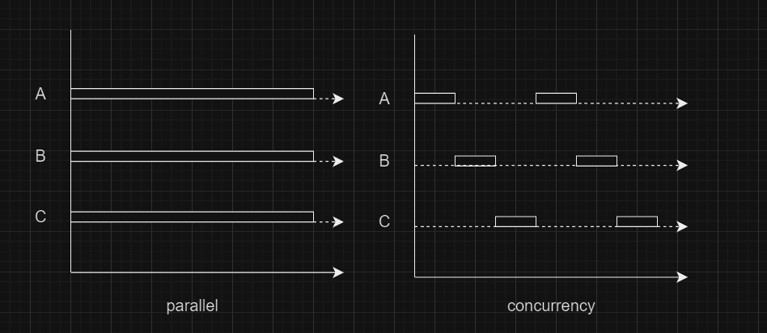

### 进程控制块

为了管理进程，内核必须对每个进程所做的事情进行清楚的描述，内核为每个进程分配一个 **PCB**（Processing Control Block）进程控制块（进程描述符表），维护进程相关信息，Linux 内核的进程控制块是 **task_struct** 结构体，在 `usr/src/linux-headers-xxx/include/linux/sched.h` 文件中可以查看 struct task_struct 结构体定义

- 进程 id：系统中每个进程有唯一的 id，用 pid_t 类型表示，其实就是一个非负整数
- 进程的状态：就绪、运行、挂起、阻塞、停止等状态
- 进程切换时需要保存和恢复的一些 CPU 寄存器
- 描述虚拟地址空间的信息
- 描述控制终端的信息
- 当前工作目录（Current Working Directory）
- umask 掩码
- 文件描述符表，包含很多指向 file 结构体的指针
- 和信号相关的信息
- 用户 id 和组 id
- 会话（Session）和进程组
- 进程可以使用的资源上线（Resource Limit）

### 进程的状态

三态模型

1. 就绪态：进程占用处理器正在运行
2. 运行态：进程具备运行条件，等待系统分配处理器以便运行，当前进程已分配到除 CPU 以外的所有必要资源后，只要得到 CPU 资源，便立即执行，在一个系统中，处于就绪状态的进程可能有多个，通常排成一个队列，称为就绪队列
3. 阻塞态：等待态（wait）或睡眠态（sleep），指进程不具备运行条件，正在等待某个事件的完成

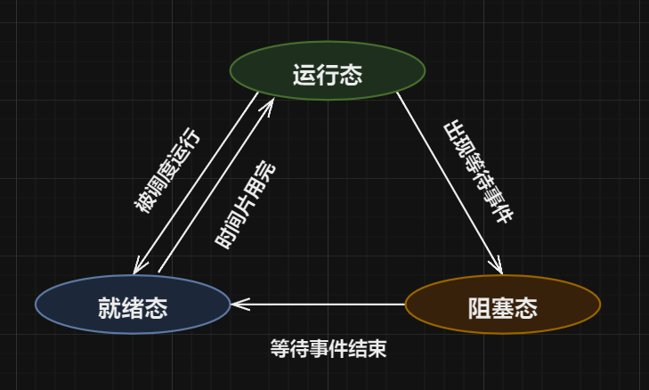

五态模型

1. 新建态
2. 就绪态
3. 运行态
4. 阻塞态
5. 终止态

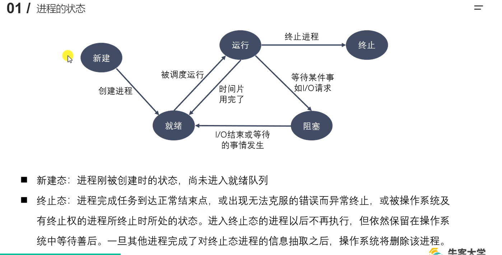


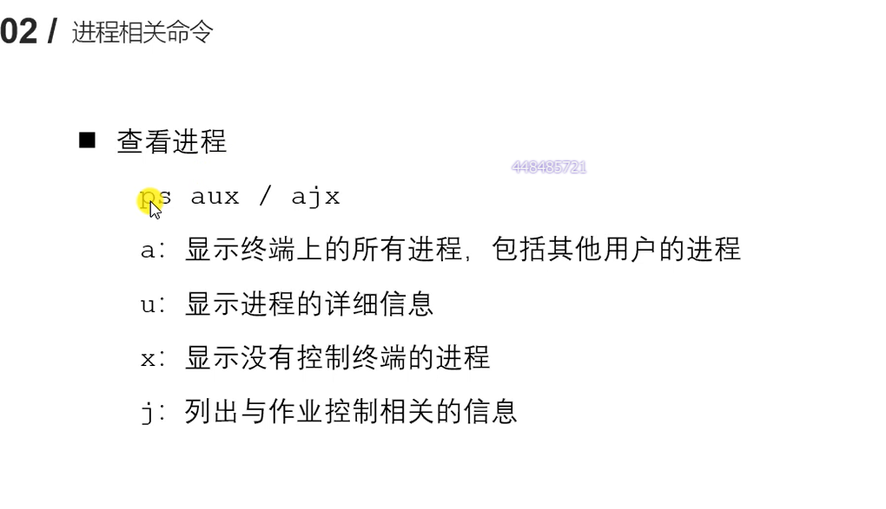

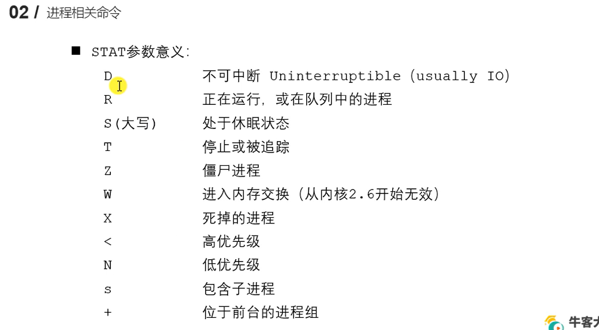

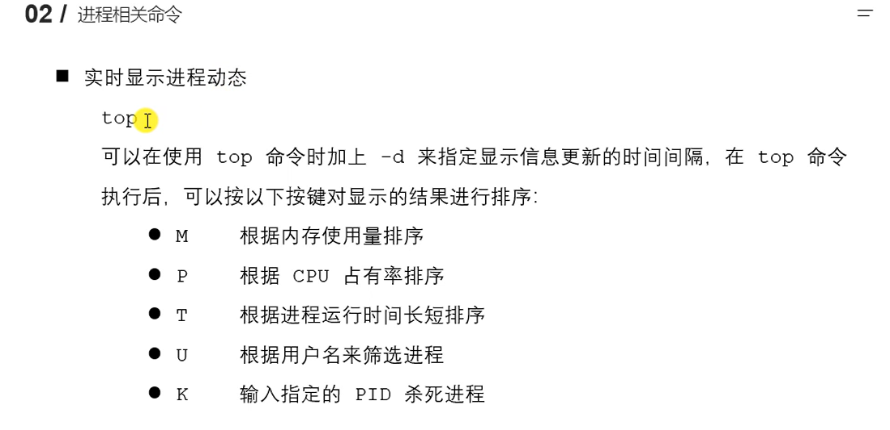

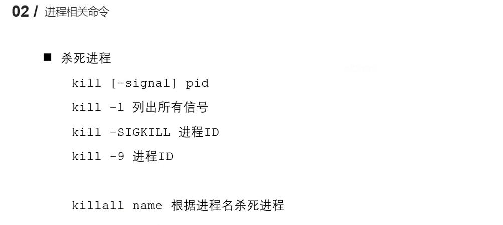

### 进程号和相关函数

每个进程都由**进程号**标识，其类型是 pid_t（整形），进程号的范围：0 ~ 32767 。进程号总是唯一的，但可以重用，当一个进程终止后，其进程号就可以再次使用。任何进程除 init 进程都是由另一个进程创建。

进程组是一个或多个进程的集合，他们之间相互关联，进程组可以接受同一个终端的各种信号，关联的进程有一个进程组号（PGID）。默认情况下，当前的进程号会被当做当前的进程组号。

进程号和进程组相关函数：

```c
pid_t getpid(void); // 获得当前进程 ID
pid_t getppid(void); // 获得当前进程 父ID
pid_t getpgid(pid_t pid); // 获取当前进程的进程组 ID
	// NULL 当前进程 ID
	// 传入进程号 ID 获得进程号的进程组 ID		
```

### 进程创建

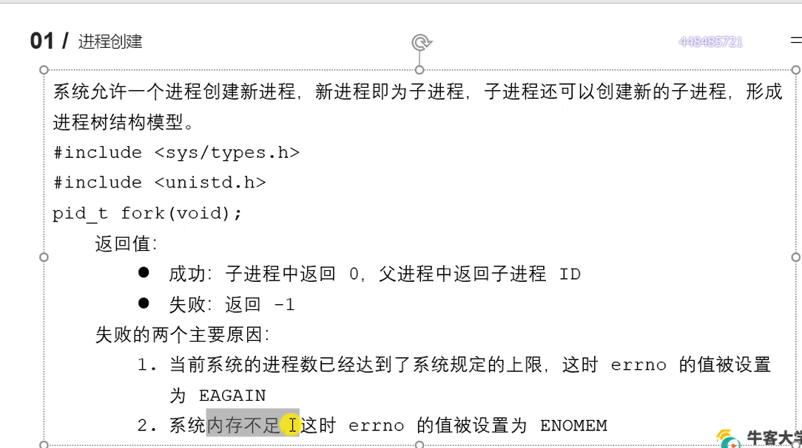

### 父子进程虚拟地址空间情况

读时共享，写时拷贝

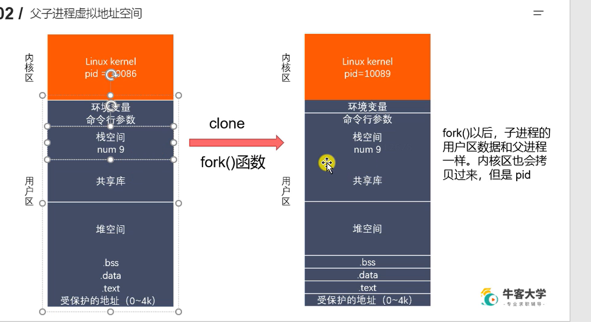

  Linux 的 fork() 使用是通过**写时拷贝**实现。写时拷贝是一种**可以推迟甚至避免拷贝数据的技术**。内核并不复制整个进程的地址空间，而是让父子进程共享同一个虚拟地址地址空间。只有在写入时才会复制地址空间（重新开辟一块内存），从而使各个进程拥有自己的地址空间。即资源的复制只有在写入时才会进行，在此之前，只有以只读的方式进行。 

  fork() 之后的父子进程共享文件，此时的 fork() 产生的子进程与父进程相同的文件描述符指向相同的文件表，引用计数增加，共享文件偏移指针。 

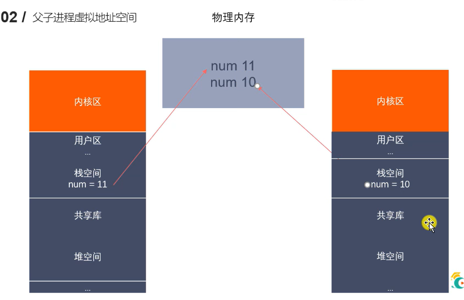


### exec 函数族

execute

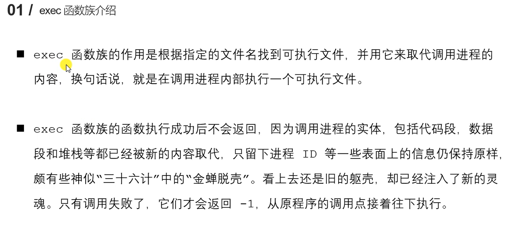

exec 函数族根据指定的文件名找到可执行文件，并用它来取代调用进程的内容，在调用进程内部执行一个可执行文件

exec 函数族的函数执行成功后不会返回，因为调用进程的实体，内核区不变，**包括代码段，数据段和堆栈等都已经被新的内容取代**，只留下进程 ID 等一些表面上的信息仍保持原样，执行失败返回 -1

替换用户区数据

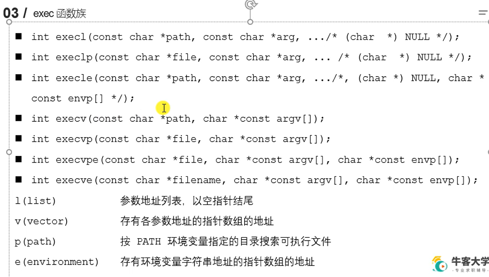

execve 是 unix 系统函数，其他的是 C 标准函数

### 进程退出、孤儿进程、僵尸进程

进程控制

#### 进程退出

```cpp
#include <stdlib.h>
void exit(int status);

#include <unistd.h>
void _exit(int status);
```

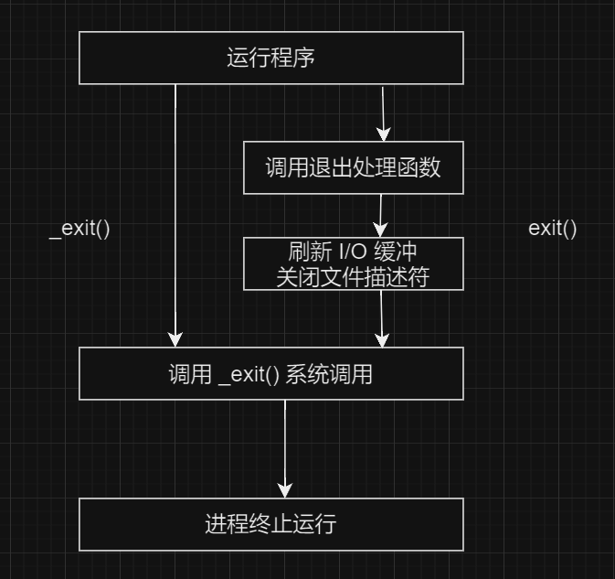

#### 孤儿进程

父进程运行结束，但子进程还在运行（未运行结束），这样的子进程称为孤儿进程（Orphan Process）

每当出现一个孤儿进程，内核就把孤儿进程的父亲设置为 init，而 initi 进程会循环地 wait() 它的已经退出的子进程

孤儿进程并不会有什么危害

#### 僵尸进程

每个进程结束之后，都会释放自己地址空间中的用户区数据，内核区的 PCB 没有办法自己释放掉，需要父进程去释放

**僵尸进程**：进程终止时，父进程尚未回收，子进程残留资源（PCB）存放在内核中，变成僵尸（Zombie）进程

僵尸进程不能被 `kill -9` 杀死

如果父进程不调用 wait() 或 waitpid()，那么保留的那段信息就不会被释放，其进程号就会被一直占用，但是系统所能使用的进程号是有限的，如果大量的产生僵尸进程，将因为没有可用的进程号而导致系统不能产生新的进程，应当避免。

#### 进程回收

在每个进程退出的时候，内核释放该进程所有的资源、包含打开的文件、占用的内存等，但是依然为其保留一定的信息，这些信息主要指进程控制块 PCB 的信息，包括进程号，退出状态，运行时间等。

父进程可以通过调用 wait 或 waitpid 得到他的退出状态同时彻底清除掉这个进程

wait() 和 waitpid() 函数功能一样，区别在于 wait() 函数会阻塞，waitpid() 可以设置不阻塞，waitpid() 还可以指定等待哪个子进程结束

一次 wait 或 waitpid 调用只能清理一个子进程，清理多个子进程应使用循环

#### 退出信息相关宏函数

```c
WIFEXITED(status)    // 非 0，进程正常退出
WEXITSTATUS(status)  // 上宏非 0，获取进程退出的状态（exit 的参数）

WIFSIGNALED(status)  // 非 0，进程异常终止
WTERMSIG(status)     // 上宏非 0，获取使进程终止的信号编号

WIFSTOPED(status)    // 非 0，进程处于暂停状态
WSTOPSIG(status)     // 上宏非 0，获取使进程暂停的信号编号
WIFCONTINUED(status) // 非 0，进程暂停后已经继续运行
```


waitpid() 设置成非阻塞的好处是父进程不用挂起。

#### 进程间通信

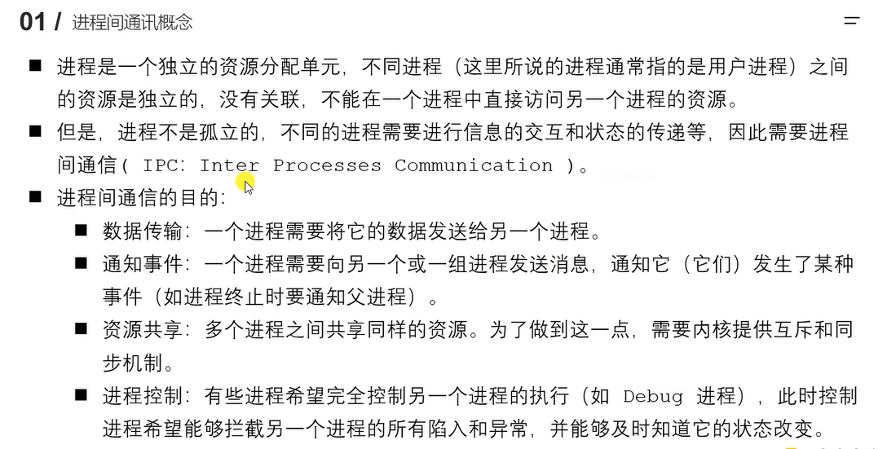

进程是一个独立的资源分配单元，不同进程（用户进程）之间的资源是独立的，没有关联，不能在一个进程中直接访问另一个进程的资源

不同的进程需要进行信息的交互和状态的传递等，因此需要进程间通信（IPC：Inter Processes Communication）

进程通信的目的：

1. 数据传输：一个进程需要将它的数据发送给另一个进程
2. 通知事件：一个进程需要向另一个或另一组进程发送信息，通知他们发生了某件事件（如进程终止时通知父进程）
3. 资源共享：多个进程之间共享同样的资源，需要内核提供互斥和同步机制
4. 进程控制：有些进程希望完全控制另一个进程的执行（如 debug 进程），此时控制进程能够阻拦另一个进程的所有陷入和异常，并能够及时直到它的状态

#### Linux 进程间通信的方式

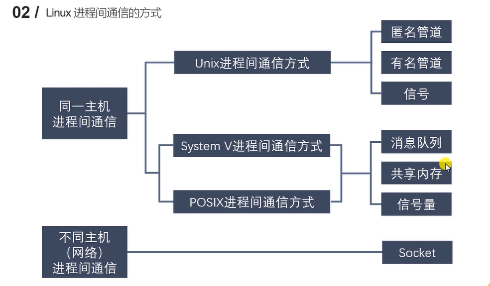

