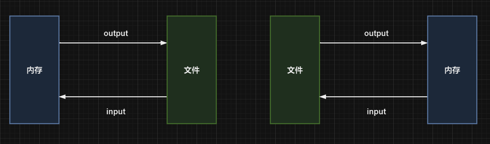
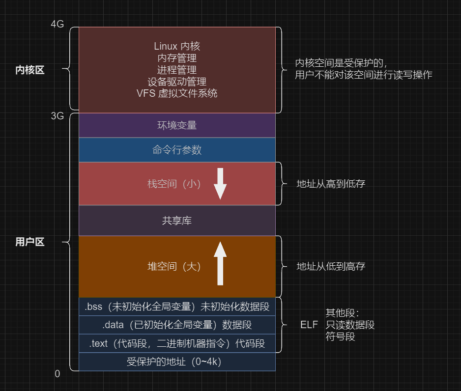
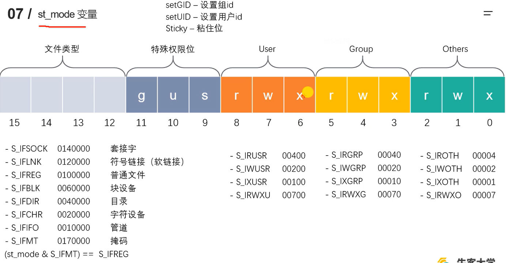

### 标准 C库 IO函数 和 Linux系统 IO函数 对比

IO 对于文件和内存是相对的。

  

#### 文件 IO

##### 标准 C 库 IO 函数

标准 C 库是可以跨平台的，带有缓冲区

缓冲区增加执行效率，数据运输到磁盘，经过缓冲区（内存），然后缓冲区再到磁盘，减少对磁盘的操作。

缓冲区已满或者刷新缓冲区或者正常关闭文件，数据从内存刷新到磁盘

缓冲区 Buffer 默认大小：8192 byte

##### 虚拟地址空间

其本身是不存在的，用于解释编程中的一些问题。被 CPU 映射到物理内存中。

  

##### 文件描述符

程序不占用内存空间，只占用磁盘空间。

一个文件可以被同时打开多次，但是返回的指针是不一样的。

通过 Linux 系统 API 得到文件描述符。

##### 文件打开

```cpp
/*
    // 打开一个已经存在的文件
    #include <sys/types.h>
    #include <sys/stat.h>
    #include <fcntl.h>

    int open(const char *pathname, int flags);
        argument:
            - pathname: 打开的文件路径
            - flags: 对文件的操作权限设置及其他设置
                - O_RDONLY
                - O_WRONLY
                - O_RDWR
        return: 文件描述符, 调用失败返回 -1

    errno: 属于 Linux 系统函数库, 库中的一个全局变量, 记录的是错误号

    // 打印 error 对应的错误描述
    #include <stdio.h>

    void perror(const char *s);
        argument:
            - s: 用户描述, 比如 openerror, 最终输出内容为 openerror: <实际错误描述>

    // 关闭文件
    #include <unistd.h>

    int close(int fd);
        argument: fd 文件描述符
        return: 调用失败返回 -1
 */

#include <sys/types.h>
#include <sys/stat.h>
#include <fcntl.h>
#include <stdio.h>
#include <unistd.h>

int main() {
    int fd = open("./word.txt", O_RDONLY);
    if (-1 == fd) {
        perror("open failed"); // open failed: No such file or directory
    }
    close(fd);

    return 0;
}
```

##### 文件打开

```cpp
/*
    // 创建一个新文件
    #include <sys/types.h>
    #include <sys/stat.h>
    #include <fcntl.h>

    int open(const char *pathname, int flags, mode_t mode); // 可变参数实现
        argument:
            - pathname: 创建的文件的路径
            - flags: 对文件的操作权限设置及其他设置
                - must include
                    - O_RDONLY
                    - O_WRONLY
                    - O_RDWR
                - optional
                    - O_CREAT 文件不存在则创建新文件
                    // ...
            - mode: 八进制的数, 表示用户对创建出的新文件的操作权限, 最终权限 mode & ~umask
                umask 八进制数, 不同的用户 umask 是不一样的, 用户面具, 普通用户 0002, root 用户 0022, 这个值是可以修改的
                0777 & ~0002
                0777 &  0775
                111111111 & 111111101
                0775
                // umask 抹去一部分权限，让创建文件的权限更加合理

    flags 为 int 占 4 byte，32 bit
    flags 32 bit，每一位就是一个标志位，代表一种情况。
    | 按位与 就表示两者状态都要
       O_RDWR  02     0b00000010
    |  O_CREAT 0100   0b01000000
                    --------------
                      0b01000010

 */

#include <sys/types.h>
#include <sys/stat.h>
#include <fcntl.h>
#include <stdio.h>
#include <unistd.h>

int main(int argc, char const *argv[]) {
    int fd = open("word.txt", O_RDWR | O_CREAT, 0777); // 给权限是 0777 实际只能是当前 mode & ~umask
    if (-1 == fd) {
        perror("open");
    }
    close(fd);
    return 0;
}
```

##### read、write 函数

```cpp
/*
    // 读文件
    #include <unistd.h>

    ssize_t read(int fd, const void *buf, size_t count);
        arguments:
            - fd: 文件描述符
            - buf: 需要读取数据存放的地方，数组地址，传出参数
            - count: 指定的数组的大小
        return:
            - error:
                - -1: On error, -1 is returned, and errno is set appropriately，设置 perror
            - success:
                - > 0: 返回实际的读取到的字节数
                - = 0: 已经读取到文件末尾
 */

#include <sys/stat.h>
#include <sys/types.h>
#include <fcntl.h>
#include <stdio.h>
#include <unistd.h>

int main() {
    int fd = open("word.txt", O_RDONLY, 0775);
    if (-1 == fd) {
        perror("open");
    }
    char buf[1024];
    while (read(fd, buf, 1024) > 0) {
        printf("%s", buf);
    }
    close(fd);
    return 0;
}
```

```cpp
/*
    // 写文件
    #include <unistd.h>

    ssize_t write(int fd, const void *buf, size_t count);
        arguments:
            - fd: 文件描述符
            - buf: 要往磁盘读入的数据，数组地址，传出参数
            - count: 要写的数据的实际大小
        return:
            - error:
                - -1: On error, -1 is returned, and errno is set appropriately，设置 perror
            - success:
                - > 0: 返回实际的写入文件的字节数
                - = 0: 没有内容写道文件
 */


#include <sys/stat.h>
#include <sys/types.h>
#include <fcntl.h>
#include <stdio.h>
#include <unistd.h>

int main() {
    int fd = open("word.txt", O_WRONLY, 0775);
    if (-1 == fd) {
        perror("open");
    }
    char buf[1024];
    int len = 0;
    // while ((len = fgets(buf, sizeof(buf), stdin)) > 0) {
    //     write(fd, buf, len);
    // }
    close(fd);
    return 0;
}
```

##### lseek 函数

```cpp
/*
    // fseek 标准 C 库
    #include <stdio.h>

    int fseek(FILE *stream, long offset, int whence);
        argument:
            - stream:
            - offset:
            - whence:
        return:

    // lseek Linux 系统函数
    #include <sys/types.h>
    #include <unistd.h>

    off_t lseek(int fd, off_t offset, int whence);
        argument:
            - fd: 文件描述符
            - offset: 偏移量
            - whence:
                - SEEK_SET: 设置文件指针偏移量
                - SEEK_CUR: 设置偏移量，当前位置加上 offset 的值
                - SEEK_END: 设置偏移量，文件大小加上 offset 的值
        return: 文件指针的最终位置
            - successful: returns the resulting offset location as measured in bytes from the beginning of the file
            - error: the value (off_t) -1 is returned and  errno is set to indicate the error

        // 作用:
            1. 移动文件指针到头文件 lseek(fd, 0, SEEK_SET);
            2. 获取当前文件指针的位置 lseek(fd, 0, SEEK_CUR);
            3. 获取文件长度 lseek(fd, 0, SEEK_END);
            4. 拓展文件长度 lseek(fd, 10, SEEK_END); // 文件拓展 10 字节（需要写一次数据），下载的时候先创建文件，在修改文件
 */

#include <sys/types.h>
#include <sys/stat.h>
#include <fcntl.h>
#include <stdio.h>
#include <unistd.h>

int main() {
    int fd = open("word.txt", O_RDWR);
    if (-1 == fd) {
        perror("open word.txt");
        return -1;
    }

    printf("当前文件指针位置: %ld\n", lseek(fd, 0, SEEK_CUR)); // 0

    /* 移动文件指针到头文件 */
    lseek(fd, 0, SEEK_SET);

    /* 获取当前文件指针的位置 */
    printf("当前文件指针位置: %ld\n", lseek(fd, 0, SEEK_CUR)); // 0
    char buf[23] = "这是新加的内容";
    write(fd, buf, sizeof(buf));

    /* 获取当前文件指针的位置 */
    printf("当前文件指针位置: %ld\n", lseek(fd, 0, SEEK_CUR)); // 23

    /* 获取文件长度 */
    printf("%ld\n", lseek(fd, 0, SEEK_END)); // 452

    /* 拓展文件长度 */
    long int ret = lseek(fd, 10, SEEK_END);
    if (-1 == ret) {
        perror("lseek 拓展文件");
        return -1;
    }
    // 需要向文件中写入一次数据才能成功拓展文件
    write(fd, " ", 1);
    printf(" 文件拓展之后的长度: %ld\n", ret); // 463

    return 0;
}
```

##### stat、lstat 函数

Linux 操作系统中可以通过 stat 指令查看文件信息

```sh
stat file
```

```cpp
/*
    // 用于获取文件的状态信息
    // Linux 中可以通过 stat file 查看 file 相关信息
    #include <sys/types.h>
    #include <sys/stat.h>
    #include <unistd.h>

    int stat(const char *pathname, struct stat *statbuf);
        argument:
            - pathname: 操作文件路径
            - statbuf: 结构体之变量，是一个传出参数，保存获取到的文件的信息
        return:
            - success: On success, 0 is returned
            - error: On error, -1 is returned, and errno is set appropriately


    // struct stat
    struct stat {
            dev_t     st_dev;           // 文件的设备编号                 ID of device containing file
            ino_t     st_ino;           // 文件的 inode 号                Inode number
            mode_t    st_mode;          // 文件的类型和存储的权限          File type and mode
            nlink_t   st_nlink;         // 连到该文件的硬链接数目          Number of hard links
            uid_t     st_uid;           // 用户 ID                        User ID of owner
            gid_t     st_gid;           // 组 ID                          Group ID of owner
            dev_t     st_rdev;          // 设备文件的设备编号              Device ID (if special file)
            off_t     st_size;          // 文件字节数(文件大小)            Total size, in bytes
            blksize_t st_blksize;       // 块大小                         Block size for filesystem I/O
            blkcnt_t  st_blocks;        // 块数                           Number of 512B blocks allocated
            struct timespec st_atim;    // 最后一次访问时间(time_t)        Time of last access
            struct timespec st_mtim;    // 最后一次修改时间(time_t)        Time of last modification
            struct timespec st_ctim;    // 最后一次(属性)改变时间(time_t)  Time of last status change
    };
 */

#include <sys/fcntl.h>
#include <sys/types.h>
#include <sys/stat.h>
#include <unistd.h>
#include <stdio.h>

int main() {
    struct stat file_stat;

    int ret = stat("word.txt", &file_stat);

    if (-1 == ret) {
        perror("stat word.txt");
        return -1;
    }

    printf("word.txt size: %ld bytes\n", file_stat.st_size);
    printf("word.txt permissions: %o\n", file_stat.st_mode & S_IRWXU); // 获取当前用户的权限
    return 0;
}
```



##### 模拟实现 ls -l 命令

```cpp
#include <sys/stat.h>
#include <sys/types.h>
#include <stdio.h>
#include <unistd.h>
#include <string.h>
#include <pwd.h>
#include <grp.h>
#include <time.h>

/*
int main(int argc, char const *argv[]) 是主函数 main 的标准参数列表。下面对这些参数进行逐个讲解：

    int argc：表示命令行参数的数量，即参数个数（argument count）。当程序运行时，可以在命令行中传递参数给程序，argc 就是用来记录这些参数数量的变量。注意，argc 包括程序名称本身，因此至少为 1。

    char const *argv[]：是一个字符指针数组，用于存储命令行参数的字符串（argument vector）。每个元素 argv[i]（其中 0 <= i < argc）都是一个 C 字符串，表示一个命令行参数。
        char const * 表示指向字符常量的指针，每个指针指向一个命令行参数字符串。
        argv[] 是一个数组，用于存储这些指针。

    通过数组的索引可以访问每个命令行参数的字符串。通常，argv[0] 存储程序的名称，而 argv[1]、argv[2] 等存储传递给程序的命令行参数。

例如，如果你在命令行中输入 ./program arg1 arg2 来运行程序，那么：

    argc 的值将为 3（包括程序名）。
    argv[0] 的值将为 "./program"。
    argv[1] 的值将为 "arg1"。
    argv[2] 的值将为 "arg2"。

通过使用 argc 和 argv，你可以在程序中动态地处理和利用命令行参数。
 */

/*
    套接字（Socket）：套接字是一种网络通信的接口，用于在计算机网络上进行进程间的通信。它允许不同机器上的进程通过网络传输数据。套接字可以是面向连接的（如 TCP 套接字）或无连接的（如 UDP 套接字）。

    软链接（Symbolic Link，也称为符号链接）：软链接是一个指向另一个文件或目录的特殊类型的文件。它类似于快捷方式，可以跨越不同的文件系统和目录边界。软链接以路径名的形式存在，指向实际文件或目录的位置。

    普通文件：普通文件是计算机文件系统中最常见的文件类型。它包含了文本、二进制数据等内容。在文件系统中，普通文件是存储用户数据的标准文件类型，没有特殊的属性或行为。

    块设备（Block Device）：块设备是一种用于存储和读取数据的设备，它按块大小（如磁盘扇区）进行数据的读写操作。块设备通常用于存储大量的数据，例如硬盘驱动器和闪存设备。

    目录：目录是文件系统中用于组织和存储其他文件和目录的特殊类型的文件。它可以包含零个或多个文件和子目录。目录用于分层次地组织和管理文件系统中的文件，方便用户访问和查找文件。

    字符设备（Character Device）：字符设备是一种用于输入和输出字符数据的设备。它以流的形式处理数据，一次一个字符地读取或写入。字符设备通常用于与终端、键盘、打印机等交互的设备。

    管道（Pipe）：管道是一种进程间通信的机制，允许一个进程的输出直接成为另一个进程的输入。它将一个进程的输出连接到另一个进程的输入，实现数据的传输。管道可以是匿名管道（在内存中创建）或命名管道（存在于文件系统中）。
 */

/*
模拟实现 ls -l file
-rwxr-xr-x 1 eorys eorys 12 Aug 24 08:25 ../word.txt
 */
int main(int argc, char const *argv[]) {
    /* 参数判断 */
    if (2 != argc) {
        printf("parameter error: ");
        if (2 < argc) {
            printf("too many parament, ");
            for (int i = 2; i < argc; ++i) {
                printf("%s ", argv[i]);
            }
        }
        else {
            printf("too few parameters");
        }
        printf("\nplease use the following format:\n%s filename\n", argv[0]);
        return -1;
    }

    struct stat file_stat;
    int ret = stat(argv[1], &file_stat);
    if (-1 == ret) {
        perror(argv[1]);
        return -1;
    }

    char file_mode[11] = { 0 };
    /*
    读权限（Read）：允许用户读取文件的内容和属性。对应的符号表示为r，对应的数字表示为4。
    写权限（Write）：允许用户修改文件的内容和属性。对应的符号表示为w，对应的数字表示为2。
    执行权限（Execute）：对于可执行文件，允许用户执行该文件。对于目录，允许用户进入该目录。对应的符号表示为x，对应的数字表示为1。
     */
    /* 1.文件权限 */
    // 文件类型
    switch (file_stat.st_mode & __S_IFMT) {
        case __S_IFSOCK: /* 套接字 */
            file_mode[0] = 's';
            break;
        case __S_IFLNK: /* 软连接 */
            file_mode[0] = 'l';
            break;
        case __S_IFREG: /* 普通文件 */
            file_mode[0] = '-';
            break;
        case __S_IFBLK: /* 块设备 */
            file_mode[0] = 'b';
            break;
        case __S_IFDIR: /* 目录 */
            file_mode[0] = 'd';
            break;
        case __S_IFCHR: /* 字符设备 */
            file_mode[0] = 'c';
            break;
        case __S_IFIFO: /* 管道 */
            file_mode[0] = 'p';
            break;
        default:
            break;
    }
    // User
    file_mode[1] = (file_stat.st_mode & S_IRUSR) ? 'r' : '-';
    file_mode[2] = (file_stat.st_mode & S_IWUSR) ? 'w' : '-';
    file_mode[3] = (file_stat.st_mode & S_IXUSR) ? 'x' : '-';
    // Group
    file_mode[4] = (file_stat.st_mode & S_IRGRP) ? 'r' : '-';
    file_mode[5] = (file_stat.st_mode & S_IWGRP) ? 'w' : '-';
    file_mode[6] = (file_stat.st_mode & S_IXGRP) ? 'x' : '-';
    // Others
    file_mode[7] = (file_stat.st_mode & S_IROTH) ? 'r' : '-';
    file_mode[8] = (file_stat.st_mode & S_IWOTH) ? 'w' : '-';
    file_mode[9] = (file_stat.st_mode & S_IXOTH) ? 'x' : '-';

    file_mode[10] = '\0';

    /* 2.硬链接数 */
    unsigned long file_nlink = file_stat.st_nlink;

    /* 3.所有者 */
    struct passwd* pw_user = getpwuid(file_stat.st_uid); // pwd.h
    char* file_user = pw_user->pw_name;

    /* 4.所属组 */
    struct group* pw_group = getgrgid(file_stat.st_gid); // grp.h
    char* file_group = pw_group->gr_name;

    /* 5.文件大小 */
    long file_size = file_stat.st_size;

    /* 6.最后修改时间 */
    long time_stamp = file_stat.st_mtime; // 在Unix和类Unix系统中，时间以秒数来表示，从 1970 年 1 月 1 日 00:00:00 UTC 开始计算
    char* time = ctime(&time_stamp); // 会带换行

    char file_m_time[512] = { 0 };
    strncpy(file_m_time, time, strlen(time) - 1); // 不包含 '\n'

    /* 7.文件名 */
    const char* file_name = argv[1];

    char buf[1024] = { 0 };
    sprintf(buf, "%s %ld %s %s %ld %s %s",
            file_mode, file_nlink, file_user, file_group, file_size, file_m_time, file_name);
    printf("%s\n", buf);

    return 0;
}
```

##### 文件属性操作函数

###### access 函数

```cpp
/*
    // 判断进程对某个文件是否有某个权限，或者判断文件是否存在
    #include <unistd.h>

    int access(const char *pathname, int mode);
        argument:
            - pathname: 文件路径
            - mode:
                 - R_OK: 是否有读权限
                 - W_OK: 是否有写权限
                 - X_OK: 是否有可执行权限
                 - F_OK: 是否存在
        return:
            -  0: success
            - -1: error On error (at least one bit in mode asked for a permission that is denied, or moist, or some other error occurred), -1 is returned, and errno is set appropriately.
 */

#include <unistd.h>
#include <stdio.h>

int main() {
    int ret = access("../word.txt", F_OK);

    if (-1 == ret) {
        perror("access");
        return -1;
    }
    printf("file exist\n");

    return 0;
}
```

###### chmod 函数

```cpp
/*
    // 修改文件权限
    #include <sys/stat.h>

    int chmod(const char *pathname, mode_t mode);
        argument:
            - pathname: 文件路径
            - mode: 可以指定一个 8 进制的数
                S_ISUID  (04000)  set-user-ID (set process effective user ID on execve(2))
                S_ISGID  (02000)  set-group-ID  (set  process effective group ID on execve(2); mandatory locking, as described
                         in fcntl(2); take a new file's group from parent directory, as  described  in  chown(2)  and
                         mkdir(2))
                S_ISVTX  (01000)  sticky bit (restricted deletion flag, as described in unlink(2))
                S_IRUSR  (00400)  read by           owner
                S_IWUSR  (00200)  write by          owner
                S_IXUSR  (00100)  execute/search by owner
                S_IRGRP  (00040)  read by           group
                S_IWGRP  (00020)  write by          group
                S_IXGRP  (00010)  execute/search by group
                S_IROTH  (00004)  read by           others
                S_IWOTH  (00002)  write by          others
                S_IXOTH  (00001)  execute/search by others
        return:
            -  0: success
            - -1: error
    int fchmod(int fd, mode_t mode);

 */

#include <sys/stat.h>
#include <stdio.h>
#include <math.h>
#include <stdlib.h>

/* 获取文件权限 */
void GetFilePermission(struct stat file_stat);

/* perror 返回值判断 */
void DetermineRetOfPerror(int ret, char* str);

/* 8 进制转 10 进制 */
void OctalToDecimal(unsigned* perm);

/* main argc 判断 */
void DetermineMainArgc(int argc, char* argv[]);

/*
./program file
 */
int main(int argc, char* argv[]) {
    /* 参数判断 */
    DetermineMainArgc(argc, argv);

    /* 获取状态文件信息 */
    struct stat file_stat;

    int ret1 = stat(argv[1], &file_stat);
    DetermineRetOfPerror(ret1, "stat");
    GetFilePermission(file_stat);

    /* 转换输入 */
    printf("enter the permissions you want to modify: ");
    unsigned perm = 0;
    scanf("%d", &perm);
    OctalToDecimal(&perm);

    /* 修改权限 */
    int ret2 = chmod(argv[1], perm);
    DetermineRetOfPerror(ret2, "chmod");

    /* 获取最新的文件状态信息 */
    int ret3 = stat(argv[1], &file_stat);
    DetermineRetOfPerror(ret3, "stat");
    GetFilePermission(file_stat);

    return 0;
}

void GetFilePermission(struct stat file_stat) {
    printf("current permission: ");
    printf((file_stat.st_mode & S_IRUSR) ? "r" : "-");
    printf((file_stat.st_mode & S_IWUSR) ? "w" : "-");
    printf((file_stat.st_mode & S_IXUSR) ? "x" : "-");
    printf((file_stat.st_mode & S_IRGRP) ? "r" : "-");
    printf((file_stat.st_mode & S_IWGRP) ? "w" : "-");
    printf((file_stat.st_mode & S_IXGRP) ? "x" : "-");
    printf((file_stat.st_mode & S_IROTH) ? "r" : "-");
    printf((file_stat.st_mode & S_IWOTH) ? "w" : "-");
    printf((file_stat.st_mode & S_IXOTH) ? "x" : "-");
    printf("\n");
}

void DetermineRetOfPerror(int ret, char* str) {
    if (-1 == ret) {
        perror(str);
        exit(-1);
    }
}

void OctalToDecimal(unsigned* perm) {
    unsigned tmp = *perm, i = 0;
    *perm = 0;
    while (tmp) {
        *perm += tmp % 10 * pow(8, i++);
        tmp /= 10;
    }
}

void DetermineMainArgc(int argc, char* argv[]) {
    if (2 != argc) {
        printf("paramenter error: ");
        if (2 > argc) {
            printf("too few paramenter");
        }
        else {
            printf("too many paraments: ");
            for (int i = 2; i < argc; ++i) {
                printf("%s ", argv[i]);
            }
        }
        printf("\nplase use following format:\n%s filename\n", argv[0]);
        exit(-1);
    }
}
```

###### chown 函数

```cpp
/*
    // 修改文件所有者和所在组
    #include <unistd.h>

    int chown(const char *pathname, uid_t owner, gid_t group);
        argument:
            - pathname: 文件路径
            - owner: 新的所有者用户 ID
            - group: 新的所在组用户 ID
        return:
            -  0: success
            - -1: error

    int fchown(int fd, uid_t owner, gid_t group);
    int lchown(const char *pathname, uid_t owner, gid_t group);
 */

#include <unistd.h>
#include <stdio.h>
#include <sys/stat.h>

int main() {
    struct stat file_stat;

    int ret1 = stat("option.txt", &file_stat);
    if (-1 == ret1) {
        perror("stat: ");
        return -1;
    }
    printf("file uid: %u\n", file_stat.st_uid);
    printf("file gid: %u\n", file_stat.st_gid);

    int ret2 = chown("option.txt", 1000, 1000); // cat /etc/passwd
    if (-1 == ret2) {
        perror("chown: ");
        return -1;
    }

    printf("ownership changed successfully.\n"); // sudo ./chown
    int ret3 = stat("option.txt", &file_stat);
    if (-1 == ret3) {
        perror("stat: ");
        return -1;
    }
    printf("file uid: %u\n", file_stat.st_uid);
    printf("file gid: %u\n", file_stat.st_gid);

    return 0;
}
```

###### truncate 函数

```cpp
/*
    // 缩进或者扩展文件至指定大小
    #include <unistd.h>
    #include <sys/types.h>

    int truncate(const char *path, off_t length);
        argument:
            - path: 文件路径
            - length: 指定后的文件大小
        return:
            -  0: success
            - -1: error，并设置 errno
    int ftruncate(int fd, off_t length);

 */

#include <unistd.h>
#include <sys/types.h>
#include <sys/stat.h>
#include <stdio.h>

int main() {
    /* 获取文件状态 */
    struct stat file_stat;
    int ret1 = stat("option.txt", &file_stat);
    if (-1 == ret1) {
        perror("stat: ");
        return -1;
    }
    printf("file size: %ld\n", file_stat.st_size);

    /* 修改文件大小 */
    printf("enter the file size you want to modify: ");
    unsigned size = 0;
    scanf("%u", &size);
    int ret2 = truncate("option.txt", size);
    if (-1 == ret2) {
        perror("truncate: ");
        return -1;
    }

    /* 获取文件状态 */
    int ret3 = stat("option.txt", &file_stat);
    if (-1 == ret3) {
        perror("fstat: ");
        return -1;
    }
    printf("file size: %ld\n", file_stat.st_size);

    return 0;
}
```

##### 文件目录

###### mkdir 函数

```cpp
/*
    // 创建目录
    #include <sys/stat.h>
    #include <sys/types.h>

    int mkdir(const char *pathname, mode_t mode);
        argument:
            - pathname: 要创建的目录的路径名
            - mode: 新目录的访问权限 mode & ~umask & 0777 最终权限
        return:
            -  0: success
            - -1: error
 */

#include <sys/stat.h>
#include <sys/types.h>
#include <stdio.h>
#include <stdlib.h>

int main() {

    system("ls -l");

    int ret = mkdir("test-dir", 0777); // drwxr-xr-x 2 eorys eorys  4096 Aug 25 14:47 test-dir
    if (-1 == ret) {
        perror("mkdir");
        return -1;
    }
    printf("successfully created folder\n");

    system("ls -l");

    return 0;
}
```

###### rmdir 函数

```cpp
/*
    // 删除一个空目录
    #include <unistd.h>

    int rmdir(const char *pathname);
        argument:
            - pathname: 删除目录路径
        return:
            -  0: success
            - -1: error, set errno
 */

#include <unistd.h>
#include <stdio.h>
#include <stdio.h>
#include <stdlib.h>

int main() {
    system("ls -l");
    int ret = rmdir("test-dir");
    if (-1 == ret) {
        perror("rmdir");
        return -1;
    }
    printf("successfully removed folder\n");
    system("ls -l");
    return 0;
}
```

###### chdir 函数

```cpp
/*
    // 修改进程当前工作目录为指定的目录路径
    #include <unistd.h>

    int chdir(const char *path);
        argument:
            - path: 路径
        return:
            -  0: success
            - -1: error, set errno
    int fchdir(int fd);
 */

#include <unistd.h>
#include <stdio.h>
#include <sys/stat.h>
#include <sys/types.h>
#include <fcntl.h>

int main() {
    /* 输出进程当前工作区路径 */
    char buf1[1024] = { 0 };
    char* pathname1 = getcwd(buf1, sizeof(buf1));
    if (NULL == pathname1) {
        perror("getpwd");
        return -1;
    }
    printf("current working directory: %s\n", buf1);

    /* 修改进程工作目录 */
    int ret1 = chdir("test2-dir");
    if (-1 == ret1) {
        perror("chdir");
        return -1;
    }
    printf("successfully changed folder\n");

    /* 进程当前目录创建文件 */
    int fd = open("test2-file.txt", O_RDWR | O_CREAT, 0775);
    if (-1 == fd) {
        perror("open");
        return -1;
    }
    close(fd);

    /* 判断新创建的文件是否创建成功 */
    int ret2 = access("test2-file.txt", F_OK);
    if (-1 == ret2) {
        perror("access");
        return -1;
    }
    printf("file exsits\n");

    /* 输出进程当前工作区路径 */
    char buf[1024] = { 0 };
    char* pathname = getcwd(buf, sizeof(buf));
    if (NULL == pathname) {
        perror("getpwd");
        return -1;
    }
    printf("current working directory: %s\n", buf);

    return 0;
}
```

###### getcwd 函数

```cpp
/*
    // 获取当前工作目录
    #include <unistd.h>

    char *getcwd(char *buf, size_t size);
        argument:
            - buf: 存储路径
            - size: buf 数组大小
        return:
            - char*: On success, these functions return a pointer to a string containing the pathname of the current working directory
            - NULL:  these  functions return NULL, and errno is set to indicate the error.  The contents of the array pointed to by buf are undefined on error.
    char *getwd(char *buf);
    char *get_current_dir_name(void);
 */

#include <unistd.h>
#include <stdio.h>

int main() {
    char buf[1024] = { 0 };
    char* pathname = getcwd(buf, 1024);
    if (NULL == pathname) {
        perror("getcwd");
        return -1;
    }
    printf("current working directory: %s\n", pathname); // /home/eorys/code/linux/file/file-directory
    return 0;
}
```

###### rename 函数

```cpp
/*
    // 重命名目录
    #include <stdio.h>

    int rename(const char *oldpath, const char *newpath);
        argument:
            - oldpath:
            - newpath:
        return:
            -  0: success
            - -1: error, set errno
 */

#include <stdio.h>
#include <stdlib.h>

int main() {
    system("ls -l");
    int ret = rename("test-dir", "test2-dir");
    if (-1 == ret) {
        perror("rename");
        return -1;
    }
    printf("successfully renamed folder\n");
    system("ls -l");
    return 0;
}
```

##### 目录遍历

```cpp
/*
    // 打开目录
    #include <sys/types.h>
    #include <dirent.h> // directory entry

    DIR *opendir(const char *name);
        argument:
            - name: 绝对路径
        return:
            - NULL: error, set errno
            - DIR*: success, directory stream
    DIR *fdopendir(int fd);

    // 读取目录，第一次调用读取第一个，第二次调用向后读取一个，依此类推
    #include <dirent.h>

    struct dirent *readdir(DIR *dirp);
        argument:
            - dirp: directory stream
        return:
            - NULL: It returns NULL on reaching the end of the directory stream or if an error occurred.
            - struct dirent*:  returns a pointer to a dirent structure representing the next directory entry in the directory stream pointed to by dirp

    //
    struct dirent {
               ino_t          d_ino;       // Inode number           目录进入点 inode
               off_t          d_off;       // Not an offset          目录文件开头至目录文件进入点的位移
               unsigned short d_reclen;    // Length of this record  d_name 的长度，不包含 NULL 字符
               unsigned char  d_type;      // Type of file; not supported by all filesystem types  d_name 文件类型 // DT_BLK - 块设备 DT_CHR - 字符设备 DT_DIR - 目录 DT_LNK - 软连接 DT_REG - 普通文件 Dt_SOCK - 套接字 DT_UNKNOWN - 未知
               char           d_name[256]; // Null-terminated filename                              文件名
    };
    // 关闭目录
    #include <sys/types.h>
    #include <dirent.h>

    int closedir(DIR *dirp);
        argument:
            - drip: closes the directory stream associated with dirp,
                    A successful call to closedir() also closes the underlying file descriptor associated with dirp.
                    The directory stream descriptor dirp is  not available after this call
        return:
            -  0: success
            - -1: error, set errno
 */

#include <sys/types.h>
#include <dirent.h>
#include <stdio.h>
#include <string.h>
#include <stdlib.h>

/*
实现查看目录下所有的普通文件的个数
./opendir path
*/

int GetPathFileNum(const char* path) { // ?? bug
    /* 打开目录 */
    DIR* dirp = opendir(path);

    if (NULL == dirp) {
        perror("opendir");
        exit(-1);
    }

    struct dirent* entry;

    int cnt_reg_file = 0;

    /* 读打开目录下的文件 */
    while (NULL != (entry = readdir(dirp))) {
        char* dname = entry->d_name; // 路径下获取文件的名字
        // 忽略 . 和 .. 目录
        if (!strcmp(dname, ".") || !strcmp(dname, "..")) {
            continue;
        }
        // 如果当前读到的是目录就要进入目录
        if (DT_DIR == entry->d_type) {
            // 拼接新目录
            char new_path[512] = { 0 };
            sprintf(new_path, "%s/%s", path, dname);
            cnt_reg_file = GetPathFileNum(new_path); // 递归调用进入新目录
        }
        // 如果当前读到的是文件就计数
        else if (DT_REG == entry->d_type) {
            ++cnt_reg_file;
        }
    }
    /* 关闭目录 */
    closedir(dirp);
    return cnt_reg_file;
}

void GetREGFile(const char* path, int* cnt) {
    /* 打开目录 */
    DIR* dirp = opendir(path);
    if (NULL == dirp) {
        perror("opendir");
        exit(-1);
    }

    struct dirent* entry;

    while (NULL != (entry = readdir(dirp))) {
        char* dname = entry->d_name;
        // 忽略 .. . 目录
        if (!strcmp(dname, ".") || !strcmp(dname, "..")) {
            continue;
        }
        // 目录
        if (DT_DIR == entry->d_type) {
            char new_path[256] = { 0 };
            sprintf(new_path, "%s/%s", path, dname);
            GetREGFile(new_path, cnt);
        }
        // 普通文件
        else if (DT_REG == entry->d_type) {
            ++*cnt;
        }
    }
    /* 关闭目录 */
    closedir(dirp);
}

int main(int argc, char* argv[]) {
    if (argc != 2) {
        printf("parameters error:");
        if (argc < 2) {
            printf("too few parameters\n");
        }
        else {
            printf("too many parameters: ");
            for (int i = 2; i < argc; ++i) {
                printf("%s ", argv[i]);
            }
            printf("\n");
        }
        printf("plase enter the format below:\n%s path\n", argv[0]);
        return -1;
    }

    // int reg_file_num = GetPathFileNum(argv[1]);
    // printf("%d\n", reg_file_num);

    int reg_file_num = 0;
    GetREGFile(argv[1], &reg_file_num);
    printf("%d\n", reg_file_num);

//     /* 打开目录 */
//     DIR* dir = opendir(argv[1]);
//     if (NULL == dir) {
//         perror("opendir");
//         return -1;
//     }
// 
//     /* 读目录 */
//     struct dirent* entry = readdir(dir);
//     while (NULL != (entry = readdir(dir))) {
//         printf("%s\n", entry->d_name);
//     }
// 
//     /* 关闭目录 */
//     closedir(dir);
    return 0;
}
```

##### dup、dup2 函数