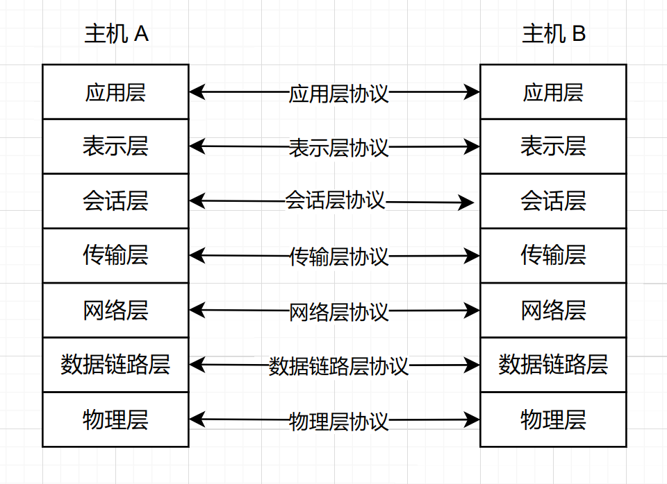

### OSI 网络分层

#### OSI 网络分层结构

每一层为上一层提供服务，依赖于下层的数据，并未上层提供接口。不同主机同层之间对等，对等层之间的规则一致，但实现不一定相同。

主机上运行的网络规则实现的集合称为协议栈，OSI/ISO 的 7 层网络结构模型可以将网络协议栈的不同层的实现划分为不同层次，将问题简单化，方便网络协议栈的实现。但由于 7 层模型的方式实现起来太复杂，所以并没有实际使用的 7 层网络协议栈。

#### OSI 的 7 层网络结构

OSI 的 7 层结构中，**自下而上**，每一层规则定了不同的特性，完成不同的功能。

##### 物理层

Physical Layer：**为上层提供物理介质**，本层数据单位为 **Byte**（比特）。

规定了物理线路和设备的触发、维护、关闭物理设备的机械特性、电气特性、功能特性和过程。实际使用中，网卡等属于本层。

##### 数据链路层

Data Link Layer：为上层提供可靠的数据传输，利用通信信道实现无差错传输，本层数据单位为 **frame**（帧）。

提供物理地址寻址、数据成帧、数据的检测重发、流量控制和链路控制等。本层地难以的规范有 SDLC、HDLC、PPP、STP、帧中继等。实际使用中，MAC 属于本层。

##### 网络层

NetWork Layer：网络层负责将各个子网之间的数据进行路由选择，将数据从一个主机传送到另一个主机，本层数据单位为 **packet**（数据包）。

网际互联、流量控制和阻塞控制等。本层的规范有 IP、IPX、RIP、OSPF 等，实际使用中，路由器属于本层。

##### 传输层

Transport Layer：将上层的数据处理为分段的数据，提供可靠或不可靠的传输，为上层掩盖下层细节，保证会话层的数据信息能够传输到另一方的会话层，本层数据单位为 **sgment**（段）。本层的规范有 TCP、UDP、SPX 等。

##### 会话层

Session Layer：会话层管理主机之间的会话过程，包括会话的建立、终止和会话过程中的管理，来提供服务请求者和提供者之间的通信。本层定义的规范有 TCP、UDP、SPX 等。

##### 表达层

Presentation Layer：对网络传输的数据进行变换，使得多个主机之间传送的信息能够相互理解，包括数据的压缩、加密、格式的转换等。本层定义的标准有 ASCII、JPEG、MPEG 等。

##### 应用层

### TCP/IP 协议栈

#### TCP/IP 协议栈模型

#### 主机到网络层协议

#### IP 协议

### IP 地址分类与  TCP/UDP 端口

### 主机字节序和网络字节序