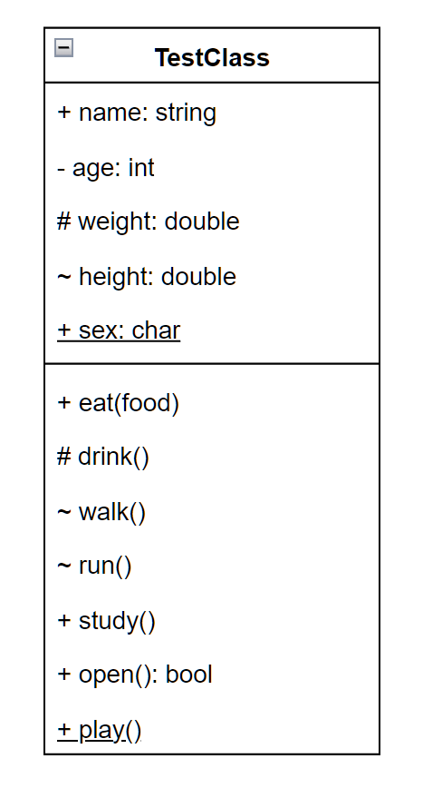
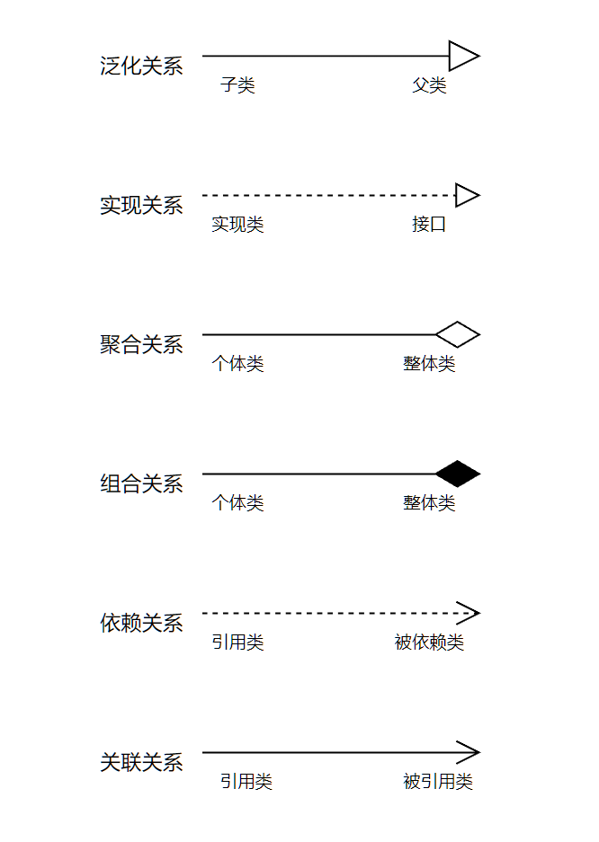
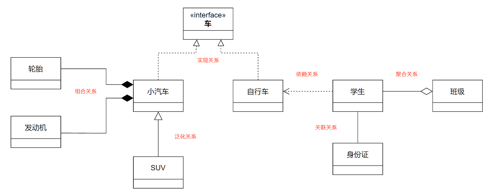

类图由**类**和**类之间的关系**组成，对类的定义由三个部 分组成：**类名**、**类的属性**、**类的方法**。

**类名**：图中 TestClass 为类名，如果字体为斜体则表示抽象类

**类的属性**：类名下方区域

**符号解释**：

- +：public，共有的，对所有类可见
- -：private，私有的，只对该类本身可见
- #：protected，受保护的，对该类及该类子孙可见
- ~：package，包的，只对同一包声明的其他类可见
- =：默认值
- 下划线：static
- 斜体：抽象，用两个尖括号包裹也可以表示抽象
- 冒号前是方法/变量名（根据有无括号区分），冒号后是返回参数/变量类型（根据有无括号区分），如果没有冒号则表示方法返回空（也可以使用 : void 表示返回空）

### 1. 泛化关系

继承关系，子类继承父类所有方法和属性，子类可以新增方法和重写父类方法。

两个对象可以使用 is-a 表示，就是继承关系（...是...）。

### 2. 实现关系

类与接口的关系。

### 3. 聚合关系

表示实体对象之间的关系，弱拥有，表示整体由部分构成的语义，例如一个部门由多个员工组成。即使整体不存在，部分依然存在。

### 4. 组合关系

表示实体对象之间的关系，表示整体由部分组成的语义，例如一个公司由多个部门组成。如果整体不存在，则部分也不存在。

### 5. 依赖关系

描述一个对象在运行期间会用到另一个对象的关系。

与关联关系不同，依赖关系是临时性关系，通常在运行期间产生，并且随着运行时的变化，依赖类也可能发生变化。

依赖关系体现为类构造及类方法的传入参数，依赖关系除了临时知道对象之外还知道对象的方法和属性。

一般来说，依赖总是单向的，不应该存在双向依赖。

> 简单说就是要使用的

### 6. 关联关系

描述不同类的对象之间的结构关系，是一种静态关系，通常与运行状态无关，一般用来定义对象之间静态的、天然的结构，关联关系是一种**强关联**的关系。

关联关系默认不强调方向，表示对象相互知道，如果强调方向，对象知道它所指向的对象（被指向对象不知道该对象）。

> 简单说就是要使用的，比依赖更强，不存在依赖关系中的偶然性，关系也不是临时的，一般是长期性的。

### 模板案例

