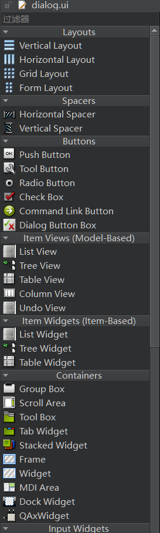
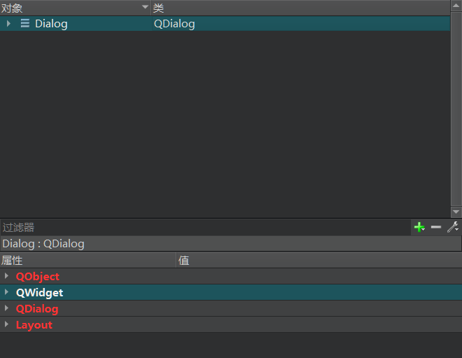

### Qt Designer

双击 .ui 文件打开 Qt Designer 界面



从上至下依次是：

- Layouts
  
  - Vertical Layout（垂直布局）
  
  - Horizontal Layout（水平布局）
  
  - Grid Layout（网格布局）
  
  - Form Layout（表单布局）

- Spacers
  
  - Horizontal Spacer（水平间隔）
  
  - Vertical Spacer（垂直间隔）

- Buttons
  
  - Push Button（按钮）
  
  - Tool Button（工具按钮）
  
  - Radio Button （单选按钮）
  
  - Check Box（复选框）
  
  - Command Link Button（命令链接按钮）
  
  - Dialog Button Box（对话框按钮盒）

- Item Views
  
  - List View（清单视图）
  
  - Tree View（树视图）
  
  - Table View（表视图）
  
  - Column View（列示图）
  
  - Undo View（撤销命令视图）

- Item Widgets
  
  - List Widget（清单控件）
  
  - Tree Widget（树形控件）
  
  - Table Widget（表控件）

- Containers
  
  - Group Box（组框）
  
  - Scroll Area（滚动区域）
  
  - Tool Box（工具箱）
  
  - Tab Widget（标签小部件）
  
  - Stacked Widget（堆叠部件）
  
  - Frame（框架）
  
  - Widget（部件）
  
  - MDI Area（MDI 区域）
  
  - Dock Widget（停靠窗口部件）
  
  - QAxWidget（封装 Flash 的 ActiveX 部件）

- Input Widgets
  
  - Combo Box（组合框）
  
  - Font Combo Box（字体组合框）
  
  - Line Edit（行编辑框）
  
  - Text Edit（文本编辑框）
  
  - Plain Text Edit（纯文本编辑框）
  
  - Spin Box（数字显示框，自旋盒）
  
  - Double Spin Box（双自旋盒）
  
  - Time Edit（时间编辑器）
  
  - Date Edit（日期编辑器）
  
  - Date/Time Edit（日期/时间编辑器）
  
  - Dial（拨号器）
  
  - Horizontal Scroll Bar（横向滚动条）
  
  - Vertical Scroll Bar（垂直滚动条）
  
  - Horizontal Slider（横向滑块）
  
  - Vertical Slider（垂直滑块）
  
  - Key Sequence Edit（按键序列编辑器）

- Display Widgets
  
  - Label（标签）
  
  - Text Browser（文本浏览器）
  
  - Graphics View（图形视图）
  
  - Calendar Widget（日历）
  
  - LCD Number（液晶数字）
  
  - Progress Bar（进度条）
  
  - Horizontal Line（水平线）
  
  - Vertical Line（垂直线）
  
  - OpenGL Widget（开放式图形库工具）
  
  - QQuickWidget（嵌入 QML 工具）


从左至右依次是：

- 编辑控件
- 编辑信号/槽
- 编辑伙伴
- 编辑 Tab 顺序
- 水平布局
- 垂直布局
- 使用拆分器水平布局
- 使用拆分器垂直布局
- 在窗体布局中布局
- 栅格布局
- 分拆布局
- 调整大小



上面是对象和类的概述，下面是对象的属性设置

> parent-child 机制：当创建一个物件，若物件伴随一个 parent，则此 parent 将物件加入其 children list。当 parent 被消除时，会根据 children list 将这个 child 消除，若 child 也有其 children list 则会连同一起被消除。这个机制简化了记忆体管理，降低了 memory leak 的风险

### ui file

方法1：添加 **Qt Designer Form** 文件，文件名 form.ui

```cmake
# ./CMakeLists.txt
set(PROJECT_SOURCES
        main.cpp
        widget.cpp
        widget.h
        form.ui # 与文件名一致
)
```

```cpp
// ./widget.h
#include <QWidget>

QT_BEGIN_NAMESPACE
namespace Ui { class Form; } // Form 需和设计中的对象名一致
QT_END_NAMESPACE

class Widget : public QWidget {
    Q_OBJECT
public:
    Widget(QWidget *parent = nullptr);
    ~Widget();
private:
    Ui::Form *ui;
}
```

```cpp
// ./widget.cpp
#include "widget.h"
// 在需要的 ui 变量的文件中调用头文件
#include "./ui_form.h"

TreeList::TreeList(QWeiget *parent)
    : QWidget(parent), ui(new Ui::Form) { // 初始化 ui
    ui->setupUi(this);
}

TreeList::~TreeList() {
    delete ui;
}
```

方法2：添加 **Qt 设计器界面类** 文件，文件名 form.ui

### Signal-Slot

`ui->setupUi(this);` 会根据 naming convention 对 slot 进行连接，即连接 on_objectName_signalName()  与 object 的 signal

在设计中添加 PushButton 控件，对象名为 `ok_btn`

```cpp
// widget.h
#ifndef WIDGET_H
#define WIDGET_H

#include <QWidget>

QT_BEGIN_NAMESPACE
namespace Ui { class Widget; }
QT_END_NAMESPACE

class Widget : public QWidget {
    Q_OBJECT
public:
    Widget(QWidget *parent = nullptr);
    ~Widget();
private:
    Ui::Widget *ui;
public slots:
    void on_ok_btn_clicked();
};

#endif // WIDGET_H
```

```cpp
// widget.cpp
#include "widget.h"
#include "./ui_widget.h"

Widget::Widget(QWidget *parent)
    : QWidget(parent), ui(new Ui::Widget) {
    ui->setupUi(this);
    // connect(ui->pushButton, SIGNAL(clicked()), this, SLOT(on_ok_btn_clicked()));
}

Widget::~Widget() {
    delete ui;
}

void Widget::on_ok_btn_clicked() {
    qDebug() << "ok";
}
```

```cpp
#include "widget.h"
#include <QApplication>

int main(int argc, char *argv[]) {
    QApplication a(argc, argv);
    Widget w;
    w.show();
    return a.exec();
}
```
