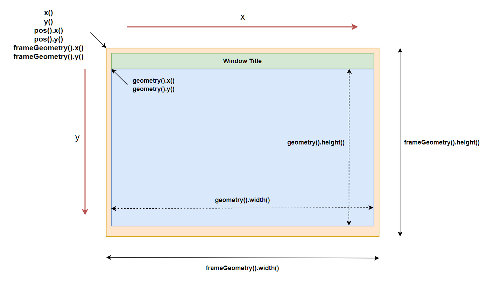

```cpp
// 获取窗口或控件的 x 和 y 位置坐标
// x 坐标是窗口左上角相对于父级窗口的水平位置，y 坐标是垂直位置
x();
y();
```

`x()` 和 `y()`: 获取或设置窗口或控件的x和y位置坐标。x坐标是窗口左上角相对于父级窗口的水平位置，y坐标是垂直位置。

```cpp
// 返回窗口的尺寸和位置
// 返回窗口的外框左上角的 x 和 y 位置坐标
frameGeometry().x();
frameGeometry().y();
// 返回窗口外框的宽度和高度
frameGeometry().width();
frameGeometry().height();
```

`pos().x()` 和 `pos().y()`: `pos()` 一般返回控件的位置信息。`pos().x()` 和 `pos().y()` 分别返回控件左上角的x和y位置坐标。

```cpp
// 返回控件的左上角的 x 和 y 位置坐标
pos().x();
pos().y();
```

`geometry().x()`、`geometry().y()`、`geometry().width()` 和 `geometry().height()`: `geometry()` 通常返回控件的尺寸和位置信息。这里的x和y是控件相对于父级窗口的位置坐标，width和height是控件的宽度和高度。

```cpp
// 返回控件的尺寸和位置，相对于父级窗口
geometry().x();
geometry().y();
geometry().width();
geometry().height();
```

`width()` 和 `height()`: 返回控件的宽度和高度。

```cpp
// 返回控件的宽度和高度
width();
height();
```


```cpp
// 返回矩形左上角坐标
rect().x();
rect().y();
// 返回矩形宽度和高度
rect().width();
rect().height();
```


```cpp
// 返回控件的宽度和高度
size().width();
size().height();
```


### Case

```cpp
#ifndef DIALOG_H
#define DIALOG_H

#include <QDialog>
#include <QLabel>
#include <QGridLayout>

class Dialog : public QDialog {
    Q_OBJECT

public:
    Dialog(QWidget *parent = nullptr);
    ~Dialog();

    void updateLabel();

private:
    QLabel *x_label;
    QLabel *x_value_label;
    QLabel *y_label;
    QLabel *y_value_label;
    QLabel *frame_label;
    QLabel *frame_value_label;
    QLabel *position_label;
    QLabel *position_value_label;
    QLabel *geometry_label;
    QLabel *geometry_value_label;
    QLabel *width_label;
    QLabel *width_value_label;
    QLabel *height_label;
    QLabel *height_value_label;
    QLabel *rect_label;
    QLabel *rect_value_label;
    QLabel *size_label;
    QLabel *size_value_label;
    QGridLayout *main_layout;

private:
    void moveEvent(QMoveEvent *);
    void resizeEvent(QResizeEvent *);
};

#endif // DIALOG_H
```

```cpp
#include "dialog.h"

Dialog::Dialog(QWidget *parent) : QDialog(parent) {
    x_label = new QLabel("x");
    x_value_label = new QLabel();
    y_label = new QLabel("y");
    y_value_label = new QLabel();
    frame_label = new QLabel("frame");
    frame_value_label = new QLabel();
    position_label = new QLabel("position");
    position_value_label = new QLabel();
    geometry_label = new QLabel("geometry");
    geometry_value_label = new QLabel();
    width_label = new QLabel("width");
    width_value_label = new QLabel();
    height_label = new QLabel("height");
    height_value_label = new QLabel();
    rect_label = new QLabel("rect");
    rect_value_label = new QLabel();
    size_label = new QLabel("size");
    size_value_label = new QLabel();

    main_layout = new QGridLayout(this);
    main_layout->addWidget(x_label, 0, 0);
    main_layout->addWidget(x_value_label, 0, 1);
    main_layout->addWidget(y_label, 1, 0);
    main_layout->addWidget(y_value_label, 1, 1);
    main_layout->addWidget(frame_label, 2, 0);
    main_layout->addWidget(frame_value_label, 2, 1);
    main_layout->addWidget(position_label, 3, 0);
    main_layout->addWidget(position_value_label, 3, 1);
    main_layout->addWidget(geometry_label, 4, 0);
    main_layout->addWidget(geometry_value_label, 4, 1);
    main_layout->addWidget(width_label, 5, 0);
    main_layout->addWidget(width_value_label, 5, 1);
    main_layout->addWidget(height_label, 6, 0);
    main_layout->addWidget(height_value_label, 6, 1);
    main_layout->addWidget(rect_label, 7, 0);
    main_layout->addWidget(rect_value_label, 7, 1);
    main_layout->addWidget(size_label, 8, 0);
    main_layout->addWidget(size_value_label, 8, 1);
    updateLabel();
}

Dialog::~Dialog() {

}

void Dialog::updateLabel() {
    QString x_str = QString::number(this->x());
    x_value_label->setText(x_str);

    QString y_str = QString::number(this->y());
    y_value_label->setText(y_str);

    QString frame_str = QString::number(this->frameGeometry().x())
        + ", " + QString::number(this->frameGeometry().y())
        + ", " + QString::number(this->frameGeometry().width())
        + ", " + QString::number(this->frameGeometry().height());
    frame_value_label->setText(frame_str);

    QString position_str = QString::number(this->pos().x())
        + ", " + QString::number(this->pos().y());
    position_value_label->setText(position_str);

    QString geometry_str = QString::number(this->geometry().x())
        + ", " + QString::number(this->geometry().y())
        + ", " + QString::number(this->geometry().width())
        + ", " + QString::number(this->geometry().height());
    geometry_value_label->setText(geometry_str);

    QString width_str = QString::number(this->width());
    width_value_label->setText(width_str);

    QString height_str = QString::number(this->height());
    height_value_label->setText(height_str);

    QString rect_str = QString::number(this->rect().x())
        + ", " + QString::number(this->rect().y())
        + ", " + QString::number(this->rect().width())
        + ", " + QString::number(this->rect().height());
    rect_value_label->setText(rect_str);

    QString size_str = QString::number(this->size().width())
        + ", " + QString::number(this->size().height());
    size_value_label->setText(size_str);
}

void Dialog::moveEvent(QMoveEvent *) {
    updateLabel();
}

void Dialog::resizeEvent(QResizeEvent *) {
    updateLabel();
}
```

```cpp
#include "dialog.h"

#include <QApplication>

int main(int argc, char *argv[]) {
    QApplication a(argc, argv);
    Dialog w;
    w.show();
    return a.exec();
}
```

