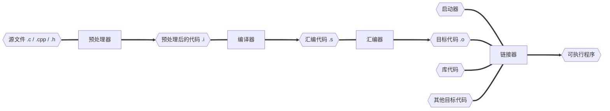

## GCC

GCC (GNU Compiler Collection) 实际上是一个编译器套件，包含了多个编程语言的编译器。最初，GCC 是 "GNU C  Compiler" 的缩写，仅用于编译 C 语言。但随着时间的发展，GCC 扩展到了其他语言，所以现在代表 "GNU Compiler  Collection"。

在 GCC 中，包括了以下主要编译器：gcc、g++、gfortran、gccgo 等

### gcc 工作流程



### gcc 编译选项

| gcc 编译选项 | 说明                                                         |
| ------------ | ------------------------------------------------------------ |
| -E           | 运行预处理器，处理所有的预处理指令                           |
| -S           | 编译源代码，生成 `.s` 汇编代码                               |
| -c           | 编译并汇编源代码，生成 `.o` 或 `.obj` 的目标文件             |
| -o           | 指定输出文件的名称                                           |
| -I \<dir\>   | 添加目录到头文件搜索路径                                     |
| -g           | 生成供调试器使用的调试信息                                   |
| -D \<macro\> | 定义宏                                                       |
| -w           | 关闭所有编译警告                                             |
| -Wall        | 开启几乎所有编译警告                                         |
| -O\<n\>      | 设置优化等级，`n` 的取值为 0 到 3。`-O0` 是无优化，`-O1` 是默认的基本优化，`-O2` 和 `-O3` 是更高级别的优化 |
| -L \<dir\>   | 添加目录到库搜索路径                                         |
| -fPIC/fpic   | 生成与位置无关的代码                                         |
| -shared      | 生成共享库                                                   |
| -std         | 指定符合 ISO C 或 C++ 标准的语言方言                         |
| -lm          | 链接标准数学库                                               |

### gcc 编译过程

源文件经过**预处理器**到预处理文件

```sh
gcc test.c -E -o app.i # 生成预处理文件
```

预处理代码经过**编译器**到汇编文件

```sh
gcc app.i -S -o app.s # 生成汇编文件
```

汇编代码经过**汇编器**到目标文件

```sh
gcc app.s -c -o app.o # 生成目标文件
```

如果直接写 -S 或者 -c

```shell
gcc test.c -S # 表示中间进行了预处理之后再进行编译
```

```shell
gcc test.c # 就表示中间进行了 预处理-编译-汇编-链接
```

### gcc 与 g++ 误区

误区：gcc 和 g++，gcc 只能编译 c 程序，g++ 只能编译  c++ 程序。

- 后缀 .c 的，gcc 把它当作 c 程序，g++ 当作 c++ 程序。
- 后缀 .cpp 的，gcc 和 g++ 都认为是 c++ 程序，c++ 语法规则更加严谨
- 编译阶段，g++ 会调用 gcc，对于 c++ 代码，两者是等价的，gcc 命令不能自动和 c++ 程序使用的库链接。通常使用 g++ 来链接，为了统一，编译和链接都使用 g++。

误区：gcc 不会定义 `__cplusplus` 宏，而 g++ 会。

- `__cpluscplus` 只是标志编译器将把代码按照 c 还是 c++ 语法来解释
- .c 源代码文件，采用 gcc 编译器，则该宏是未定义的

误区：编译只能用  gcc，链接只能用 g++。

- 编译可以用 gcc / g++，链接可以用 g++ 或者 gcc -lstdc++ （-l std c++）
- gcc 命令不能自动和 c++ 程序使用的库链接，所以使用 g++ 来链接，但在编译阶段，g++ 会自动调用 gcc，二者等价
