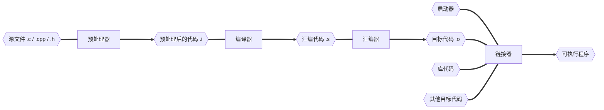

## GCC

GCC (GNU Compiler Collection) 实际上是一个编译器套件，它包含了多个编程语言的编译器。最初，GCC 是 "GNU C  Compiler" 的缩写，仅用于编译 C 语言。但随着时间的发展，GCC 扩展到了其他语言，所以现在它代表 "GNU Compiler  Collection"。

在 GCC 中，包括了以下主要编译器：

- **gcc**
- **g++**

### GCC 安装

#### Windows

[sourceforge](https://sourceforge.net) 上安装的版本为旧版本

[niXman/mingw-builds-binaries/releases ](https://github.com/niXman/mingw-builds-binaries/releases) github 上下载新版本

- 32位的操作系统，选择 i686，64位的操作系统，选择 x86_64；
- 13.1.0 是 GCC 的版本号；
- win32 是开发 windows 系统程序的协议，posix 是其他系统的协议（例如Linux、Unix、Mac OS）；
- 异常处理模型 seh（新的，仅支持64位系统），sjlj（稳定的，64位和32位都支持）， dwarf（优于sjlj的，仅支持32位系统）；
- msvcrt、ucrt 运行时库类型，
- MSVCRT（Microsoft Visual C Runtime）是 Microsoft Visual C++ 早期版本使用的运行时库，用于支持 C 程序的运行。它提供了一些常用的 C 函数，如 printf、scanf、malloc、free等。MSVCRT 只能在 32 位 Windows 系统上运行，对于 64 位系统和 Windows Store 应用程序不支持。UCRT（Universal C Runtime）是在 Windows 10 中引入的新的 C 运行时库，用于支持 C 程序的运行和开发。UCRT 提供了一些新的 C 函数，同时还支持 Unicode 字符集和安全函数，如 strcpy_s、strcat_s、_itoa_s 等。UCRT 同时支持 32 位和 64 位系统，并且可以与 Windows Store 应用程序一起使用；
- rev1 构建版本；

#### Unix

使用包安装

```shell
# Ubuntu
sudo apt update
# 安装工具包
sudo apt install build-essential

# 单独安装 gcc / g++
sudo apt install gcc
sudo apt install g++
```

安装新版 gcc/g++

```sh
sudo apt install gcc-10
sudo apt install g++-10

# 使用新版本
gcc-10 s.c -o out.o

# 修改 gcc-10/g++-10 软链接
sudo rm /usr/bin/gcc
sudo rm /usr/bin/g++

sudo ln -s /usr/bin/gcc-10 /usr/bin/gcc
sudo ln -s /usr/bin/g++-10 /usr/bin/g++
```


### gcc 工作流程



### gcc 编译选项

| gcc 编译选项                       | 说明                                                         |
| ---------------------------------- | ------------------------------------------------------------ |
| -E                                 | 预处理指定的源文件，不进行编译                               |
| -S                                 | 编译指定的源文件，但不进行汇编                               |
| -c                                 | 编译、汇编指定的文件，但不进行链接                           |
| -o file1 file2 或者 file2 -o file1 | 将文件 file2 编译成可执行文件 file1                          |
| -I directory                       | **指定 include 包含文件的搜索目录**                          |
| -g                                 | 在程序编译时，生成调试信息，该程序可以被调试器调试           |
| -D                                 | 在程序编译时，指定一个宏                                     |
| -w                                 | 不生成任何警告信息                                           |
| -Wall                              | 生成所有警告信息                                             |
| -On                                | n 的取值范围：0~3，编译器的优化选项的 4 个级别，-O0 表示没有优化，-O1  表示缺省值，-O3 优化级别最高 |
| -I（大 i）                         | 在程序编译的时候，**指定使用的库**                           |
| -L                                 | 指定编译的时候，**搜索的库的路径**                           |
| -fPIC/fpic                         | 生成与位置无关的代码                                         |
| -shared                            | 生成共享目标文件，通常用在建立共享库时                       |
| -std                               | 指定 c 方言。-std=c99，gcc 默认的方言为 GNU C                |
| -lm                                | 链接过程中检索并使用数学库函数                               |

### gcc 编译过程


1. 源文件经过**预处理器**到预处理后代码， .c 文件变成 .i 预处理文件

   ```sh
   gcc test.c -E -o app.i # 生成 app.i 文件
   ```

2. 预处理代码经过**编译器**到汇编代码， .i 文件变成 .s 汇编文件

   ```sh
   gcc app.i -S -o app.s # 生成 app.s 文件
   ```

3. 汇编代码经过**汇编器**到目标代码， .s 文件变成 .o 目标文件

   ```sh
   gcc app.s -c -o app.o # 生成 app.o 文件
   ```


如果直接写 -S 或者 -c

```shell
gcc test.c -S # 表示中间进行了预处理之后再进行编译
```

所以直接写源代码文件就是直接生成可执行文件

```shell
gcc test.c # 就表示中间进行了 预处理-编译-汇编-链接
```

在编译过程中，汇编器和链接器是两个不同但相关的阶段。它们分别发生在汇编之后和链接之后，有以下区别：

1. 汇编器之后：在汇编器阶段，源代码被翻译成机器语言指令，并生成目标文件（object file）。目标文件包含了机器代码和与之相关的符号表信息。然而，在目标文件中，对其他目标文件或库文件中符号的引用尚未解析。因此，目标文件可能包含对未定义符号的引用，这些符号需要在链接阶段被解析。
2. 链接器之后：链接器阶段发生在汇编器之后。链接器将多个目标文件（object files）以及可能的库文件进行连接，形成最终的可执行文件或库文件。链接器的主要任务是解决目标文件中对未定义符号的引用，将其与其他目标文件或库文件中定义的符号关联起来。这样，所有的符号引用都可以得到解析，生成一个可以运行的程序。

### gcc 编译多文件

```shell
.
├── bubble.cpp
├── main.cpp
├── select.cpp
└── sort.h

gcc select.cpp bubble.cpp main.cpp -o app
```

### gcc 与 g++ 误区

误区：gcc 和 g++，gcc 只能编译 c 程序，g++ 只能编译  c++ 程序。

- 后缀 .c 的，gcc 把它当作 c 程序，g++ 当作 c++ 程序。
- 后缀 .cpp 的，gcc 和 g++ 都认为是 c++ 程序，c++ 语法规则更加严谨一些
- 编译阶段，g++ 会调用 gcc，对于 c++ 代码，两者是等价的，gcc 命令不能自动和 c++ 程序使用的库链接。通常使用 g++ 来链接，为了统一，编译和链接都使用 g++。

误区：gcc 不会定义 __cplusplus 宏，而 g++ 会。

- __cpluscplus 只是标志编译器将把代码按照 c 还是 c++ 语法来解释
- .c 源代码文件，采用 gcc 编译器，则该宏是未定义的

误区：编译只能用  gcc，链接只能用 g++。

- 编译可以用 gcc / g++，链接可以用 g++ 或者 gcc -lstdc++ （-l std c++）
- gcc 命令不能自动和 c++ 程序使用的库链接，所以使用 g++ 来链接，但在编译阶段，g++ 会自动调用 gcc，二者等价

### gcc 使用

```sh
gcc 源文件名.c -o 可执行文件名

# gcc 编译选项
-E # 预处理指定的源文件
-S # 编译指定的源文
-c # 编译、汇编指定的文件
-o file1 file2
-g # 在程序编译时，生成调试信息，该程序可以被调试器调试
-D # 在程序编译时，指定一个宏
-W # 不生成任何警告信息
-Wall # 生成所有警告信息
-On # n 的取值范围: 0~3，编译器的优化选项的 4 个级别，-O0 表示没有优化，-O1 表示缺省值，-O
-I  # 指定编译时指定使用的库
-L  # 指定编译时搜索的库的路径
-fPIC # 生成与位置无关的代码
-fpic # 生成与位置无关的代码
-std  # 指定 c 方言，-std=c99，gcc 默认 GNU C
-lm   # 链接时检索并使用数学库函数
```

### man

```sh
man [] <function> # 查看 <function> 的文档

# 在帮助文档下 输入 /
/RETURN VAL # 搜索该文档下的包含返回值的内容

使用 man 命令的基本语法如下：
man [section] command/function_name
其中：
    section：可选参数，表示手册页的章节号。如果省略该参数，man 命令将按照默认的顺序搜索所有章节，并显示找到的第一个匹配的手册页。常见的章节号包括：
        Section 1：用户命令 (User Commands)
        Section 2：系统调用 (System Calls)
        Section 3：C 库函数 (Library Functions)
        Section 4：设备文件 (Special Files)
        Section 5：文件格式和协议 (File Formats and Protocols)
        Section 6：游戏和屏幕保护程序 (Games and Screensavers)
        Section 7：杂项 (Miscellaneous)
        Section 8：系统管理命令 (System Administration Commands)
    command/function_name：要查询手册页的命令或函数名称。
```


