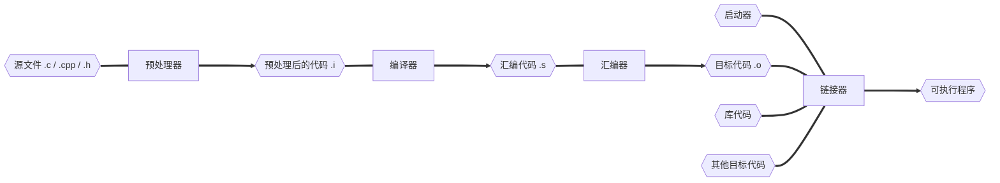

## GCC

GCC (GNU Compiler Collection) 实际上是一个编译器套件，它包含了多个编程语言的编译器。最初，GCC 是 "GNU C  Compiler" 的缩写，仅用于编译 C 语言。但随着时间的发展，GCC 扩展到了其他语言，所以现在它代表 "GNU Compiler  Collection"。

在 GCC 中，包括了以下主要编译器：

- **gcc**
- **g++**

### gcc 工作流程



### gcc 编译选项

| gcc 编译选项                       | 说明                                                         |
| ---------------------------------- | ------------------------------------------------------------ |
| -E                                 | 预处理指定的源文件，不进行编译                               |
| -S                                 | 编译指定的源文件，但不进行汇编                               |
| -c                                 | 编译、汇编指定的文件，但不进行链接                           |
| -o file1 file2 或者 file2 -o file1 | 将文件 file2 编译成可执行文件 file1                          |
| -I directory                       | **指定 include 包含文件的搜索目录**                          |
| -g                                 | 在程序编译时，生成调试信息，该程序可以被调试器调试           |
| -D                                 | 在程序编译时，指定一个宏                                     |
| -w                                 | 不生成任何警告信息                                           |
| -Wall                              | 生成所有警告信息                                             |
| -On                                | n 的取值范围：0~3，编译器的优化选项的 4 个级别，-O0 表示没有优化，-O1  表示缺省值，-O3 优化级别最高 |
| -I（大 i）                         | 在程序编译的时候，**指定使用的库**                           |
| -L                                 | 指定编译的时候，**搜索的库的路径**                           |
| -fPIC/fpic                         | 生成与位置无关的代码                                         |
| -shared                            | 生成共享目标文件，通常用在建立共享库时                       |
| -std                               | 指定 c 方言。-std=c99，gcc 默认的方言为 GNU C                |
| -lm                                | 链接过程中检索并使用数学库函数                               |

### gcc 编译过程


1. 源文件经过**预处理器**到预处理后代码， .c 文件变成 .i 预处理文件

   ```sh
   gcc test.c -E -o app.i # 生成 app.i 文件
   ```

2. 预处理代码经过**编译器**到汇编代码， .i 文件变成 .s 汇编文件

   ```sh
   gcc app.i -S -o app.s # 生成 app.s 文件
   ```

3. 汇编代码经过**汇编器**到目标代码， .s 文件变成 .o 目标文件

   ```sh
   gcc app.s -c -o app.o # 生成 app.o 文件
   ```


如果直接写 -S 或者 -c

```shell
gcc test.c -S # 表示中间进行了预处理之后再进行编译
```

所以直接写源代码文件就是直接生成可执行文件

```shell
gcc test.c # 就表示中间进行了 预处理-编译-汇编-链接
```

在编译过程中，汇编器和链接器是两个不同但相关的阶段。它们分别发生在汇编之后和链接之后，有以下区别：

1. 汇编器之后：在汇编器阶段，源代码被翻译成机器语言指令，并生成目标文件（object file）。目标文件包含了机器代码和与之相关的符号表信息。然而，在目标文件中，对其他目标文件或库文件中符号的引用尚未解析。因此，目标文件可能包含对未定义符号的引用，这些符号需要在链接阶段被解析。
2. 链接器之后：链接器阶段发生在汇编器之后。链接器将多个目标文件（object files）以及可能的库文件进行连接，形成最终的可执行文件或库文件。链接器的主要任务是解决目标文件中对未定义符号的引用，将其与其他目标文件或库文件中定义的符号关联起来。这样，所有的符号引用都可以得到解析，生成一个可以运行的程序。

### gcc 编译多文件

```shell
.
├── bubble.cpp
├── main.cpp
├── select.cpp
└── sort.h

gcc select.cpp bubble.cpp main.cpp -o app
```

### gcc 与 g++ 误区

误区：gcc 和 g++，gcc 只能编译 c 程序，g++ 只能编译  c++ 程序。

- 后缀 .c 的，gcc 把它当作 c 程序，g++ 当作 c++ 程序。
- 后缀 .cpp 的，gcc 和 g++ 都认为是 c++ 程序，c++ 语法规则更加严谨一些
- 编译阶段，g++ 会调用 gcc，对于 c++ 代码，两者是等价的，gcc 命令不能自动和 c++ 程序使用的库链接。通常使用 g++ 来链接，为了统一，编译和链接都使用 g++。

误区：gcc 不会定义 __cplusplus 宏，而 g++ 会。

- __cpluscplus 只是标志编译器将把代码按照 c 还是 c++ 语法来解释
- .c 源代码文件，采用 gcc 编译器，则该宏是未定义的

误区：编译只能用  gcc，链接只能用 g++。

- 编译可以用 gcc / g++，链接可以用 g++ 或者 gcc -lstdc++ （-l std c++）
- gcc 命令不能自动和 c++ 程序使用的库链接，所以使用 g++ 来链接，但在编译阶段，g++ 会自动调用 gcc，二者等价

### gcc 使用

```sh
gcc 源文件名.c -o 可执行文件名

# gcc 编译选项
-E    # 将源文件输出预处理后的代码，不进行编译、汇编和链接
-S    # 将源文件编译为汇编代码 .s，不进行汇编和链接
-c    # 将源文件编译为目标文件 .o，不进行链接
-o    # 指定输出文件名
-g    # 生成调试信息，以便调试器进行调试
-D    # 定义宏，-DDEBUG 定义名为 DEBUG 的宏
-W    # 不生成任何警告信息
-Wall # 生成所有警告信息
-On   # n 的取值范围: 0~3，编译器的优化选项的 4 个级别，-O0 表示没有优化，-O1 表示缺省值
-I    # 指定库头文件路径
-L    # 指定库文件的搜索路径
-l    # 指定链接库的名称
-fPIC # 生成与位置无关的代码
-fpic # 生成与位置无关的代码
-std  # 指定 c 方言，-std=c99，gcc 默认 GNU C
```


