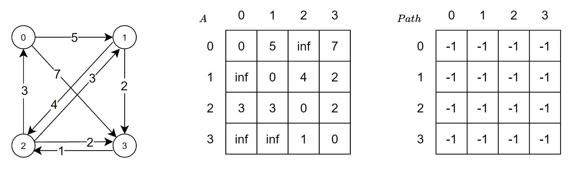

### folyd 最短路径



$A$ 表示邻接矩阵，存储任意两个顶点当前的最短路径长度

$Path$ 存储任意两个顶点在最短路径上的中间点

对于每一个顶点 $v$ ，和任意顶点对 ( $i,j$ )， $i\neq j$ ， $v\neq i$ ， $v\neq j$ ，如果 $A[i][j]>A[i][v]+A[v][j]$ ，则将 $A[i][j]$ 更新为 $A[i][v]+A[v][j]$ ，并且将 $Path[i][j]$ 更新为 $v$ ，表示顶点 $i$ 到 $j$ 的中间点为 $v$ 。

上图中 $v$ 最大为 3，第一次取 $v=0$ 中间点，去掉顶点对中出现 0 的顶点对，以及顶点对中顶点相同的顶点对。

```
{1, 2}
A[1][2] = 4, A[1][0] = inf, A[0][2] = inf
A[1][2] < A[1][0] + A[0][2]

{1, 3}
A[1][3] = 4, A[1][0] = inf, A[0][3] = 7
A[1][3] < A[1][0] + A[0][3]

{2, 1}
A[2][1] = 3, A[2][0] = 3, A[0][1] = 5
A[2][1] < A[2][0] + A[0][1]

{2, 3}
A[1][2] = 4, A[1][0] = inf, A[0][2] = inf
A[2][3] < A[2][0] + A[0][3]

{3, 1}
A[3][1] = inf, A[3][0] = inf, A[0][1] = 5
A[3][1] < A[3][0] + A[0][1]

{3, 2}
A[3][2] = 1, A[3][0] = inf, A[0][2] = inf
A[3][2] < A[3][0] + A[0][2]
```

$v=1$ ， $v=2$ ， $v=3$ 以此类推。

- [floyd](https://baike.baidu.com/item/Floyd%E7%AE%97%E6%B3%95)